# Azure DevOps 中的预提交作业工作流

> 原文：<https://devops.com/pre-commit-job-workflow-in-azure-devops/>

许多组织使用开放的组合，因此许多组织使用开源和商业工具的组合，Azure DevOps(以前称为 VSTS)和包括 Azure pipelines 等功能的应用程序生命周期管理(ALM)工具。本文讨论如何在 Azure 中实现端到端的 DevOps 设置

**先决条件:**

1.  签署
2.  创建的项目选择了版本控制
3.  选择过程模板(敏捷/Scrum)
4.  代码回购——一个在 VSTS，一个在 GitHub/cloud GitLab
5.  构建服务器–使用 MSDN 订阅的配额
6.  部署–来自 MSDN 的 Azure 订阅
7.  其他工具–VSTS 支持的工具/ [Azure DevOps](https://azure.microsoft.com/en-us/services/devops/)

*   预提交作业的目标是降低代码中的复杂性、重复和潜在错误的风险，以便直接部署到生产中。
*   在通常的工作流程中，构建将定期生成并发布以供测试。然而，有可能出现一些代码质量问题和构建部署问题。
*   在预提交作业的帮助下，我们可以配置触发器来为开发人员发出的每个拉请求生成构建。此外，这使开发团队能够创建部署您的拉请求代码或拉请求构建的拉请求发布，这有助于在合并代码更改之前检测部署/发布问题。
*   预提交部署还有助于在周期的早期发现部署/发布问题，保持更好的代码质量，并以更高的信心发布。

## 在 Azure DevOps 中为项目管理配置**敏捷板，并跟踪完成它的步骤**

**步骤:**

有了 Azure Boards，我们可以跨不同团队计划、跟踪和讨论工作。有了 Azure Boards，我们可以快速简单地开始跟踪项目的任务、功能和缺陷。

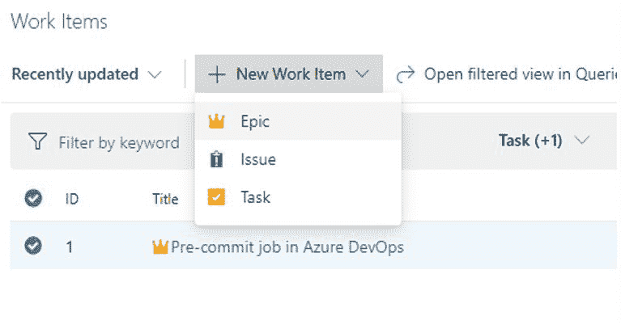

对于我们必须在 sprint 上创建的每个项目，转到 **Boards** 并选择 **Work Items** 来创建一个新的用户故事并提供验收标准。选择**板**并创建**新工作项**，然后在**史诗**下选择**用户故事**并点击**任务**并提供任务描述。

## 设置分支、版本控制和分支策略

**步骤:**

*   从 VCS 进口代码。
*   在 Repos 下，创建分支，如 dev 或 test。
*   建立分支策略以提高代码质量。

### **利用分支策略提高代码质量**

分支策略帮助团队保护他们重要的开发分支。分支策略强制团队的变更管理标准和代码质量。

### **为审查代码设置分支策略**

对于最成功的软件开发项目来说，代码评审是很好的实践。我们必须配置最少数量的评审者来评审代码并完成拉请求。

*   在 pull 请求中完成的代码审查只是为了找到明显的 bug。
*   代码审查有助于保护团队免于糟糕的提交或合并，以及阻碍团队生产力的不良构建。

审查将有助于在合并之前发现这类问题，保护我们的重要分支，例如发布分支，免受不期望的变更。

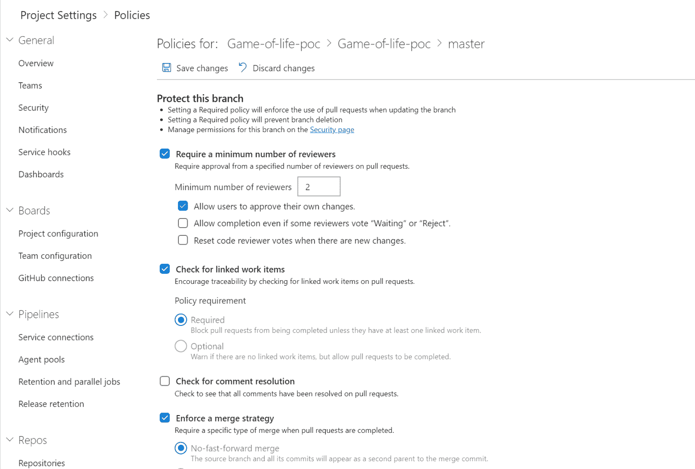

## **预提交，启用拉取请求**

**步骤:**

**完成拉取请求的工作流程:**

*   创建拉式请求
*   完成拉取请求

**拉取请求的好处:**

*   同行审查
*   足够的测试和更好的稳定性
*   减少冲突
*   连续交货
*   更明确的责任

**创建拉取请求:**

*   拉式请求将评审和代码合并成一个单一的协作过程。
*   对于分支中的每个 bug 修复或新特性，我们必须创建一个新的 pull 请求。
*   一旦开发分支构建顺利完成，就将团队成员添加到拉请求中。然后，成员可以对您的更改进行审核和投票。

**将工作项目链接到您的拉取请求:**

在 Azure DevOps 中选择**概述**选项卡。在**工作项**中选择 **+** 添加链接按钮，关联您当前的拉动请求。

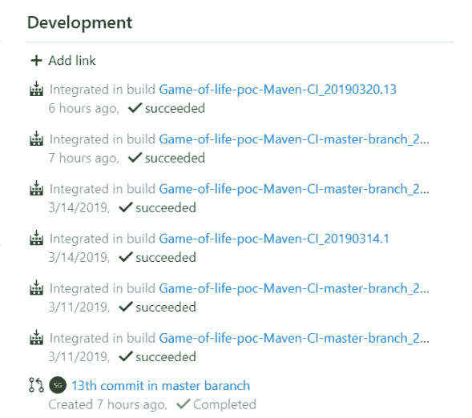 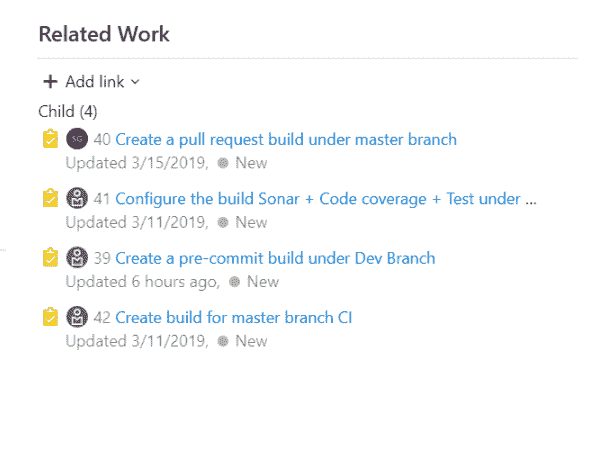

**完成拉取请求:**

*   基本策略要求一些评审者无异议地批准代码。
*   如果没有选择**允许用户批准他们自己的更改**，拉请求的创建者仍然可以投票**批准他们的拉请求**，但是他们的投票不会计入**要求，最少审核者**策略。
*   如果任何审核者拒绝更改，除非完成允许用户选择，否则拉请求无法完成，即使一些审核者选择了**等待**或**拒绝**。
*   要在新的变更被推送到源分支时重置代码审查者投票，请在有新的变更时选中**重置代码审查者投票**。

**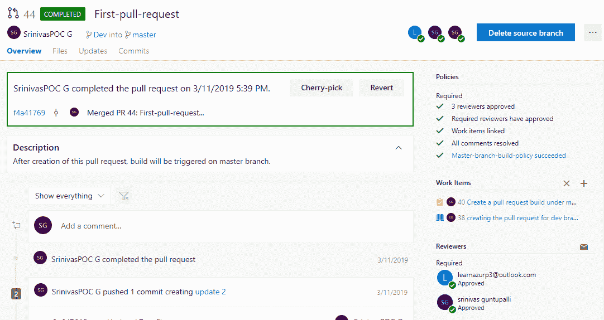**

## **每夜 CI 构建**

**步骤:**

**构建触发器:**

*   我们可以配置构建触发器，为提交到分支的每个代码生成 war 包。
*   在**构建**下，选择**触发**以启用 **CI** 并包含主分支。
*   可以为分支的每次提交启用构建触发器。

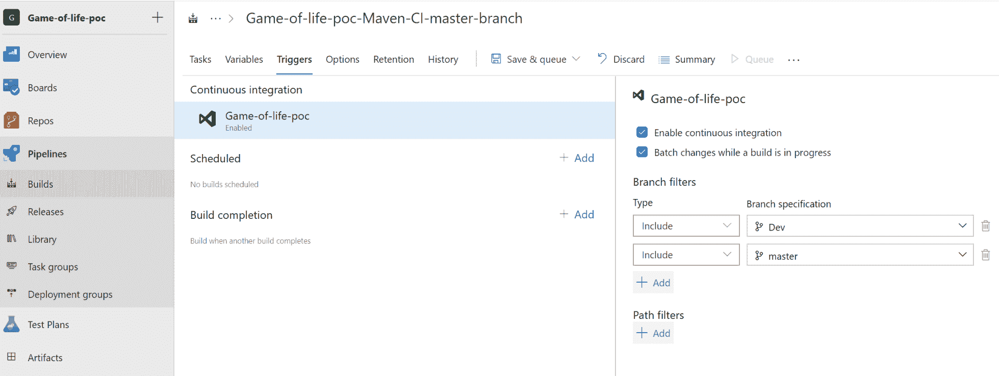 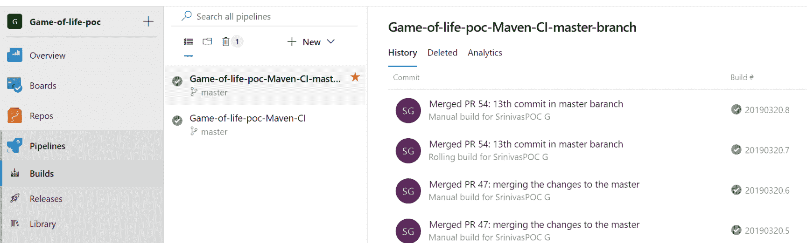

*   配置两个构建—一个用于开发分支，一个用于主分支。
*   如果开发人员执行代码，开发分支构建将在开发分支策略的帮助下自动触发。
*   一旦 dev 分支构建完成，评审者批准 pull 请求并触发主分支构建。一旦构建完成，就转移到发布部分。
*   代码质量分析和单元测试/Junit 测试在 dev 分支中配置。已经启用了**代码评审**和**发现 bug** 等代码质量网关。

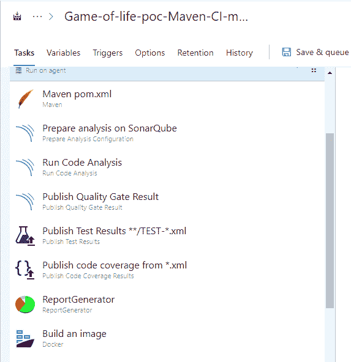

## 通过 Azure Kubernetes 服务(AKS)持续部署(发布)

**先决条件:**

*   任何源代码管理工具，如 Git/SVN 或 Azure Repo
*   微软 MSDN 帐户
*   Azure 帐户创建和 VSTS/Azure DevOps 帐户创建
*   创建 docker 文件，并与源代码一起放在 Git 中
*   要创建的 YAML 文件与源代码一起放在 Git 中
*   将在 Azure 门户中创建 Kubernetes 集群
*   Docker hub 帐户或 Azure 容器注册表
*   构建定义–Docker 构建映像

## 为要部署的应用程序创建 Docker 文件

创建服务原则，以提供对要部署在 Azure Kubernetes 服务上的应用程序/Docker 映像的访问。选择 **Deploy to Kubernetes** 任务，并进行以下配置:

*   创建新的 Kubernetes 服务连接
*   选择用于部署的命令选项
*   提供配置文件的位置，即 Deployment.yaml
*   选择容器注册类型
*   选择订阅
*   选择**替换令牌**任务，在将图像推送到容器注册表时自动附加图像的标签号
*   执行部署并查看日志

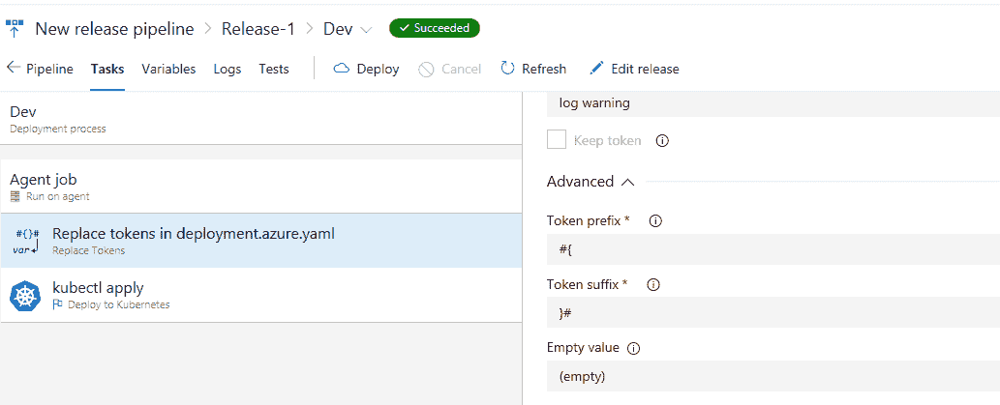

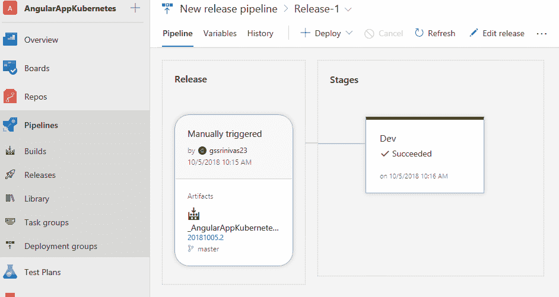

**测试计划:**

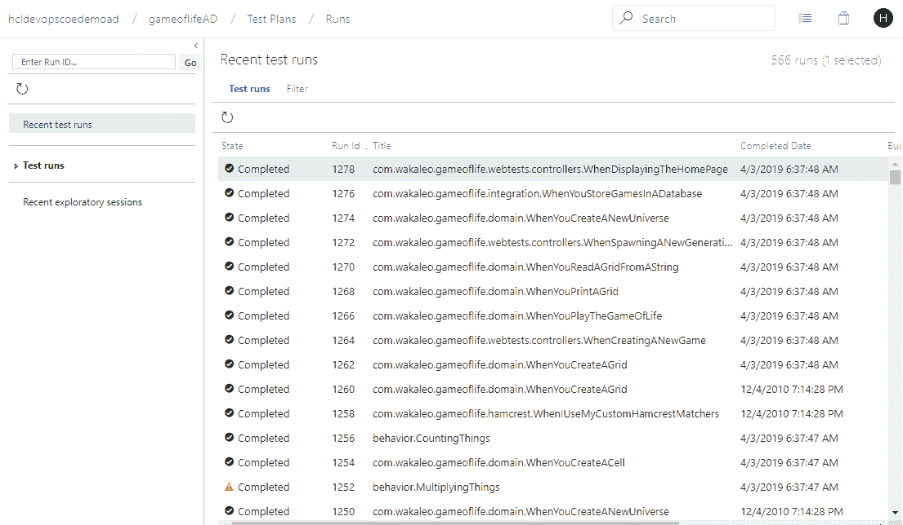

**负载测试:**

**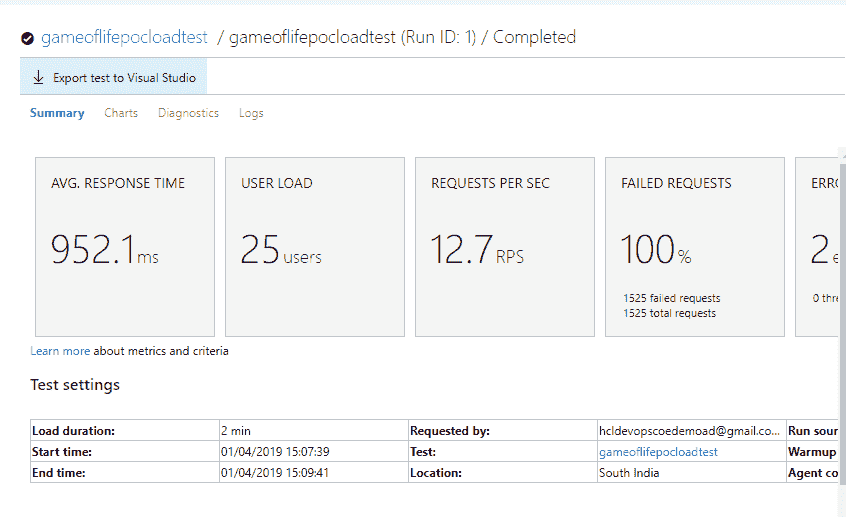**

## 管道历史

Azure Pipelines 用于自动构建和测试您的代码项目，并使其对其他用户可用。Azure Pipelines 集成了 CI 和 CD 来持续测试和构建您的项目，并将其发送到任何目标服务器。它通过在 Azure DevOps 中作为任务集成的各种工具，提供 CI 和 CD 的全栈端到端流。

## 结论

使用 Azure DevOps，您可以设置端到端 DevOps，并提供可跟踪性、预提交、CI 和部署到 [Kubernetes](https://devops.com/kubernetes-adoption-are-you-game-for-it/) 。

**

*本文由 HCL Technologies Ltd .首席工程师* *Srinivasa Rao Guntupalli 合著。他从事各种 DevOps 技术，如 Git、maven、Jenkins 和云技术，包括 AWS、Azure、Azure DevOps/VSTS。*

— [纳文·曼切姆](https://devops.com/author/naveen-manchem/)