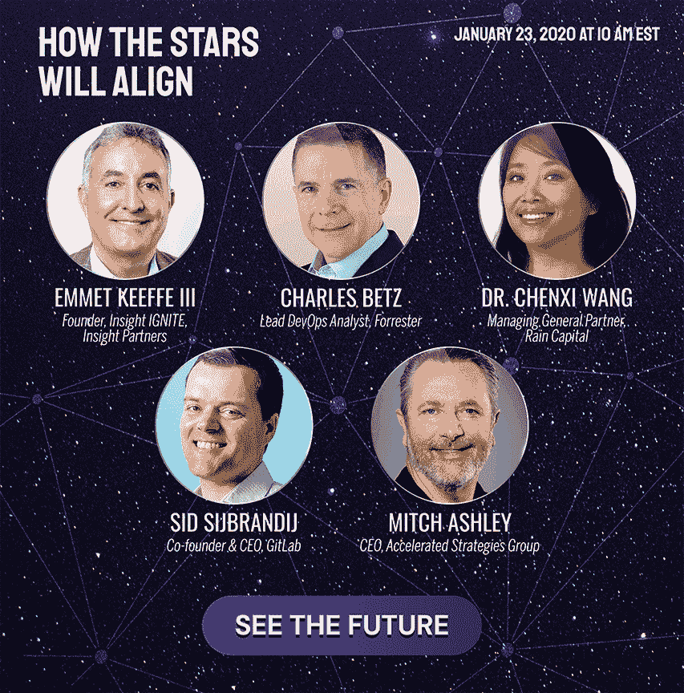

# 预测 2020 年:新的一年会带来什么？

> 原文：<https://devops.com/predict-2020-what-will-the-new-year-bring/>

随着假期的临近，我们自然会想到下一年以及它为我们准备了什么。我们会得到更多的钱吗？我们会找到真正的幸福吗？DevOps 和安全性之间会有更好的集成吗？会有更多的 Kubernetes 实例吗？前两个可能有点模糊，但很有可能后两个将在 2020 年 1 月 23 日的[预测 2020 虚拟峰会](https://predict2020.io/)上讨论，届时全明星阵容的行业名人将提供他们对未来的愿景。

水晶球？检查。斯瓦米帽？检查。与行业相关的见解？检查。知道自己在说什么的非常聪明的人？仔细检查。

与去年的活动类似，Predict 2020 将以虚拟环境为特色，包括会议厅、演示剧场、博览馆等。这不仅仅是一系列的 YouTube 现场演示，而是真正的坐在办公桌前的会议体验。

## 扬声器

我们为期一天的主题演讲人包括来自 DevOps、云原生、网络安全、数字化转型和 IT 领域的分析师、从业者、风险投资家和思想领袖。每个人都将分享他们对 2020 年及以后的最佳预测。

预定发言的有:

*   Emmet Keeffe III ，Insight IGNITE 创始人，Insight Partners
*   Forrester 首席 DevOps 分析师 Charles Betz
*   [王晨曦博士](https://predict2020.io/speakers/dr-chenxi-wang/)，雨城资本执行普通合伙人
*   [Sid Sijbrandij](https://predict2020.io/speakers/sid-sijbrandij/) ，GitLab 联合创始人&首席执行官
*   加速战略集团首席执行官 Mitchell Ashley
*   红帽公司首席安全架构师 Mike Bursell

还将有一个展厅，您可以在这里与其他与会者和赞助商互动，观看视频和下载更多信息。

这应该是一个坐在自己舒适的椅子上学习和交流的好日子。

## 注册和赞助商信息

现在就可以在 [https://predict2020.io](https://predict2020.io) 注册。出席免费。

如果你对专家、学者和名人认为来年的大趋势和故事感到好奇，那就在你的日历上做个标记，参加“预测 2020”吧。

— [Alan Shimel](https://devops.com/author/ashimmy/)