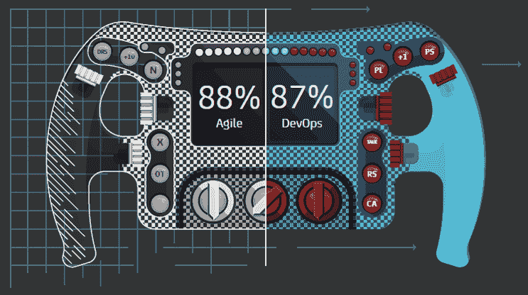

# 可预测的进展:跟踪 DevOps 成熟度度量

> 原文：<https://devops.com/predictable-progress-tracking-devops-maturity-metrics/>

随着 DevOps 方法的不断发展，我们很自然地看到对相关成熟度度量的培养越来越重视。

例如，在 [2016 年 DevOps 报告](https://devops.com/state-devops-report-reaping-results/)中，DORA 的研究人员在创建相关 ROI 测量方面进行了初步尝试。

类似地，由 CA Technologies 赞助的研究人员科尔曼·巴夏礼发布的一份新报告提供了额外的证据，表明随着敏捷和 DevOps 过程的继续扩展，今天的实践者越来越多地使用度量来优化他们的工作。

这份名为“[利用敏捷和开发运维加速速度和客户价值](https://www.ca.com/us/rewrite/articles/agile/accelerating-velocity-and-customer-value-with-agile-and-devops.register.html)”的报告发现，几乎每个企业都采用了某种形式的敏捷，87%的企业在一定程度上采用了敏捷，73%的企业利用了开发运维。

与这些实践的整体成熟度相关，那些正在转向最广泛地采用技术的组织可以预见会看到更大的回报。然而，根据这项研究，尽管被广泛采用，只有三分之一的人广泛部署了这两种方法。

Percentage of Advanced Adopters Reporting Improvements in Customer Experience

基于对 1，770 名高级业务和 IT 高管的调查，该研究还密切调查了组织用来衡量敏捷和 DevOps 计划如何转化为客户交互的特定 KPI。

最值得注意的是，“高级”敏捷和 DevOps 采纳者已经观察到，与“基本”采纳者相比，总体客户体验提高了 87%以上。

就这些努力如何影响业务驱动因素而言，科尔曼·巴夏礼发现:

*   高级敏捷实践者的决策时间缩短了 40 %,相比之下，初级用户的决策时间缩短了 33%。
*   高级 DevOps 采用者注意到上市速度提高了 42 %,相比之下，初级从业者只提高了 24%。

**关键绩效指标**

为此，研究强调了组织用来衡量敏捷和开发运维实践对客户的影响的特定 KPI。事实上，研究发现，在接受调查的所有组织中，有三分之二到四分之三的组织已经建立了这种衡量标准。

科尔曼巴夏礼的研究人员指出，其中至少有一半专注于业务或客户相关的指标，反映了“关键软件对企业实现其核心使命的能力已经变得多么重要”。

最常被调用的指标包括:

*   业务增长(特别是收入):超过 73%
*   运营或流程效率:超过 73%
*   员工生产力:超过 73%
*   客户体验:超过 71%
*   IT 相关成本:超过 71%
*   上市速度:超过 71%
*   客户满意度(通过 NPS):超过 70%
*   决策时间:超过 70%
*   开发质量:超过 70%
*   员工保留率:超过 64%

如果提高应用交付速度和整个组织的速度实际上是参与敏捷和开发运维的主要目标，那么研究证明这些技术正在产生预期的效果。毕竟，调查发现，在被调查的大约三分之一的组织中，决策时间和上市速度正在加快。

与其他重要的关键绩效指标相关，科尔曼·巴夏礼强调指出，整整四分之三的采用者已经推动了[整体客户体验](http://www.ca.com/us/rewrite/articles/application-economy/walmart-envisions-the-shopping-cart-of-the-future.html)以及员工招聘和保留，这是 DevOps 报告中也强调的一项重大优势。

除了对客户产生积极影响，现实情况显然是，敏捷和 DevOps 也在让公司改善员工氛围方面发挥了巨大作用——正如 DORA 的研究人员所指出的那样，当你考虑到当今 it 人才短缺以及吸引新员工通常需要花费多少成本时，这是一个巨大的优势。

科尔曼·巴夏礼的其他关键发现包括“之前和之后”的度量，许多组织正在观察与他们持续采用和改进所涉及的方法本身相关的度量。

我鼓励您[下载整个报告](https://www.ca.com/us/rewrite/articles/agile/accelerating-velocity-and-customer-value-with-agile-and-devops.register.html)，并利用它来衡量您在敏捷和 DevOps 转型方面取得的进展，以及您可能需要重新检查您的努力的地方。

— [阿鲁纳·拉维钱德朗](https://devops.com/author/aravichandran/)