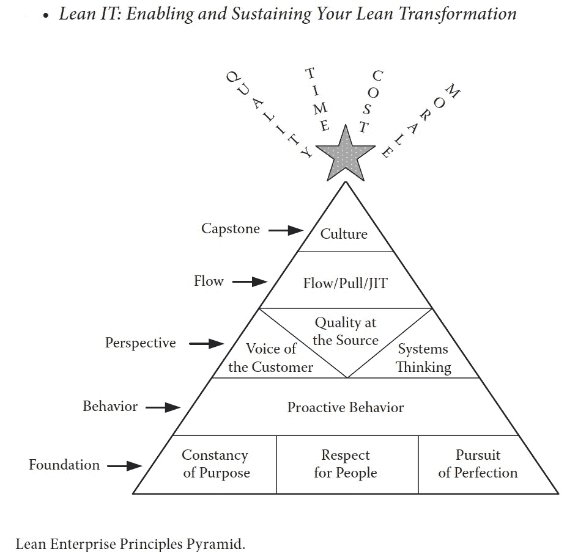

# 原则、系统和工具——关于 DevOps，Shingo 能教给我们什么

> 原文：<https://devops.com/principles-systems-and-tools-what-shingo-can-teach-us-about-devops/>

在我的[上一篇文章](https://devops.com/the-power-of-a-game-what-i-learned-from-facilitating-the-phoenix-project-simulation/)中，游戏的力量:我从促进凤凰项目模拟中所学到的，我们探索了 DevOps 和敏捷实践是如何建立在底层精益原则之上的，这些原则可以追溯到几十年前的丰田生产系统。当你回顾精益的历史时，几乎不可能不遇到伟大的思想家[新乡重夫](https://en.wikipedia.org/wiki/Shigeo_Shingo)。新吾与[大野泰一](https://en.wikipedia.org/wiki/Taiichi_Ohno)([丰田生产系统](https://en.wikipedia.org/wiki/Toyota_Production_System)之父)密切合作，在丰田建立精益生产系统的同时推进精益思想。

作为一个早在 DevOps 出现之前就试图将精益应用于 IT 的人，我总是说 DevOps 是为了创造一个安全的环境，在这个环境中可以深入思考，质疑正在发生的事情，思考疯狂的事情，根据结果进行实验和学习。十年前，我被 Shingo Institute 邀请担任老师、教练和评估员。我最近因我的书《T2 精益 IT——实现并维持你的精益转型》获得了 Shingo 奖。我从新乡重夫的著作中学到的东西极大地加深了我对精益和流动在其中的作用的理解。这些想法反映在下面的精益企业金字塔中，它们在敏捷和 DevOps 中的有效性令人惊讶。

## **原则和 IT 优势**

原则是永恒的普遍真理，它控制着结果，不管你是否相信它。把它看作是一个基本的真理或命题，作为一个信念和行为系统的基础。原则决定后果和结果——积极的和消极的。“创造客户价值”是商业成功的核心原则。如果你不相信客户价值，或者不实现客户价值，你的前景会相当暗淡。

在《精益 IT》中，我介绍了一些推动 IT 成功的关键原则:

让我们从 DevOps 的工作定义开始——一种思维模式、工具集和实践集，它将软件开发和 IT 运营结合起来，以缩短开发/运营生命周期，从而经常交付小的迭代功能、修复和更新，并与业务目标和价值创造紧密结合。

从 DevOps 的角度考虑精益原则金字塔:

*   基金会原则建立了一种信任、尊重、专注和学习的有意文化。
*   行为是我们展示和参与的方式。
*   透视是看待 IT 工作的一种全新方式。
*   心流是有效开发的结果。
*   金字塔的顶点培育了信任、安全、实验、合作和创新的再生文化。
*   结果是更高质量的 IT 解决方案和服务，更少的时间，更低的成本和更健康的团队。

对于任何风格的开发运维、敏捷和高速 IT 来说，要想取得成功，这些原则中的每一条都必须得到解决。你不可能一次解决所有的问题，所以我建议从基础开始，同时采取措施加强流动。如果你专注于这两个元素，对人的尊重和心流，你将永远朝着正确的方向前进。

## **系统和 IT 卓越**

Shingo 将系统定义为高度集成的工具和任务的集合，以完成特定的结果。Shingo 模型抓住了原则、系统、工具和结果之间的重要关系。它还支持阐明如何在 It(或任何组织)中实现卓越的三个关键见解。它需要变得更好，然后通过它的系统、工具和结果不断变得更好(不是开玩笑)。要做到这一点，理解这些要素是如何被原则所充实和强化的至关重要。

## ** ** **见识**

1.  理想的结果需要理想的行为
2.  信念和系统驱动行为
3.  原则指导理想的行为

对于 DevOps 和敏捷来说，Shingo 模型提供了变革的逻辑顺序。换句话说，我们需要回答的关键问题是什么？

1.  DevOps 的理想行为是什么样子的？
2.  我们的人民今天有什么信仰，他们需要什么信仰来拥抱 DevOps？我们今天有什么系统(想一想:工作系统、程序、政策和技术)，它们驱动什么行为，需要改变什么？
3.  我们对精益原则的理解如何澄清我们对问题#1 的理解？

花点时间思考原则和系统在你的转变中的作用。你的方法越是基于原则的稳定性，你成功的机会就越大。如果你或你的组织并不真正相信这些原则，围绕你确实相信的原则进行对话将是一个很好的开始。

— [迈克·奥森](https://devops.com/author/mike-orzen/)