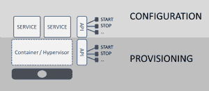

# 供应与配置

> 原文：<https://devops.com/provisioning-vs-configuration/>

如今，围绕着容器——一个码头——有大量的炒作和兴奋，就像虚拟化席卷数据中心一样。在这两种情况下，对运营的兴奋都集中在通过这种技术部署和管理基础设施的容易程度上。

然而，无论是容器还是管理程序，服务器和网络虚拟化之间仍然存在明显的差异，在对可能性感到兴奋之前，必须考虑到这一点。

有两种截然不同的用例，任何东西的虚拟化和容器化都被认为是有益的:规模和部署。

**刻度**

就规模而言，虚拟化和容器化都是优秀的技术。两者都可以完全封装服务(无论是应用程序还是网络),并且能够快速部署同一服务的多个实例，只需要很少(如果有的话)的调配后需求。这是云计算和 NFV 所基于的前提:快速部署服务和应用的克隆，以实现与需求相匹配的弹性可伸缩性。

就可扩展性而言，服务的虚拟化或容器化(主要)是数据中心天堂中的匹配。

**部署**

然而，使用虚拟化或容器实现新服务的快速部署并不一定会带来同样的好处。值得注意的是，与虚拟化和容器相关的标准化和 API 能够实现无缝的可伸缩性，它们只关注容器或虚拟机的管理。调配虚拟机或容器的能力不是问题；API 支持以极快的速度快速配置容器或虚拟机。

这些 API 所不能做的是，一旦提供了这些服务，就可以对其进行快速的配置。

**配置！=供应**

这是一个必须做出的重要区分，以免我们认为我们可以利用虚拟化和容器来实现自助式数据中心，即 IT 即服务。虽然虚拟化和容器使得提供服务实例变得相对容易，但是仍然必须完成这些服务的配置。当部署新服务时，现有配置将不会完全有效。如果只是为了确保服务与正确的应用程序进行交互，那么总会有一些定制必须发生。

这意味着一旦服务供应完成，仍有工作要做。例如，在没有指导它如何分配负载(使用什么算法)和分配给哪组服务器(配置一个池)的情况下，不能简单地启动负载平衡服务。

认识到部署过程中这两个步骤之间的差异并考虑到配置后配置对该过程的影响非常重要。根据配置方法的不同，这一步会对整个部署过程的速度和效率产生严重影响。

出于监控目的，还必须注意虚拟机的运行状况和状态与服务的运行状况和状态不同，无论是应用程序还是网络服务。两者都必须在虚拟化基础架构中进行监控和管理，以满足 MTTD(平均检测时间)和 MTTR(平均解决时间)目标。

在大多数情况下，配置的影响是两者中较大的，其时间需求对应用程序部署生命周期的影响最大。在减少错误和缩短上市时间方面，最终为 DevOps 提供最大好处的是配置流程的优化，而不是配置。