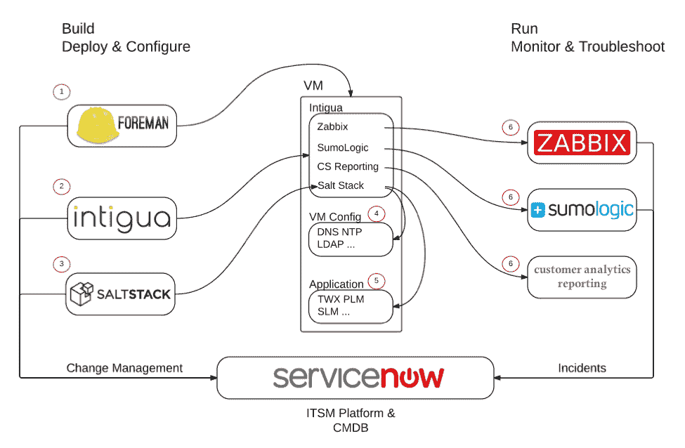

# PTC:使用 DevOps 转变应用程序

> 原文：<https://devops.com/ptc-using-devops-transform-applications/>

大公司和单一应用程序通常与 DevOps 无关。但我最近发现，一些最好的 DevOps 操作来自最大的组织和最复杂的应用程序，PTC 就是最新的例子。

如果您不熟悉 PTC，该公司为希望改善运营的企业提供了广泛的产品。其解决方案涵盖从企业资源规划(ERP)到产品生命周期管理(PLM)和物联网(IoT)平台即服务(PaaS)等领域。其现有产品从内部解决方案开始，现已扩展到包括物联网在内的现代解决方案。但是现在有很大的需求将它们转换为基于云的产品。随着 PTC 沿着这条路走下去，它需要一个现代化的交付链来支持它。

## 输入云服务

因此，PTC 成立了云服务小组，向客户提供其现有平台的云版本。其基于云的产品满足任何其他现代软件即服务(SaaS)和 PaaS 产品的所有相同要求——更快的发布、更频繁的更新和更高的质量。经过几年的云服务团队建设，该公司已经证明，它可以像海报中的 DevOps 环境一样，自动化和改进其传统内部平台的交付。

这段旅程并不容易，它并不是以 DevOps 为目标开始的。目标很简单，就是向客户提供解决方案。DevOps 是其面临挑战后的自然结果。有些挑战是所有开发业务的共同挑战，但其他挑战非常独特:

1.  **许多变量:** PTC 必须支持各种部署中的各种客户。PTC 与客户合作，满足他们对平台版本的不同需求，也了解他们对软件更新的不同需求。并且每一个潜在的变体都有一个独特的 [雪花配置](https://www.sumologic.com/2016/01/04/snowflake-configurations-and-devops-automation/) ，这与大多数云平台向所有用户提供一个生产版本不同，它的整个发布生态系统实际上是一个广泛的配置和版本。
2.  **数据完整性:**无论怎样，数据都是重要的。但是，PTC 与长期以来在其内部解决方案中拥有数据的客户合作，这些数据需要安全地、没有任何瑕疵地传输到云中。这些数据是业务关键型应用程序和持续业务流程的一部分。
3.  **教育用户:** 随着客户继续他们的云计算之旅，PTC 将通过客户成功、持续的知识转移和 PTC 教育服务的无止境在线平台来支持这些变化。

因此，it 不仅面临技术挑战，还面临巨大的变更控制和人员挑战。在任何软件交付可以开始之前，云服务组有一个特定的部分负责必要的开发，以 SaaS 化现有的应用程序，并为每个版本建立一个金主。

最初的交付链是肉搏战:一个解决方案，一个客户，一次一个版本。这需要很多热情的人来管理手动发布过程和客户。

云服务高级总监 Tameem Hourani 指出:“我们不能一直把人扔在问题上。尽管 PTC 已经通过 ServiceNow 建立了工作流，但每个步骤都是手动的，根本无法扩展。但是客户和发行都在以不断攀升的速度增长。让新的团队成员来处理负载是不可行的。

因此，it 转向良好的实践和工具，以构建一个交付链，能够在不到两个小时(而不是几天)内完成全新的部署，并在不到 10 分钟内完成升级。以下是最终的设置:

PTC 对自动化来说并不陌生。该公司利用 ITIL 的做法已经有一段时间了。但 ITIL 缺乏的是与顾客的接触。因此，随着 ITIL 主干网和 [ServiceNow](https://www.servicenow.com) 的到位，PTC 增加了被称为[领班](https://theforeman.org/)的流水线级编排。

在这种配置中，ServiceNow 和 Foreman 实质上充当了整个环境的记录系统。ServiceNow 是所有状态和工作流的记录系统。它也是任何新的更新或部署的基本入口点。Foreman 是记录所有客户和所有部署的基础架构和配置的系统。但它也是编排所有方面的“清单”。

为了管理基础架构协调和创建配置模板，PTC 求助于 [Saltstack](https://saltstack.com/) 。它最初使用另一个工具，但是 Salt 的好处是它允许更多的顺序编排，而不是使用另一个只有状态选项的工具。

PTC 使用另一个独特的工具叫做 [Intigua](http://www.intigua.com/) 。Intigua 引起了我的极大兴趣，因为我[之前谈过服务器代理](http://thenewstack.io/malitia-of-server-agents/)的资源和管理开销。因为现在很多对服务器的监控都是由代理完成的，这实际上变成了一个严重的管理问题。

“发展现代交付链的唯一途径是工具。大多数新工具是由代理人驱动的，”Hourani 指出。“人们很容易忘记，新的工具和流程也是有成本的。通常成本低于他们提供的好处，但它仍然存在。代理商的管理看起来很简单，但实际上大规模这么做时，事情很容易失控。”

PTC 在各种配置中有四个以上的独特代理。Intigua 的价值点之一是“自我修复”的能力，并确保代理始终正确运行。

一旦获得 IP，Intigua 就会根据标签、策略和 AWS 区域安装和配置代理。当 Intigua 运行时，它将确保代理是最新的，并且如果出现问题，自修复代理将开始工作。在高度可变的配置网格中使用 Intigua 作为单一平台的能力是一个巨大的优势。

由 ServiceNow 触发，由 Foreman、Salt 和 Intigua 配置，部署基础设施和代码。但是为了了解和维护客户的所有环境，PTC 需要一些强大的生产监控工具。它使用通过 Intigua 部署为代理的 [SumoLogic](https://www.sumologic.com) 进行日志分析。对于大多数应用程序，使用 Sumo 的单个实例就可以了。但是 PTC 必须为每个客户分离一个实例，而且这个过程必须完全自动化。与另一个监控工具 [Zabbix](https://www.zabbix.com/) 有一些重叠，它被设置为在触发警报时尝试自我修复。

然后是詹金斯。虽然不用于整个部署过程，但它用于在测试过程中驱动测试和管理状态。生产版本的升级是逐步完成的，完整的部署是全栈完成的。

## 服务层风靡一时

云服务和共享服务不一定是新的。我最近写了一篇关于 [Wix](https://devops.com/2015/12/16/wix-requires-visibility-and-insights-are-the-key/#!prettyPhoto) 的文章，也有类似的方法。但是，与 SaaS 化内部解决方案相关的复杂性，以及变量的数量，不仅增加了另一层复杂性，也增加了可重复交付链的另一层价值。

我对这样的案例研究感到谦卑，因为它证明了那些说他们的环境对开发人员来说太复杂的人还没有看到什么是可能的。