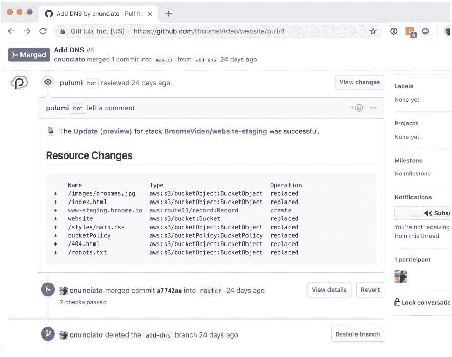

# Pulumi 加强了 DevOps 平台集成

> 原文：<https://devops.com/pulumi-tightens-devops-platform-integration/>

Pulumi 今天发布了其开源平台的 2.0 版本，用于在云中自动供应 IT 基础设施，提供与十几个不同的持续集成/持续交付(CI/CD)平台和源代码管理(SCM)系统的更紧密集成。通过最新的更新，Pulumi 现在还包括 CI/CD 应用程序，通过这些应用程序，pull 请求将触发 Pulumi 预览和更新。

此外，Pulumi 还添加了预览变更的工具，同时使共享架构模式、库和最佳实践变得更加容易。

最后，Pulumi 2.0 增加了额外的工具来执行策略、简化测试和管理秘密。

Pulumi 旨在使开发人员能够使用熟悉的编程工具，如 Python、JavaScript、TypeScript、Go 和。NET/C#。这种方法消除了掌握 YAML 文件或其他专有语言和模板的需要。

Pulumi 首席执行官 Joe Duffy 表示，目标是通过为开发人员提供管理云基础设施所需的“超能力”,加快 IT 管理向开发人员转移的速度。迄今为止，Pulumi 声称其工具已有超过 10，000 名用户。

随着新冠肺炎疫情带来的经济衰退，预计对它的控制向左转移的速度将会加快。作为控制或减少人员的努力的一部分，许多组织将通过给予开发人员对 IT 基础设施更直接的控制来减少对 IT 运营人员的依赖。

然而，与此同时，Duffy 指出，许多 IT 运营人员发现掌握 Python 相对简单，然后他们可以使用 Python 来利用 Pulumi 自动化大量云基础架构的供应，从而变得更加高效。一些组织可能更喜欢保留已经学会如何编程的 IT 操作人员。

与 CI/CD 平台更紧密的集成会在多大程度上鼓励开发人员对 It 基础设施进行更多的控制还有待观察。对 Pulumi 支持的 CI/CD 平台——Jenkins、Spinnaker 和 GitHub——的支持将使开发人员更容易实现这一目标。不太清楚的是，开发商希望在多大程度上控制基础设施。不管怎样，他们中的许多人在这个问题上可能很快就没什么选择了。

当然，Pulumi 并不是唯一一个可以自动提供云基础设施的框架。然而，它确实使开发人员更容易提供基础设施，而不必花时间学习另一套编程工具的细微差别。即使在缩减 IT 人员规模的组织中，开发人员仍然面临着更快地交付更多代码的压力。开发人员可能希望分配给管理 IT 基础设施的时间最多也是有限的。

无论前进的道路如何，许多组织将很快发现他们不能再等待他们的内部 it 文化接受最佳自动化和 DevOps 实践。优化受限 IT 资源的经济压力可能会变得很大。没有人确切知道低迷会持续多久，但很明显，许多组织将试图在未来的日子里少花钱多办事。