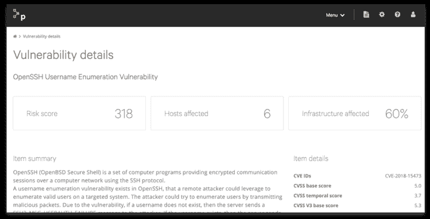

# Puppet 旨在自动修复漏洞

> 原文：<https://devops.com/puppet-aims-to-automate-vulnerability-remediation/>

Puppet 今天发布了 Puppet 修复软件，这使得自动优先处理和修复软件漏洞变得更加容易。

Puppet 产品副总裁 Matt Waxman 表示，Puppet Remediate 基于 Puppet 平台中现有的自动化功能，使 DevOps 团队更容易专注于解决漏洞。他说，大多数现有的解决漏洞的方法依赖于手动过程，这经常导致漏洞不能以特别及时的方式得到解决。

Waxman 说，为了加快这一过程，Puppet Remediate 根据漏洞的潜在严重程度来识别漏洞，然后让 [DevOps 团队](https://devops.com/puppet-ceo-sanjay-mirchandani-reflects-on-a-year-at-puppet/)选择自动修复该漏洞的所有已知实例。Puppet Remediate 将基础设施数据与从 Tenable、Qualys 和 Rapid7 实时收集的漏洞数据相结合，以确定漏洞的优先级。

未经开发运维团队的明确批准，Puppet 修复不会自动修复漏洞。Waxman 指出，这一点至关重要，因为在许多情况下，应用的补丁仍然需要由 DevOps 团队进行测试和审查。一旦获得批准，Puppet 补救包括四个预先构建的任务，使开发运维团队能够处理 80%以上的典型补救工作负载，这一点非常重要，因为一旦发现漏洞，就会发现已经构建和部署的许多其他软件模块也犯了同样的错误。

Waxman 说，使用 Docker 容器部署的 Puppet Remediate 依赖于一种无代理的漏洞修复方法，这种方法给 Linux 或 Windows 应用程序环境增加了最小的开销。他补充说，目标是让开发者或网络安全团队更容易在任何平台上部署 Puppet remediation。

Waxman 说，主要目标是帮助组织采用最好的 DevSecOps 流程。在缺乏自动化的情况下，分配给手动解决现有应用程序中的漏洞的时间量经常受到忽视，因为开发人员要赶在最后期限之前开发新的应用程序。当然，具有讽刺意味的是，每个新的应用程序只会增加需要解决的潜在漏洞的数量。为了恢复漏洞补救流程的秩序，Puppet 正在为将成熟的 IT 自动化框架应用于应用程序安全管理提供案例。

组织完全接受自动化应用程序漏洞修复可能需要一段时间，但鉴于网络安全专业人员的长期短缺，采用这些类型的平台似乎是不可避免的。根本没有足够的熟练网络安全专业人员参与应用程序开发和部署流程的各个方面。

至少，自动化漏洞修复工具应该通知开发人员最常犯的错误。随着时间的推移，随着开发人员意识到他们在重复解决同一个问题，被发现的这些漏洞的数量应该会下降。一旦这一点变得显而易见，期待已久的从应用程序环境中消除特定漏洞的教学时刻就有望到来。

— [迈克·维扎德](https://devops.com/author/mike-vizard/)