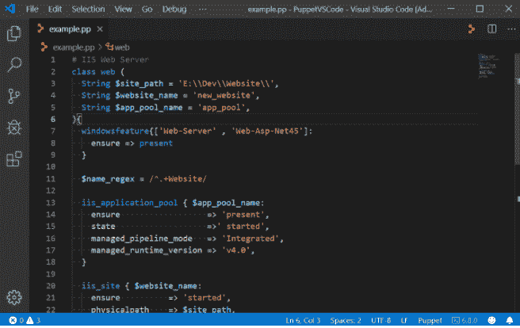

# Puppet 深化了 Windows 集成

> 原文：<https://devops.com/puppet-deepens-windows-integration/>

Puppet 今天宣布，它通过添加组策略迁移功能扩展了对其 it 自动化工具组合中 Windows 环境的支持，该功能可以同时跟踪多个 Windows 配置，并提供对寻求部署开源 Chocolately package manager 的组织的帮助。

此外，Puppet 还通过添加 Puppet PowerShell 期望状态配置(DSC)构建器模块扩展了对 Microsoft 工具的支持，通过该模块，可以直接公开 Microsoft 用来配置操作系统的 PowerShell 工具。

最后，Puppet 还添加了一个 Puppet VSCode 扩展，使 Windows 管理员能够调用 Puppet 域特定语言(DSL ),使用他们现有的用户界面和 Windows 文本编辑器来访问智能感知和错误检查等功能。

Puppet CTO Abby Kearns 表示，随着新冠肺炎疫情带来的经济低迷，人们对 IT 自动化的兴趣显著增加。她说，虽然多年来一直运行 Linux 实例的 IT 组织已经能够访问广泛的 IT 自动化工具，但 Windows 环境还没有享受到同等水平的对等性，即使组织今天试图管理的一半工作负载都基于 Microsoft.net 代码。

卡恩斯补充说，随着自动化的压力比以往任何时候都大，Puppet 看到了填补这一空白的机会。

通过依赖 Puppet 工具来自动化 Linux 和 Windows 平台，降低 it 总成本的机会也出现了，因为组织希望限制或减少 IT 人员。Puppet 声称已经有超过 40，000 家组织在使用它的工具，包括全球 5，000 家组织中的 80%以上。

目前还不清楚微软在 It 自动化工具上的投资程度，特别是与那些将云内外的基础设施作为代码来管理的 IT 供应商相比。然而，自从推出 Azure 以来，微软一直在投资工具，将基础设施作为代码来管理。Puppet 产品组合的深度使 IT 组织能够将 IT 自动化应用于操作系统，现在又通过 Chocolately 应用于应用程序。

不太清楚的是，作为经济衰退后降低成本努力的一部分，IT 组织最终会在多大程度上统一 Windows 和 Linux 系统的管理。大多数组织继续孤立地管理 Windows 和 Linux 系统。然而，随着 IT 组织更广泛地采用 IT 自动化，许多组织都希望尽可能在一组通用的最佳开发运维实践上实现标准化。

与此同时，将 IT 自动化扩展到中端市场的机会仍然很大。大多数企业 IT 组织已经在很大程度上接受了 IT 自动化。中端市场的 IT 团队通常不具备将基础架构作为代码进行管理所需的技能和资源。然而，随着 IT 自动化工具越来越容易被普通 IT 管理员使用，中端市场 IT 组织部署的大量 IT 系统最终将实现自动化的那一天可能很快就会到来。