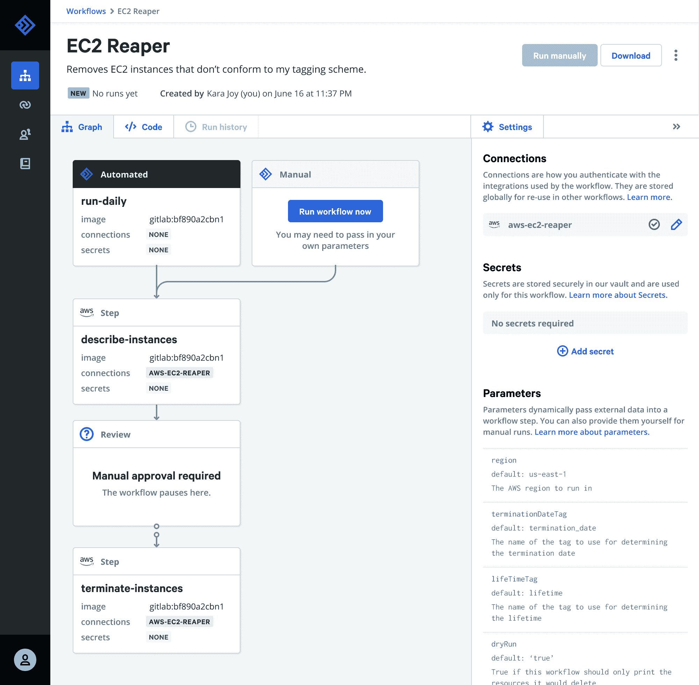

# puppet 启动中继以简化自动化开发运维工作流

> 原文：<https://devops.com/puppet-launches-relay-to-simplify-automating-devops-workflows/>

Puppet today 发布了 Relay 的公测版[，这是一个事件驱动的平台，DevOps 团队可以通过它自动调用预配置的工作流。](https://www.globenewswire.com/news-release/2020/06/24/2052769/0/en/Puppet-Introduces-Public-Beta-of-Relay-for-Cloud-Native-Event-Driven-Automation.html)

公司首席技术官 Deepak Giridharagopal 表示，Relay 会侦听 DevOps 事件，然后这些事件可以触发自动工作流，例如自动删除未充分利用的云资源，实施网络安全控制或补救已知问题。

Relay 连接到数十种 DevOps 工具、云服务和应用程序编程接口(API)，以自动化跨广泛平台的工作流，包括 PagerDuty、GitHub、Datadog、吉拉、Terraform、Slack 等。

Giridharagopal 表示，Relay 还将使 IT 组织能够重复使用工作流，而不是不断拼凑一次性工作流来处理可以使用现有内容解决的日常用例。

这个问题的根源是开发运维环境中的工具泛滥。每个 DevOps 团队倾向于使用他们喜欢的工具创建他们自己的工作流，即使他们可能正在复制已经使用其他工具解决的工作流过程。Relay 提供了一种跨不同的 DevOps 工具重用工作流的方法，Giridharagopal 说这将显著提高 DevOps 的整体生产率。

他补充说，中继平台还被设计为可扩展的，因为它也允许 DevOps 团队创建定制的工作流，然后这些工作流可以由 DevOps 团队的其他成员重用。

Giridharagopal 表示，随着微服务的兴起，DevOps 环境中的工作流自动化显然将成为一个更紧迫的问题。随着需要管理的单个服务数量的增加，在更复杂的 IT 环境中实现工作流自动化的需求变得更加迫切。他说，DevOps 团队不能有效地管理依赖手动工作流程的现代云原生应用程序。

Relay 是向事件驱动架构的更广泛转变的一部分，它在 IT 环境中获得了越来越多的关注。虽然事件驱动架构作为一个概念已经存在了几十年，但基于无服务器计算框架的平台的出现正在改变调用 IT 资源的方式。通过任意数量的 API，使用这些类型的平台来自动化广泛的 it 功能是可行的。

当然，许多组织面临的最大挑战是构建跨多个平台一致工作的自动化工作流。构建这些工作流所需的流程专业知识水平并非无关紧要。Puppet 通过 Relay 提供预配置的工作流，以解决 DevOps 环境中一些更常见的用例。DevOps 团队仍然需要构建他们自己的定制工作流来解决更复杂的用例。然而，Relay 等平台承诺大幅减少创建脚本和相关工作流来处理日常任务所花费的时间。

与此同时，随着新冠肺炎疫情带来的经济衰退，人们对各种形式的 IT 自动化的兴趣正在上升。IT 组织正在快速行动，通过尽可能多地自动化流程来降低 IT 总成本。在许多情况下，尚不清楚一些 it 组织何时能够很快增加员工数量。就其本身而言，自动化现在不仅是为了提高生产率，也是为了生存。