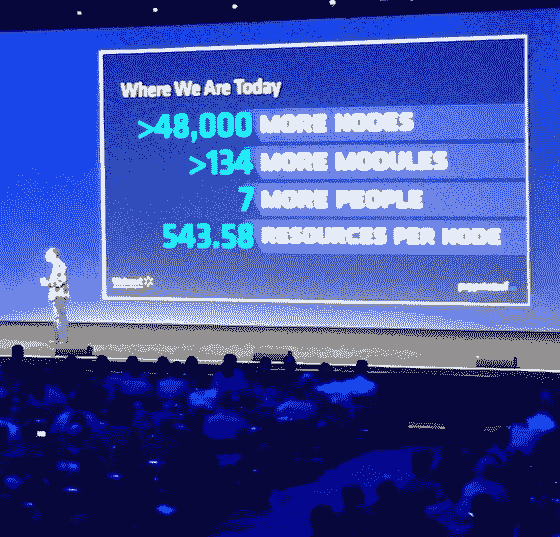
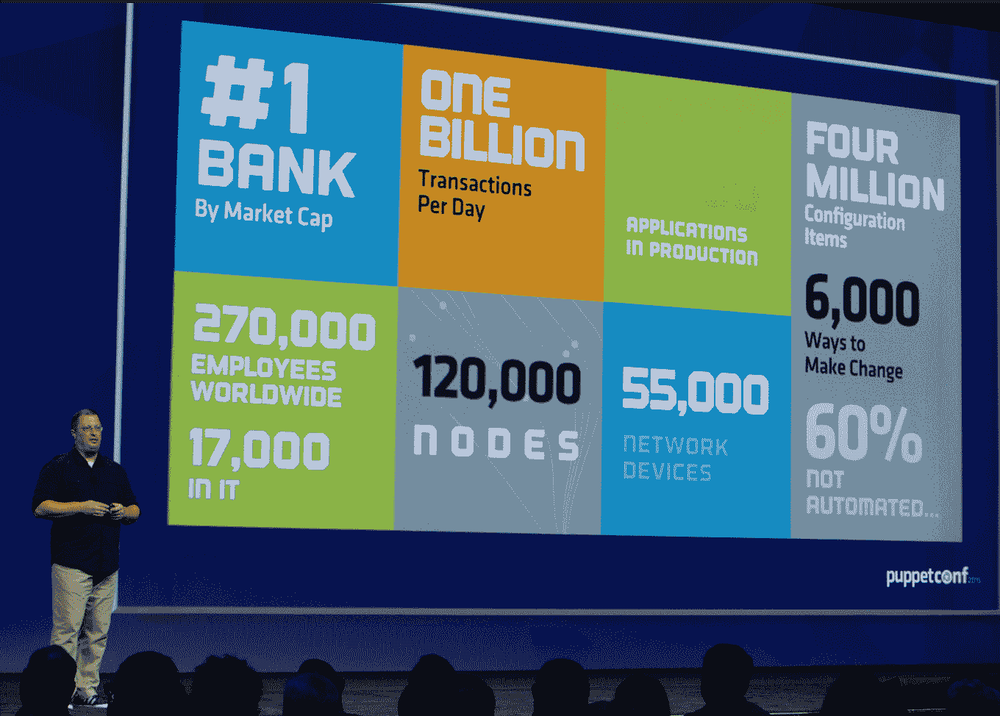
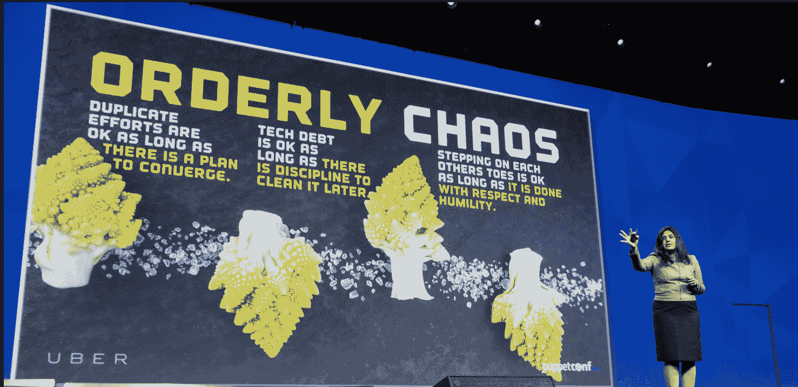

# PuppetConf 2015 与会者利用 DevOps 和自动化解决问题、改变生活

> 原文：<https://devops.com/puppetconf-2015-attendees-solve-problems-change-lives-with-devops-automation/>

一个由 7，000 多名 IT 专业人员组成的蓬勃发展的社区最近在线和亲自参加了 Puppet Labs 的年度 PuppetConf 2015 活动，以了解优步、沃尔玛和富国银行等全球领先企业如何发展强大的组织文化，并利用 DevOps、自动化和其他现代 IT 工具和实践来解决问题和构建高性能数据中心，从而为数百万客户服务并“改变生活”

通过自动化解决改变生活的问题的艺术没有被木偶实验室的客户沃尔玛遗忘。高级技术专家马丁·杰克逊(Martin Jackson)引用了一位同事的话，这位同事在 Puppet Labs 首次开始使用该公司的 it 自动化软件时就预见到了它将带来的好处，“我们将借此改变生活，”他说这一预言已经实现。

从具体的角度来看，他向观众们讲述的改变生活的结果是可以衡量的。借助 Puppet Labs 自动化软件，沃尔玛在短时间内从相对较少的通过自动化管理的节点发展到了多达 48，000 个。

***沃尔玛高级技术专家 Martin Jackson 出席 PuppetConf 2015***

有了这种自动化水平，Jackson 说他的组织能够更好地支持沃尔玛实现以尽可能低的价格服务数百万顾客的目标。

大多数消费者，甚至是企业最终用户，都不会过多考虑在移动设备或电脑上处理像银行交易这样简单的事情。但 PuppetConf 的与会者知道，让一个应用程序变得像用于网上银行工作的应用程序一样普通，背后有一个复杂的技术蜘蛛网。

Wells Fargo， [全球市值最大的银行](https://www.wsj.com/articles/wells-fargo-co-is-the-earths-most-valuable-bank-1437538216) ，是 Puppet Labs 的客户，利用自动化技术进行应用编排、节点配置和应用部署的自动化。

Wells Fargo DevOps 经理 Nate Loomis 用“回到未来”作为比喻，谈到了走在信息技术前沿的必要性，同时也要保证为客户提供可靠的服务。当 Wells Fargo IT 从以节点为中心的观点转变为以应用程序为中心的观点时，其资源调配开始变得更快，从几个月缩短到喝杯咖啡的时间。

通过 Puppet Labs，Wells Fargo 管理着 120，000 个节点和 55，000 台网络设备，每天处理超过 10 亿笔交易，托管超过 2，300 个生产应用，40%以上的运营完全自动化。

***富国银行 DevOps 经理 Nate Loomis 出席 2015***

**文化事关**

DevOps 不仅仅是工具。在波特兰会议中心向人群发表讲话时，优步的商业智能负责人 Komal Mangtani 强调，其 IT 文化推动工程师以进步的名义进行实验，并不断寻找解决问题的新方法。

*随着《火星人》(《T2 》)男主角马特·达蒙的照片出现在大屏幕上，曼格塔尼借用了电影中的一句台词，她告诉与会者，“如果你解决了足够多的正确问题，你就可以回家了，”这是一个幽默的说法，指的是顾客广泛使用优步来搭车回家，这在人群中并没有被遗忘。她强调，虽然大多数人认为优步是一个应用程序、乘车和汽车，但它远不止如此——她指出，在其 it 文化中，有一个由“激烈而谦逊”的工程师组成的专门团队，正在帮助该公司每天提供超过 100 万次乘车。*

***总结事情***

**

*虽然是 Puppet Labs 的创始人兼首席执行官 Luke Kanies 在他的主题演讲中总结了 IT 自动化和 DevOps 的要点，其中包括 Puppet 应用程序编排的现场演示。在会议上发言时，他告诉人群，“我们在木偶实验室是来帮助你们实现这个目标的。作为一家公司，我们致力于缩短从您获得新技术到您的用户获得真正价值的时间。你会看到我们作为一家公司随着时间的推移而发展，越来越好地协调我们提供的工具和我们所做的工作，以帮助您更直接、更一致和更重复地提供客户价值。”*

*要更深入地了解 PuppetConf 2015，请访问博客:[https://puppet labs . com/blog/puppet conf-2015-day-1-back-to-the-future-with-application-orchestration](https://puppetlabs.com/blog/puppetconf-2015-day-1-back-to-the-future-with-application-orchestration)*

*观看主题演讲:[https://puppet labs . com/presentations/puppet conf-2015-lukes-keynote-address](https://puppetlabs.com/presentations/puppetconf-2015-lukes-keynote-address)*