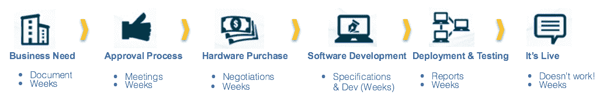
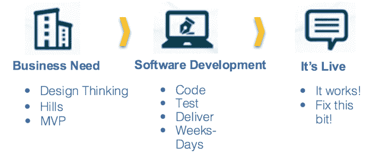

# 将“业务”放在 DevOps 中

> 原文：<https://devops.com/putting-biz-devops/>

最近我和一个客户进行了一次对话，我们都得出结论，DevOps，在一些对话中使用，是错误命名的。DevOps，顾名思义，意味着改进的重点是针对开发和运营。虽然这是真的，但我认为 DevOps 在更高的层次上是为了更快更可靠地将业务需求投入生产。下图说明了这种更高层次的生命周期。

任何有意义的 DevOps 实践的目标都是减少从左边的“业务需求”转移到“它是实时的！”的时间并提高效率在右边。这就是为什么我如此热衷于使用精益方法来改进解决方案交付过程。

那么商业在哪里介入呢？显然，业务应该涉及“业务需求”，但是具有良好开发运维实践的组织让业务贯穿整个生命周期。在一个项目的生命周期中，进行路线修正和指导的能力是非常重要的。我们知道事情会变，我们计划构建的东西可能与我们实际交付的东西不同。将业务与开发和运营团队紧密联系在一起是帮助推动这种一致性的良好步骤。如果我们做对了，我们可能能够构建一个更简单的 DevOps 交付周期，如下所示:

同样重要的是，我们应该衡量对业务至关重要的事情。通过这样做，这也将有助于提高跨业务、开发和运营的一致性。以下是我用来为我的客户改进解决方案交付流程的一些面向业务的指标。这些可能适合放入您的“BizDevOps”衡量策略中:

| **公制** | **详情** | **效益/影响** |
| 部署频率 | 你的用户收到新版本的频率如何？这个标准应该是稳定的版本到版本。 | 您的最终用户应该会看到 bug 修复、新特性等的稳定发展。，建立对您交付的产品的信心。 |
| 改变音量 | 每个版本中有多少新的故事(或特性)？ | 您的最终用户应该会看到不断发布的新功能。 |
| 续订、用户量、新用户 | 你的用户群是在增加、减少还是保持不变？ | 不断增长的用户群表明你的产品是否被认为是有用的。 |
| 每用户收入 | 收入或成本是否会随着用户群的变化而变化？ | 这是显示你的产品的价值和经济影响的另一个指标。 |
| 客户体验 KPI | 

*   Customer ticket quantity
*   Event severity ratio
*   System availability

 | 这些指标让你对你的产品的整体质量有一个视角。 |

采用对您的团队和项目有意义的正确的面向业务的度量标准将帮助您将您的 DevOps 能力扩展到更广泛、更有意义的“BizDevOps”实践中！

有关相关指标的更多信息，请查看我的博客“[项目经理如何衡量云项目的成功](http://www.thoughtsoncloud.com/2015/07/how-project-managers-can-measure-a-cloud-projects-success/)”另外，请参考 Forrester Consulting 关于 IBM UrbanCode 在 https://ibm.biz/BdXUjt[的总体经济影响的报告](https://t.co/os5nTMpGDE)

**关于作者/里克·韦弗**

Rick Weaver 是 IBM Cloud 的主管，领导美国东部云顾问公司。Rick 拥有与 IBM 全球最大客户合作的丰富经验。Rick 领导的工作是帮助世界各地的客户改进他们在开发运维、软件工程、敏捷采用、自动化和云实施方面的实践。在之前的工作中，Rick 领导过 Rational Lab Services for AP and China，IBM 的 SOA 工具战略，帮助推动了 IBM 工具开发和集成的内部转变，并领导了 WebSphere Tools 的全球技术销售团队。Rick 住在德克萨斯州的达拉斯，已经在 IBM 工作了 25 年。

联系瑞克 [LinkedIn](https://www.linkedin.com/in/rick-weaver-962a4b10) | [Twitter](https://twitter.com/weaver_rick)