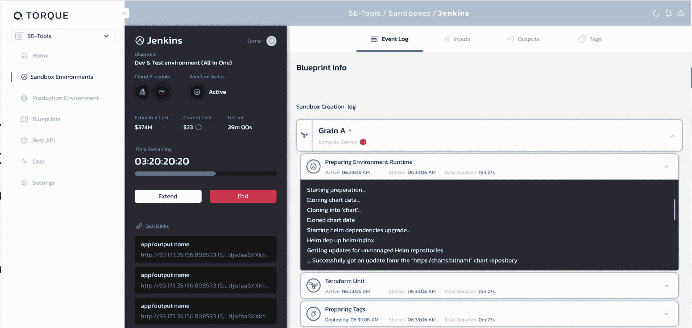

# Quali 向平台添加控制平面来管理 IaC

> 原文：<https://devops.com/quali-adds-control-plane-to-platform-to-manage-iac/>

Quali 在其 Torque 平台中添加了一个控制平面，使 DevOps 团队能够在[异构分布式计算环境](https://devops.com/?s=heterogeneous%20distributed%20computing%20environment)中一致地提供和协调基础设施。

Quali 的产品副总裁 Amir Rosenberg 表示，控制平面允许 DevOps 团队通过可重用的蓝图集中管理基础架构的供应，这些蓝图可通过自助式门户访问，个人开发人员也可以访问。他说，这种方法消除了 DevOps 团队代表开发团队手动配置基础架构时出现的瓶颈。

Torque 的最新版本还增加了增强的可见性和成本控制功能，例如设置最大持续时间和并发环境数量的限制以及环境总成本的限制。还包括 Kubernetes 集群的成本报告工具，以及可应用于蓝图、沙盒和空间的改进的预测和资源消耗策略。

安全性增强包括新的可定制的基于角色的蓝图访问、API 令牌控制以及与机密管理平台的集成。

通过其软件即服务(SaaS)平台，Quali 可以通过云帐户或连接到存储蓝图的 GitHub 帐户的用户界面来访问 Torque。Rosenberg 说，目标是使 DevOps 团队能够在不影响开发人员工作效率的情况下保持对基础设施供应方式的控制。他指出，在越来越多的组织启动多个应用程序开发项目的时代，人们对开发人员的速度比以往任何时候都更加敏感。

事实上，基础设施配置不当是因为开发人员犯了错误。例如，端口处于开放状态并不罕见，网络犯罪分子随后会利用该端口来窃取数据。Quali 正在提供一个 DevOps 平台，使集中应用策略成为可能，这些策略充当护栏，防止开发人员犯供应错误。作为使用 Terraform 等工具创建的脚本的替代方案，蓝图可以自动部署完整的应用程序环境。这种方法还提供了更多关于资源消耗方式的可见性。

理论上，开发人员在管理基础设施上花费的每一分钟，都可以减少他们编写代码的时间。Rosenberg 指出，随着应用环境变得越来越复杂，开发人员将基础设施作为代码来管理变得越来越具有挑战性。问题是可以为开发人员提供基础设施的 DevOps 团队被他们需要管理的项目数量所淹没。因此，DevOps 团队正在成为瓶颈。当然，这只会鼓励更多的开发者自己提供基础设施，Rosenberg 指出，这会导致更多的错误。

尚不清楚 It 组织何时甚至是否会寻找一种替代方案来减少对开发人员的依赖，但大多数人似乎都认为开发人员有更好的事情可做。