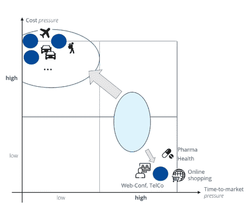
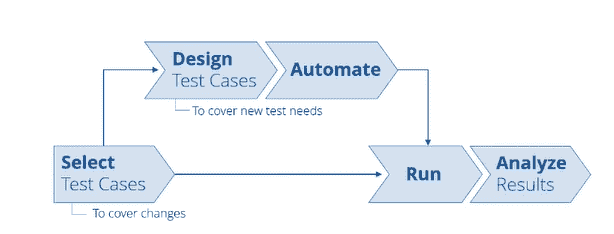
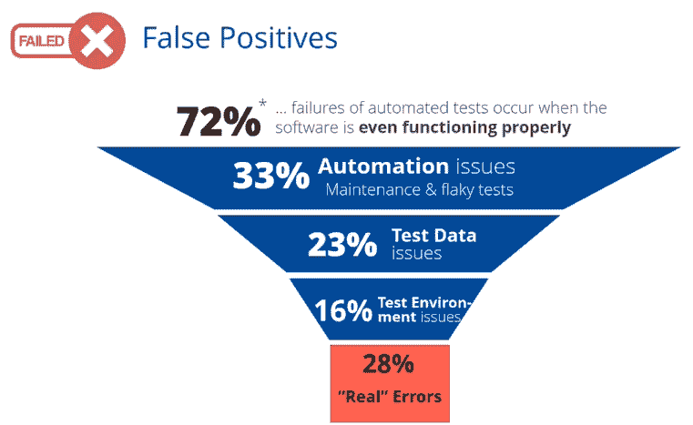

# 新冠肺炎疫情期间的质量与速度

> 原文：<https://devops.com/quality-at-speed-during-the-covid-19-pandemic/>

回想 2015 年。美国经济正处于高速增长的早期阶段，这一势头将持续数年。在某种程度上，95%的组织都在实践敏捷。分配给 QA 和测试的 IT 预算比例刚刚从 18%增加到 26%(凯捷《世界质量报告》)。

成为测试界的年度流行语。随着所有关于 DevOps 和敏捷的讨论，很明显速度很重要。事实上，大多数团队还没有达到的水平。敏捷的采用率仍然很低(每个组织中只有不到 50%的团队真正实践了敏捷)，成熟度甚至更低(只有 17%的实践者报告了成熟的采用率)。尽管如此，不祥之兆依然清晰可见。领导者想要更多更快的应用程序开发——所以测试人员至少应该为即将到来的风暴做好准备。

从那时起，几乎所有行业的组织都发展到了一个最佳状态，上市时间压力相对较大，成本压力适中。截至 2019 年底，在大多数组织中，速度质量已经从流行词发展到业务。

但是新冠肺炎来了。现在，我们正处于全球化的疫情之中。每一个企业、每一个非营利组织和每一个政府机构都会受到影响，但影响的方式不同。

对速度的期望突然转变为各种各样的组织的超速运转，包括政府机构和非营利组织、医疗保健和制药公司、在线零售商、在线会议提供商和电信公司。是的，每个人都已经在努力加速他们的软件交付过程。许多企业组织已经在扩展敏捷和开发运维方面取得了巨大的进步。但是，这些组织中很少有人能够以目前所需的极限速度交付应用程序。

对于另一组人来说，降低成本突然成了头等大事。航空公司、酒店以及其他旅游和休闲组织经历了如此巨大的财富变化，以至于速度不再是问题。焦点转移到提高成本效率，以努力抵消这些惊人的损失。

假设高质量是不可妥协的，那么从质量的角度来看，这两个群体面临着截然不同但同样艰巨的挑战。

第一组中的组织突然需要以初创公司的速度构建、测试和发布应用程序，但遗留系统、复杂的应用程序环境和严格的监管审查带来了额外的负担。以速度保证质量仍然是目标，但是“速度”部分要快得多。

第二组中的组织需要确定如何继续满足严格的质量要求，同时大幅缩减测试预算。质量和速度现在并不重要。速度被经典的成本-质量-速度三角的另一个角所取代，成为新的口号“成本决定质量”

在当前形势下很难找到好消息。但是，至少从软件测试的角度来看，还是有一些安慰的。无论你是面临前所未有的上市时间压力，还是极端的成本压力，相同的核心“测试效率”策略都会帮助你。

这里有一个在软件测试过程的不同步骤中提高测试效率的方法的快速概述。

## **选择和设计测试用例**

我将这两个步骤放在一起讨论，因为它们都面临着一个共同的挑战:直觉。大多数现代商业系统都非常复杂——如此复杂以至于对于大多数测试人员来说，直观地识别覆盖特定测试需求的最佳测试集是不可行的。有一个更系统的方法来找到最小的——但是最有效的——测试集将会节省你的时间和金钱。

对于设计渐进测试的测试用例，线性扩展和成对测试等方法会有所帮助，而增强智能可以极大地简化它们。

为了选择回归测试应该运行的测试用例，考虑变更影响分析。一些方法识别哪些对象受到给定变更的影响，然后帮助您将测试范围缩小到受影响的对象。这通常会减少 15%的测试范围。不错，但是你可以做得更好。

人工智能支持的变更影响分析根据变更是否会给对象带来风险，准确定位给定更新中需要测试的内容。使用这种方法，您可以减少 85%或更多的测试工作。这种方法不仅更快更便宜，而且在发现缺陷方面效率更高。影响生产的缺陷数量减少了 75%到 95%，有时甚至是 100%(生产中没有缺陷)。

## **自动化和执行**

在这里，技术脚本是最耗费时间和成本的。保持脚本运行需要一定程度的维护，这种维护会降低测试效率。应对这一挑战的一种方法是采用基于模型的方法来测试自动化。这种方法已经经过了多年的现场测试，并被证明可以解决测试维护的噩梦，这种噩梦注定了太多的测试自动化计划。

最新的产品是人工智能驱动的 UI 测试自动化。这是一个值得深入讨论的大话题——但这里有一个快速的概述。用自然语言指定测试。甚至在实际的 UI 准备好之前就构建测试。随着技术实现的变化，使用相同的测试。像人类测试人员一样理解动态行为。绝对可以测试任何技术——比人的眼睛还快。好奇？敬请关注。

## **结果分析**

对于结果分析来说，假阳性是吸干你资源的吸血鬼。误报是指即使应用程序运行正常，测试仍会失败。他们真的会在成本和速度上杀了你。首先，需要有人找出测试失败的原因。这可能包括手动检查相关的应用程序功能，检查测试自动化，检查测试数据，检查测试环境的每个元素是否都正常运行——甚至可能是以上所有的事情。一旦找到确切的问题，就需要修复它。然后，需要重新运行测试。如果仍然失败，冲洗并重复。

如何阻止误报？首先，用基于模型的测试自动化或者我在上一节提到的人工智能驱动的测试来稳定自动化。当您进入更高级的自动化场景时，有状态测试数据管理和服务虚拟化可以帮助您将测试稳定到适合 CI/CD 的程度。然后，您的最后一个挑战是处理由异步应用程序行为、并发性问题和测试顺序依赖性等导致的不稳定测试。同样，AI 和 ML 可以在这里提供巨大的帮助——标记潜在的假阳性，甚至帮助您确定原因和最佳解决方案。

## **最终想法**

新冠肺炎将原来的质量速度最佳点分裂成了极限速度阵营和极限成本节约阵营。在这两种情况下，提高测试效率的相同核心策略将帮助您提高速度并降低测试成本。如果你面临极大的时间压力，表明你在满足速度预期的同时也降低了成本肯定不会有坏处。如果你目前正在降低成本，因为你所在的行业基本上处于停滞状态，那么现在采取这些措施将会让你做好准备，当世界再次变得更加正常时，你将会加速它的恢复。