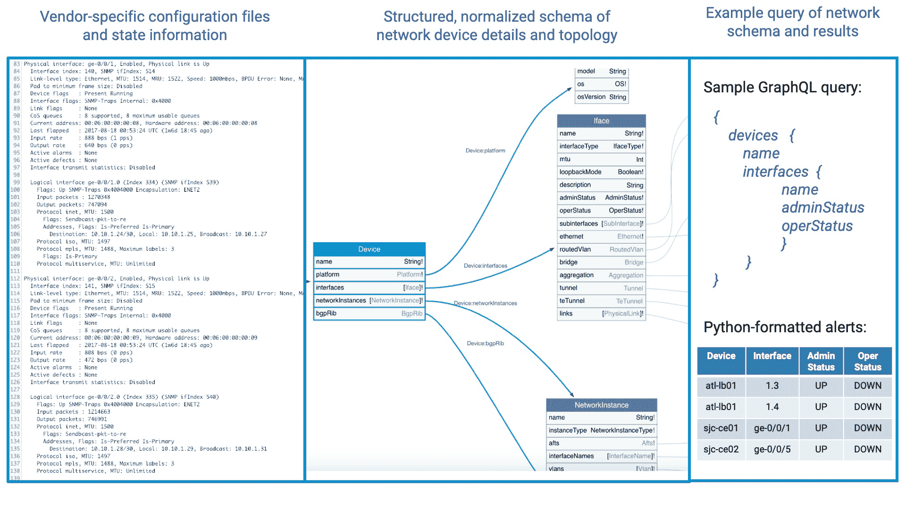
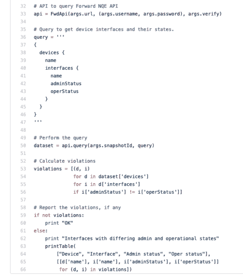

# 像查询数据库一样查询您的网络

> 原文：<https://devops.com/query-your-network-like-a-database/>

网络流程自动化是 DevOps 中经常被忽略的组件。将 DevOps 理念融入网络或 DevNetOps，可以带来更大的流程改进和更灵活的部署。幸运的是，随着标准和开放数据模型的不断发展，自动化网络任务变得越来越容易，从而允许对网络基础设施进行更多的编程访问和洞察。然而，最显著的变化是现在能够编写关于网络设备和拓扑的查询，就像查询数据库一样！

快速部署应用程序更新时，网络灵活性是关键。通常需要更改策略或更新配置。当网络运营商能够以编程方式检查状态和/或修复这些变化中的关键问题时，他们能够最好地服务于开发运维流程。以下是一些在整个网络基础设施中普遍有用的查询示例:

*   我网络中的所有分布层接入链路都有冗余路径吗？
*   当前是否所有边界网关协议(BGP)会话都是与已配置的对等方建立的？
*   down 设备的最近邻是什么？
*   我的网络中是否有任何设备接口当前处于关闭状态？

请注意，我们不再一次查看一台设备，而是在一个简单的查询中查询所有设备的网络问题和状态。面临的挑战是创建一个结构化的网络详细信息数据模型，该模型跨所有供应商和设备类型进行标准化，以便单个编程查询可以利用。例如，目标是能够查询 Juniper 交换机上的接口端口以及 Check Point 防火墙的状态。随着 OpenConfig 等标准的建立，将配置每个设备的详细文本文件转换成这种规范化的数据模型变得越来越容易。OpenConfig 为跨供应商和应用程序的面向网络的应用程序定义了一个通用的语法和模式。

随着 [GraphQL](http://graphql.org/) 查询语言的广泛采用，现在访问这样的网络模式非常有效。网络数据模型在设计上将是图形化的数据结构，GraphQL 非常适合在几分钟内构建对这种模式的灵活数据查询。GraphQL 由脸书开发，并于 2015 年成为开源项目。现在，它已经被数百个注重开发的组织采用，作为一个更有效的 API 模型，而不管底层模式是如何构造的。

除了面向网络的应用程序，GraphQL 已经在 DevOps 组织中广泛使用。GraphQL 非常直观，查询看起来像一个不包含数据的 JSON 对象。查询只是返回一个带有特定请求数据的 JSON 对象。从那时起，将 GraphQL 查询嵌入到脚本语言(如 Python)中以分析、处理或格式化结果只是几行代码的事情。如果您没有在 DevOps 编码中使用 GraphQL，那么您应该使用它！

完整的过程如下图所示(图 1)，其中文本文件可以被解析并规范化为一个表示当前网络状态的开放式图形数据库模式。可以构造 GraphQL 查询，并使用 Python 脚本(图 2)来格式化结果，如第三列所示。以下示例返回网络中每个接口端口的预期管理状态以及当前运行状态(启动或关闭)。Python 脚本会比较这两种状态，并在出现任何差异时发出警报。

Figure 1

在图 1 的示例查询结果中，假设警报是从 F5 负载平衡器(atl-bl01)和 Juniper 路由器(sjc-ce01)报告的。编写可以解析如此不同的设备类型和文本文件的代码——如果没有基于 OpenConfig 之类的标准化数据库模式，将会非常复杂。然而，一个简单的 GraphQL 查询可以应用于整个网络。用于嵌入上述查询、比较结果和显示表格的 Python 代码的主要部分如下所示:

Figure 2

网络运营正成为开发运维流程中日益重要的一部分。当您可以将网络基础设施视为数据库时，网络任务的自动化会大大简化。当利用开放数据模型和查询语言(如 GraphQL)时，将确认网络策略和健康检查的查询嵌入到 Python 脚本中可能是微不足道的。这将首次实现敏捷开发和网络运营的新融合。

大卫·埃里克森