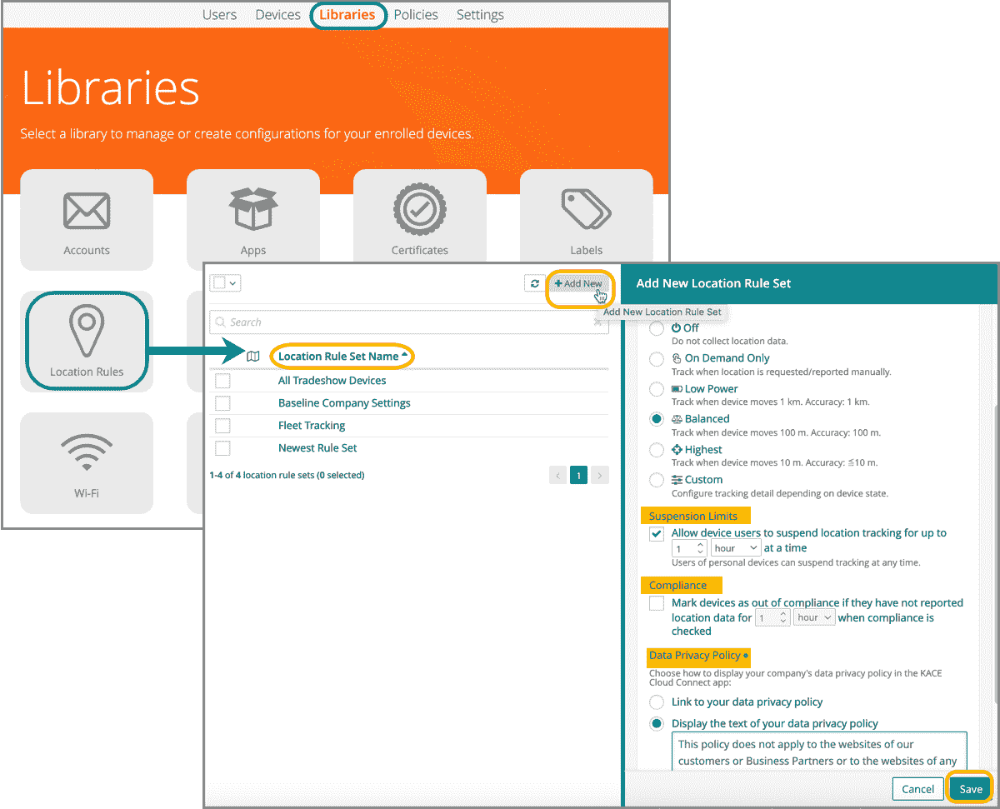

# Quest Software 扩展了 MDM 云覆盖范围

> 原文：<https://devops.com/quest-software-expands-mdm-cloud-reach/>

Quest Software 今天扩展了其移动设备管理(MDM)服务的覆盖范围，除了能够跟踪移动设备和应用的位置之外，还能够对其进行更精细的控制。

KACE 云 MDM 服务增加的功能[包括支持 Android 设备的“Kiosk Mode ”,允许管理员锁定设备并限制特定应用程序或任务的活动，以及不允许的应用程序功能，该功能为 Android 设备带来了与苹果 iOS 设备相同的黑名单功能。](https://www.globenewswire.com/news-release/2020/03/03/1994255/0/en/New-Quest-KACE-Cloud-MDM-Simplifies-Mobile-Endpoint-Management-and-Minimizes-Fraudulent-Access.html)

Quest Software 还为 MacOS 设备添加了文件加密工具，并扩展了云服务的多租户功能，使配置文件能够在 Apple Business Manager 或 Apple School Manager 中应用。

Quest Software 的 KACE 云 MDM 产品经理 Jody Evans 表示，该服务的最新更新旨在使 it 团队更容易使用云服务管理各种移动计算设备，而不必部署和管理。

从长远来看，大多数 IT 团队的目标将是依靠云服务尽可能统一终端管理。埃文斯说，与此同时，大多数组织将继续依赖云服务和本地设备的组合来管理终端。

尚不清楚 It 组织统一终端管理的程度和速度。内部 IT 团队倾向于管理台式机和笔记本电脑。然而，平板电脑和智能手机等移动计算设备通常通过电信运营商或托管服务提供商(MSP)提供的门户进行管理。

IT 系统管理领域的竞争自然非常激烈。KACE 的产品线自 2003 年以来就一直存在，当时该公司开发了自动化管理 Windows 桌面的设备。2010 年，戴尔收购了 KACE 网络公司，2012 年收购了 Quest 软件公司，该公司与 KACE 网络公司和 SonicWall 一起成为戴尔软件公司的一部分。大约在同一时间，VMware(也是戴尔的一部分)也一直在通过收购将其业务扩展到 MDM 领域。

为了帮助筹集将戴尔私有化所需的现金，Quest Software 和 SonicWall 被正式拆分为两家独立的公司，并出售给风险投资公司。KACE 产品线仍由 Quest Software 负责。从那以后，Quest Software 一直在逐步推出以云服务形式交付的产品组合实例。

然而，与此同时，DevOps 的崛起也改变了 ITSM。虽然大多数终端仍然使用基于 ITIL 框架的服务台进行管理，通常依赖作业传票来管理任务，但驻留在这些平台上的许多移动应用程序正在使用 DevOps 流程进行管理，以更快地提供更丰富的终端用户体验。目前还不清楚使用 ITIL 流程的端点管理和使用 DevOps 流程的移动应用的融合程度。

与此同时，对移动应用程序和设备的依赖继续增加。许多最终用户现在在平板电脑和智能手机上花费的时间比他们在传统桌面系统前花费的时间还要多。IT 团队现在面临的挑战是确定管理从未如此多样化或复杂的 IT 端点环境的最佳方式。

— [迈克·维扎德](https://devops.com/author/mike-vizard/)