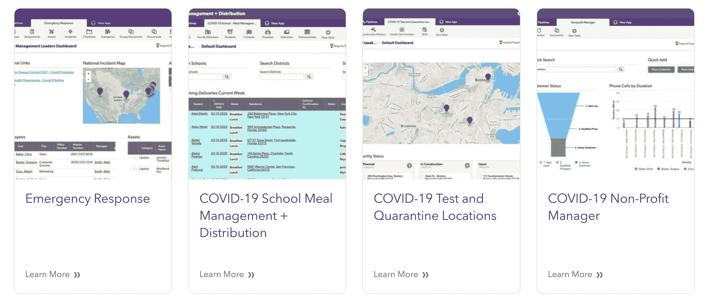

# Quick Base 为急救人员提供免费的低代码平台

> 原文：<https://devops.com/quick-base-makes-free-low-code-platform-available-for-first-responders/>

Quick Base 是一家提供构建低代码应用程序平台的公司，该公司本周宣布，它将在 9 月 30 日之前免费向需要快速构建应用程序以解决新冠肺炎疫情 T2 问题的急救组织提供其平台。

Quick Base 的首席产品和技术官杰伊·贾米森(Jay Jamison)表示，很明显，急救人员很快将需要应用程序来跟踪从呼吸机等资产到热图的各种事情，热图显示了某个地理区域的患者数量与重症监护病房(ICU)的数量之间的关系。

Quick Base 还提供模板，可用于构建最常见类型的应急响应应用程序，例如新奥尔良市已经在使用的应用程序。

Jamison 指出，其他需要的应用程序包括实时跟踪可能无视新冠肺炎限制的企业或不顾紧急法令驱逐租户的房东的能力。

这些应用程序中的大多数需要在几天内开发，而不是几周或几个月。他说，为此，Quick Base 还向急救组织提供其内部客户成功员工以及第三方顾问的专业知识。

此外，Quick Base 计划通过其在线商店认证许多这些应用程序，这将使一个地方的第一响应者组织更容易利用另一个第一响应者组织已经开发的应用程序。

总的来说，贾米森说，第一响应组织需要在整个组织中应用 DevOps 原则，以适应高度不稳定的情况。他指出，随着程序的发展和新的紧急法令的颁布，应用程序无疑将需要修改。

从 IT 角度来看，最大的挑战是许多第一响应者组织缺乏动态构建应用程序所需的流程专业知识。具有 IT 专业知识的志愿者将需要与医疗专家一起工作，医疗专家将需要最有可能部署在云中但可通过一系列移动计算设备访问的应用程序。所有这些应用程序在首次部署时完美运行的可能性几乎为零，因此及时更新应用程序至关重要。

当然，应用程序和 IT 流程并不总是对抗疫情时首先想到的事情。然而，第一反应者对现场不断变化的情况反应越快，就有可能拯救越多的生命。在一些大城市，急救人员可能已经获得了一系列应用程序，这些应用程序可能会在不同程度上扩展以应对当前的挑战。然而，在较小的地区，这种应用程序的可用性充其量只是名义上的。

Quick Base 并不是构建应用程序的低代码和无代码工具的唯一提供者，因此快速构建应用程序有很多选择。无论采用哪种平台，时间都是关键。意大利、西班牙和中国的疫情已经表明，事态失控的速度有多快。如果任何新的应用程序将与任何其他新兴的 CIVID-19 热区相关，则构建该应用程序的工作需要立即开始。

— [迈克·维扎德](https://devops.com/author/mike-vizard/)