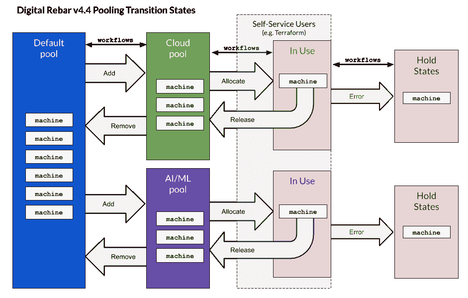

# RackN 将裸机服务器转变为云

> 原文：<https://devops.com/rackn-transforms-bare-metal-servers-into-a-cloud/>

RackN 正在对 RackN Digital Rebar Platform 进行更新，这将使使用 Terraform 等工具来配置裸机服务器变得更加容易。

公司首席执行官罗布·希施菲尔德表示，该平台的 4.4 版本增加了一个应用编程接口(API)，使裸机服务器能够抽象为资源组。他说，IT 管理员可以根据属性图请求一台机器来提供一组裸机服务器，就像它们是一个云平台一样。他指出，RackN 还提供了可用的工作流，使 IT 团队能够更容易地自动化分配和重新分配流程。

与此同时，RackN Digital Rebar Platform 的最新版本增加了对可信平台模块(TPM)安全引导的支持，这是一种行业标准，可确保只有可信的软件才能加载到机器上。大多数自动化平台不支持 TPM 安全引导，这迫使 IT 团队在自动化的好处和拥有安全平台之间做出选择。希施菲尔德声称，RackN Digital Rebar Platform 是 VMware 环境中唯一支持(TPM)安全引导的自动化框架。

他说，在这个最新版本中，带外管理密码、TLS 证书和 VLANs 在默认情况下也是安全的。

希施菲尔德说，IT 团队希望能够像供应虚拟机一样供应裸机服务器，就像它们是代码一样。同样重要的是，他们需要一个自动化工具，以便在需要将这些机器重新分配给另一个工作负载时，能够轻松地取消这些机器的配置。

然而，实现这一目标不应该要求 IT 组织雇用一名站点可靠性工程师(SRE)，他说，并指出 RackN Digital Rebar 平台是为普通 IT 管理员设计的。SRE 可以在 RackN Digital Rebar 平台中定义 IT 管理员可以重用的工作流；事实上，RackN 计划增加对 Git 库的支持，这将使共享工作流变得更容易，希施菲尔德补充道。

虽然在云中部署工作负载与在本地 IT 环境中部署工作负载的原因各不相同，但随着人们对在裸机服务器上部署 Kubernetes 集群的兴趣不断上升，云平台相对于本地 IT 环境的自动化优势正在缩小。大多数 It 团队可能还需要一段时间才能将裸机服务器当作另一种云资源来管理。然而，现在实现这一目标的主要障碍可能是文化上的，而不是技术上的。

与此同时，IT 团队应该期望看到裸机服务器在容器时代得到更广泛的应用。当然，至少在可预见的将来，对虚拟机的需求总是存在的。挑战在于，随着新类别的云原生应用程序工作负载的出现，IT 基础架构环境本身正变得越来越多样化。