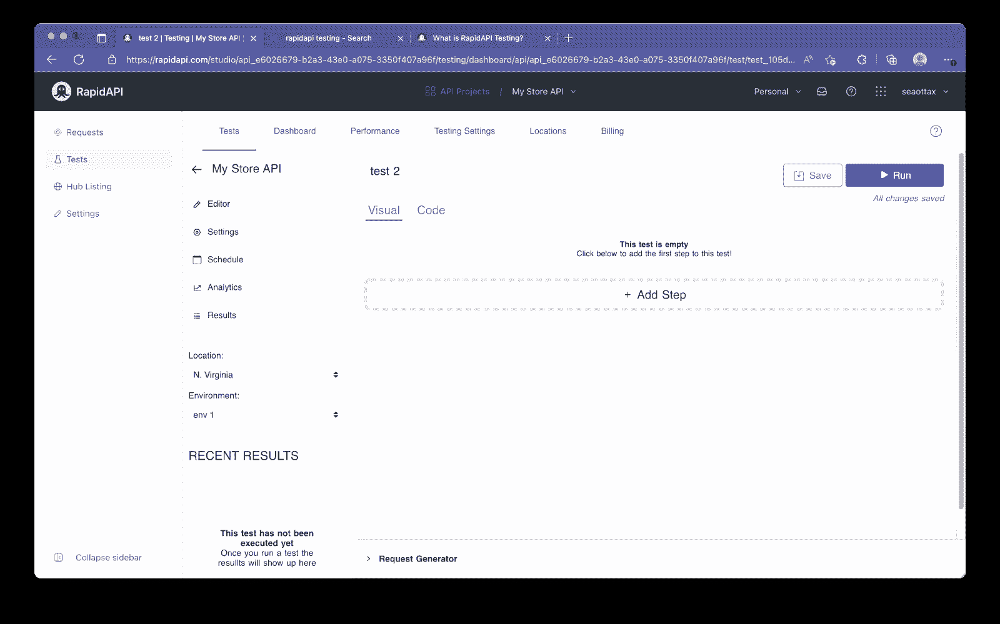

# RapidAPI 增加了工具来简化 API 的构建

> 原文：<https://devops.com/rapidapi-adds-tool-to-make-building-apis-simpler/>

RapidAPI 今天在其产品组合中增加了一个免费的 RapidAPI Studio 产品,使开发人员更容易构建、消费、管理和货币化应用编程接口(API)。

RapidAPI 高级副总裁兼产品负责人韦德·韦格纳(Wade Wegner)表示，RapidAPI Studio 可用于测试版，让开发人员更容易在设计和开发、测试和管理之间切换，而不会失去上下文。

Wegner 补充说，它还被设计为通过浏览器访问，作为桌面应用程序、macOS 本机应用程序或作为微软提供的 VS 代码工具的扩展，整合到开发人员的工作流程中。

他指出，这种方法也使得开发团队更容易在 API 项目上合作。

API 是所有现代应用开发项目的基础。现代应用中包含的每个微服务都有自己的 API。因此，组织正在构建和公开的内部和外部 API 的数量呈指数级增长，尤其是随着[数字业务转型](https://digitalcxo.com)计划的数量持续增长。虽然今天使用的大部分 API 都是面向内部的，但是随着更多的业务流程数字化，面向外部的 API 的数量会急剧增加。

不太清楚的是，在部署这些 API 之后，组织中谁负责管理它们。在某些情况下，开发人员对它们以及应用程序的每个其他组件承担责任。然而，开发人员倾向于转向其他项目；DevOps 和网络安全团队负责管理、保护和更新 API。在一系列备受瞩目的违规事件之后，这是更好地保护软件供应链的更大努力的一部分。

不幸的是，这些 API 的文档在许多组织中有些松散。在许多情况下，组织甚至不确定已经部署了多少 API。令许多组织懊恼的是，他们还发现，以前被开发人员放弃的所谓僵尸 API 仍然可以被网络犯罪分子利用来泄露数据。

同时，API 的管理变得越来越复杂。除了现有的 REST APIs 和基于 XML 的遗留 web 服务，组织现在也在部署 GraphQL APIs。结果是 API 模式的混合，需要不同级别的专业知识来管理和保护。

尚不清楚对保护软件供应链的日益关注会对 API 管理产生怎样的影响。然而，很明显，网络犯罪分子越来越善于发现不安全的 API，通过这些 API 他们可以泄漏数据。组织面临的挑战是，如果没有一个合适的框架来管理这些 API，就无法保护它们。无论如何，随着构建和部署 API 变得更加简单，API 管理危机很快就会到来。唯一有待观察的是，在这个问题完全失控之前，组织将在多大程度上领先于这个问题。