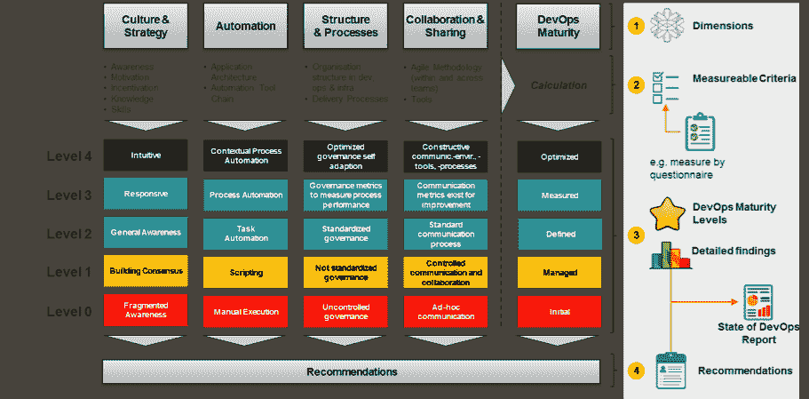

# 你准备好你的 DevOps 转型了吗？

> 原文：<https://devops.com/ready-devops-transformation/>

错过发布截止日期、长发布周期和高风险发布已经成为过去。如果您的目标是持续的应用交付，以实现快速的反馈循环和减少浪费，DevOps 实践提供了实现这些目标的方法。

[DevOps](http://automic.com/devops-ara) 是关于敏捷转型的，它超越了敏捷开发，进入生产，以实现持续交付。DevOps 实践为敏捷开发之后的必要的下一步提供帮助，以利用敏捷的全部潜力，并通过开发团队避免大规模的交付后变更，但在他们准备投入生产之前。

挑战在于驾驭这种[开发运维转型](http://automic.com/devops-ara)——让它更快发生，风险更小。这种转变的速度和方向取决于具体情况，例如，您部署的技术类型、您的组织结构和流程的形状，以及您最重要的业务和 IT 需求是什么。

## 开始转型之旅

只有评估了您组织当前的 DevOps 成熟度和方向，您才能开始扩展您的 [DevOps](http://automic.com/devops-ara) 实施，并在持续交付的转型之旅中更快地前进。换句话说，要知道你要去哪里，你需要知道你现在在哪里。

通过用 0 级和 4 级( *见图* )来衡量你在这些维度上的状态，你可以确定自己目前的状况，并为未来的改进提出建议和措施。

**文化和战略:** DevOps 需要一个强有力的愿景和战略，它的成功将取决于你的员工的意识、知识、技能和动力。该支柱针对所有相关单位(开发和运营)中的敏捷性，阐述了您的意识培养和支持计划以及激励系统的有效性和一致性。它还包括人们的情绪和动机的快照，以使这种变化成为现实。

[**自动化**](http://www.automic.com) **:** 这一支柱阐述了作为持续交付的重要前提的 IT 自动化方面的组织成熟度。对应用架构和 DevOps 自动化工具链都进行了评估。评估包括应用程序配置、供应、部署、测试、基础架构和应用程序监控方面的相关自动化功能。成熟度是跨基础架构、平台和应用程序这三个层次并按技术堆栈进行评估的，例如，您的 SAP 平台。NET 或 Java 堆栈——然后组合成一个级别。

**结构和流程:**对所有相关单位目前使用的组织结构、方法和流程进行持续交付有效性评估。这着重于他们的敏捷适应性和成熟度。治理以及敏捷团队和过程如何嵌入到更广泛的组织中也是评估范围的一部分。

**协作和共享:**开发、运营、基础设施和中间件团队之间的协作和共享对于加速交付流程并使其更加精简至关重要。该评估着眼于工具(例如，用于部署的工具)、信息(例如，交付管道中的包的状态)、过程(例如，ITIL 发布过程和开发发布过程)和功能(例如，开发中的发布工程师和生产中的部署专家)的特定共享与冗余。

现在你对事实了如指掌。[DevOps 成熟度评估服务](http://automic.com/devops-consulting)将所有这些作为记录的调查结果，包括一系列关于如何扩展和成熟您的 devo PS 活动的建议。