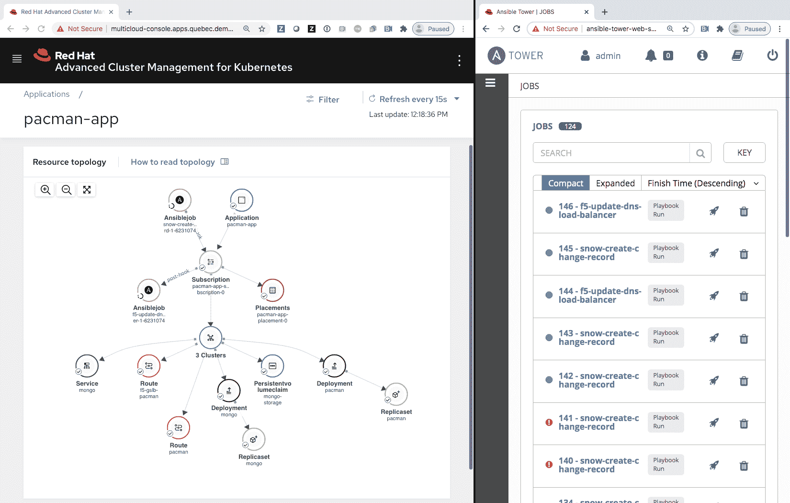

# Red Hat 扩展了 Ansible 自动化框架的范围

> 原文：<https://devops.com/red-hat-expands-scope-reach-of-ansible-automation-framework/>

Red Hat 今天在其在线 [AnsibleFest 2020](https://www.ansible.com/ansiblefest) 会议上宣布了 Ansible Automation 平台的内部版本，称为 Private Automation Hub，并预览了连接由 Red Hat 作为云服务管理的 Ansible Automation 平台和内部版本的技术。

此外，Red Hat 正在为其认证的 Ansible Content Collections 服务提供更多预集成工作流，用于 Red Hat OpenShift、Kubernetes Core 和 VMware vSphere REST 应用程序编程接口(API)。

最后，该公司预览了 Ansible Automation Platform 和 Red Hat Advanced Cluster Management 之间的集成，Red Hat Advanced Cluster Management 是一种最初由母公司 IBM 开发的工具，用于大规模管理 Kubernetes 集群。作为这项工作的一部分，Red Hat 将整合其 Kubernetes Operators 工具的实施，用于在基于 Kubernetes 构建的 Red Hat OpenShift 平台上部署应用程序，并为 Red Hat Advanced Cluster Management 提供资源操作器，使 Ansible Automation Platform 能够在需要时执行 Kubernetes 集群之外的任务。

Red Hat 的管理副总裁乔·菲茨杰拉德(Joe Fitzgerald)表示，现在有超过 60 个可用的内容集合，可以部署在内部或由 Red Hat 管理的云服务中。他说，连接器将使 it 团队更容易访问由 Red Hat 及其合作伙伴策划的工作流内容，同时继续为他们自己独特的 IT 环境创建存储在本地的自动化剧本。

随着可应用声明性 IT 自动化框架的 IT 领域的数量不断增加，Fitzgerald 表示，IT 团队可以创建的剧本变得越来越全面。然而，与其他 IT 自动化平台不同，Ansible 不要求 IT 运营团队学习如何编码。他说，随着新冠肺炎疫情和大多数员工在家工作，IT 团队试图自动化的工作流数量大幅增加。

该框架现在也可以应用于遗留 IT 环境以及部署了云原生技术的 Kubernetes 集群。在 AnsibleFest 期间，Red Hat 将展示由 Google 开发的 Knative 开源中间件的支持概念证明，该中间件将无服务器计算框架与 Kubernetes 集群集成在一起。

虽然仍然有 DevOps 团队采用可编程框架作为代码来管理 IT，但许多传统的 IT 管理员正在采用 Ansible 作为自动化日益复杂的 IT 环境的手段。Ansible 提供了一个通用框架，IT 团队可以通过该框架自动配置服务器、虚拟机、集群、交换机、路由器和存储系统，而不是为 IT 环境中的每个平台购买和部署自动化工具。随着 Cisco Systems 等供应商支持 Ansible ，能够跨越多个 IT 领域的工作流数量继续增加，因为内部 IT 团队共享他们创建的或由 IT 服务公司为他们制作的行动手册。

无论内部 IT 如何获得对这些行动手册的访问，无论自动化需求是什么，现在都有可能找到用 Ansible 编写的行动手册来解决它。