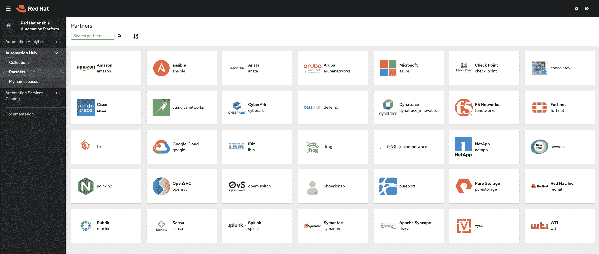

# Red Hat 扩展了 Ansible 自动化框架的范围

> 原文：<https://devops.com/red-hat-extends-reach-of-ansible-automation-framework/>

本周，Red Hat 发布了一系列可下载的自动化 IT 流程的工作流，这些工作流将通过 Ansible Automation Hub 提供。

与此同时，Red Hat 更新了 Red Hat ansi ble Automation Platform，添加了一个自动化服务目录来跟踪工作流和一个投资回报(ROI)计算器，使 IT 团队能够根据使用情况确定哪些工作流最有价值。

Red Hat 还更新了核心的 Red Hat Ansible 塔式自动化引擎，以简化流程并减少瓶颈。

红帽负责红帽 Ansible 自动化平台的副总裁汤姆·安德森表示，红帽认证的 Ansible 内容集合包括来自红帽和经过审查的第三方提供商的工作流。因此，使用 Ansible [来自动管理 IT](https://devops.com/red-hat-extends-scope-of-ansible-tools/) 的 IT 团队可以对这些行动手册和工作流既安全又受支持充满信心，他说。

他指出，Red Hat 决定将 Ansible 工作流内容的管理与底层平台分开，因为很明显，新工作流的可用速度比核心 Red Hat Ansible 自动化平台的更新速度更快。

作为这项工作的一部分，Red Hat 本周还提供了额外的自动化工作流，这些工作流利用 Red Hat Tower 通过一个集中的控制台来自动化任务和工作，以及利用 Red Hat Satellite systems 管理软件和 Red Hat Insights 监控服务的工作流。

Anderson 说，随着新冠肺炎疫情带来的经济衰退，人们对 IT 自动化的兴趣大大增加了。许多组织要么冻结了 IT 员工人数，要么被迫缩减 IT 员工规模。然而，随着微服务和 Kubernetes 集群等新兴技术的发展，管理 IT 环境变得越来越复杂。

当然，一些组织可能会选择暂停采用新平台，但同样多的组织会继续投资于推动数字业务转型计划所需的云原生技术，这需要更灵活、更有弹性的应用程序。安德森说，正因为如此，围绕 IT 自动化项目的紧迫性增加了。

事实上，他指出，Red Hat 已经创建了“办公时间”，在此期间，公司为 IT 团队提供在特定时间接触 Red Hat 人员的机会，以提供额外的指导。

作为一个开源项目，Ansible 作为一个管理框架越来越受欢迎，因为它提供了一种自动化 it 的声明性方法，不需要 IT 运营团队学习如何编码。Ansible 还被包括思科系统和戴尔技术在内的 it 基础设施提供商所接受，这使得 IT 团队可以更容易地创建跨多个平台自动执行任务的行动手册。安德森指出，随着时间的推移，这些跨平台能力促进了生态系统的创建，从而进一步增加了 Ansible 的动力。

毫无疑问，在疫情之前，IT 团队越来越依赖 IT 自动化框架。然而，现在自动化 IT 管理不仅仅是为了提高生产力和效率；在许多情况下，这已经成为一个生存问题。