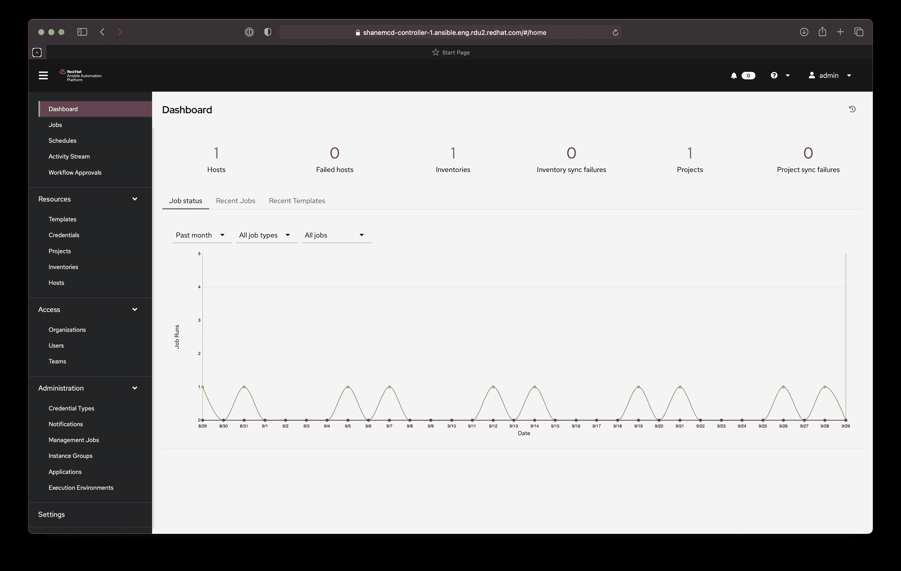

# 红帽扩大了自动化的野心范围

> 原文：<https://devops.com/red-hat-extends-scope-of-ansible-automation-ambitions/>

在在线 [Ansiblefest](https://www.ansible.com/ansiblefest) 期间，Red Hat 宣布推出 Red Hat Ansible Automation Platform 2 预览版，旨在使大规模自动化 it 流程变得更加容易。

Red Hat 负责 Ansible 产品管理的高级经理 Richard Henshall 表示，以前大多数 IT 团队一直在自动化单个流程，但随着组织越来越擅长创建剧本来自动化流程，他们现在需要找到管理往往相互依赖的多个自动化的方法。

Ansible Automation Platform 2 还使 IT 团队能够使用自动化控制器(以前称为 Ansible Tower)来自动化跨基于容器的单片和云原生应用程序的流程，该自动化控制器使用 Red Hat Operator 工具与 Red Hat OpenShift(一种基于 Kubernetes 的应用程序开发和部署平台)进行了更紧密的集成。还有一个自动化网格功能，它将不同的自动化组件连接在一起，并提供状态检查。

Ansible Automation Platform 2 还在 Ansible Engine 中引入了自动化执行环境，使得创建独立的[自动化](https://devops.com/?s=automation)空间成为可能，这些空间可以在整个组织中轻松复制和重复。

Red Hat 还包括一个自动化内容导航器，以帮助团队验证自动化内容是否在最大的环境中正常工作，以及 Red Hat Insights analytics 服务的更新，使自动化控制器可能出现的问题能够浮出水面，并通过自动应用策略来消除。

Henshall 说，展望未来，IT 团队应该期待看到 Red Hat 更加关注使事件成为触发自动化的催化剂。如今，大多数自动化流程都是从 IT 管理员触发流程开始的。然而，随着数字业务转型计划的成熟，显然需要在特定事件发生时触发自动化。

Henshall 说，虽然仍有许多组织刚刚开始自动化 IT 流程，但也有许多组织正在进入下一个成熟阶段。因此，他们现在需要一个自动化平台来简化大规模自动化管理。

总的来说，Ansible 旨在使开发人员和 it 运营团队能够在不需要太多编程专业知识的情况下声明式地创建自动化。然而，创建可靠工作的剧本仍然需要对正在被自动化的过程有深刻的理解。大多数 IT 团队都被建议在流程首次自动化时密切监控流程，以确保它们按照预期执行任务。

最终，现在的问题是大多数 it 流程何时实现自动化，而不是是否实现自动化。当然，DevOps 团队一直处于自动化的最前沿，但现在很明显，随着 it 环境变得更加复杂，云计算和边缘计算平台的兴起，企业 IT 团队需要更积极地拥抱自动化。Henshall 说，自动化的最大障碍是找到一个对自动化流程有热情的人来领导这项工作。

自然，这些努力中的大部分最初将集中在重复、乏味和手动的 IT 任务上，但以前所未有的规模实现 IT 流程自动化的潜力从未如此之大。