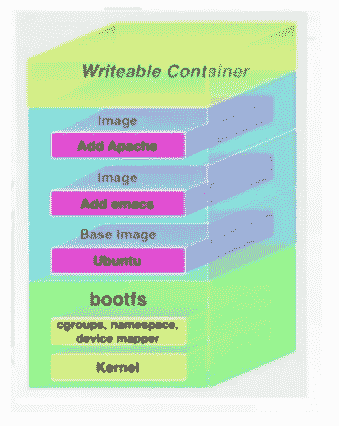
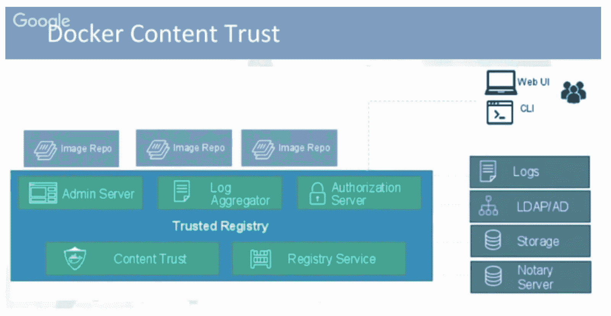

# 使用 Docker 容器降低应用程序的风险

> 原文：<https://devops.com/reducing-risk-in-applications-using-docker/>

码头工人。似乎在这个时代，你要么使用 Docker 容器，要么将要使用 Docker 容器。如果你还没有赶上这股潮流，看看之前的一篇文章，“ [*Docker:新的普通*](https://blog.sonatype.com/docker-devops-new-ordinary)*”如果你在车上或者正在考虑，但是担心他们的安全，是时候继续读下去了。*

*joséManuel Ortega([jmortega . github . io](https://github.com/jmortega))是西班牙的一名软件工程师和安全研究员。我最近在网上看了他题为“测试 Docker 图像安全性”的演讲他概述了典型的 Docker 部署，解释了攻击面和威胁，介绍了如何检测漏洞，并概述了一些最佳实践。简而言之，他的建议将帮助你学习如何更好地保护你的 Docker 容器。*

 *(Docker 新手？读这一段；所有其他人跳过前面。)如果你不确定 Docker 是什么，José给出了这样的解释:“Docker 容器将一个软件包装在一个完整的文件系统中，该文件系统包含它运行所需的一切:代码、运行时、系统工具、系统库——任何你可以安装在服务器上的东西，不管它运行在什么环境中。”

也就是说，容器是隔离的，但是共享一个操作系统，并且在适当的情况下，共享二进制文件和库。Docker 提供了额外的隔离层，使您的基础设施在默认情况下更加安全。这使得应用程序的生命周期更快、更容易配置，降低了应用程序中的风险。

首先，José列出了 Docker 的默认安全机制:

*   Linux 内核名称空间
*   Linux 控制组(cgroups)
*   坞站守护程序
*   Linux 功能(libcap)
*   像 AppArmor 或 SELinux 这样的 Linux 安全机制

José介绍了其他工具、附加组件、最佳实践等。，以增加码头集装箱的安全性。我将在这里介绍其中的大部分。

**码头工人检查工具。**Docker Inspect 工具内置于 Docker 中。它提供了关于主机名、映像 ID 等信息。当你启动 Docker 的时候它就会出现。

**Docker 内容信任**。它保护不受信任的图像。它可以在每台托管主机上启用签名检查，保证提取图像时的完整性，并提供发布者和消费者之间的信任。

****

**Docker 文件安全。** Docker 文件构建 Docker 容器。他们不应该写秘密，如用户和密码。您应该删除不必要的 setuid 和 setgid 权限，使用 GPG 和证书安全地下载包，并尝试将一个映像或容器限制为一个服务。

**集装箱安检**。Docker 安全是关于限制和控制内核上的攻击面。不要在容器中以 root 用户身份运行应用程序，并创建特定的用户来测试和管理 Docker 映像。以只读方式运行文件系统，这样攻击者就无法覆盖数据或将恶意脚本保存到映像中。

José提供了一个有用的清单来检查 Docker 容器的安全性，但它并不短。请记住，如果您要部署数百或数千个这样的容器，您将希望确保安全问题的一致处理，以阻止黑客:

**审核 Docker 图像。**您可以使用各种商业和开源工具扫描您的映像，查找已知漏洞，例如:

所有这些解决方案都可以集成到 CI/CD 管道的一个元素中，有些可以集成到多个位置。

José更详细地探讨了这些解决方案和最佳实践，并在他的完整演讲中提供了技术实现技巧，可在此免费获取。如果您正在从事 Docker 安全方面的工作或对此感兴趣，他的演讲值得您花费时间。

渴望更多由实践者(而不是供应商)领导的 DevOps 讨论吗？你也可以在这里观看全天 DevOps 会议的 99 个其他演讲。

— [德里克·威克斯](https://devops.com/author/derek-e-weeks/)*