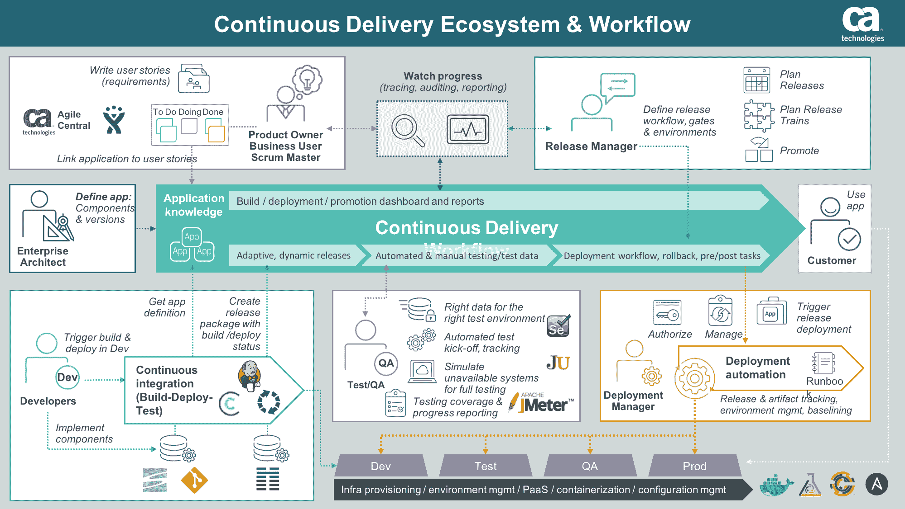

# 发布自动化:交付高质量的回报

> 原文：<https://devops.com/release-automation-quality-payoff/>

你有没有试过测试一个应用程序的最新版本却发现你的版本不对？

也许您意外地获得了错误的版本，或者您没有针对测试环境的正确配置文件，或者您的数据库没有正确更新，或者您正在使用的脚本仍然指向软件的先前版本。

无论是哪种情况，我们都同意，跟踪所有各种工件、数据库模式变化、配置参数以及准确测试和部署应用程序所需的其他组件既耗时又容易出错。

如今，许多公司都在寻求 DevOps、[连续交付](http://www.ca.com/us/why-ca/continuous-delivery.html?intcmp=headernav)和敏捷开发方法来缩短应用交付周期，减少错误数量和与应用部署流程相关的成本。几乎所有的企业都是软件公司，它们的生存依赖于通过软件向客户提供差异化的产品和服务。

如果不能立即对客户需求和竞争压力做出反应，也必须能够快速做出反应，这样才能在竞争中保持领先。每年发布一次的日子已经一去不复返了。

如今，我们看到公司每月、每周甚至每天都在生产环境中部署新功能。在一些公司，每天在开发、测试和生产环境中都会进行数百次(如果不是数千次的话)部署。我们曾经使用的旧方法根本无法支持这种数量和节奏。

## **采用**发布自动化

那么，这些公司如何过渡到这种新的思维方式呢？一句话——自动化；具体来说，通过尽早和经常地自动化。

关于您的发布过程的一切都是自动化的候选者。这包括环境供应和配置自动化、构建自动化、测试自动化以及发布和部署自动化。

我们的一个[客户](http://www.ca.com/us/collateral/case-studies/jewelers-mutual-insurance-company-releases-more-applications-faster-and-at-lower-cost-with-ca-release-automation.html)最近实施了 [CA 发布自动化](http://www.ca.com/us/products/ca-release-automation.html)，并在八周内实现了 90%的部署自动化。曾经需要五个多小时和一组人员完成的部署现在只需几分钟。

Jewelers Mutual 的平台工程师 Tim Dallmann 表示:“这不仅为我们节省了大量时间，还降低了手动过程中出现人为错误的风险。

另一家客户是一家大型航空公司，他们实施了 CA 发布自动化，并立即将生产中断从三个月内的平均 237 次减少到接下来四个月内的 15 次、7 次、6 次和 5 次。

并且 [Molina Medicaid Solutions](https://www.youtube.com/watch?v=ztY5Vn9VaGs&list=PLO7SodxCJyn6OXtHI1kPoLkKmfDKIxDdt&index=73) 将其人为错误成本降低了 90 %,同时更快地响应紧急部署请求并提高部署质量。

自动化是至关重要的，但是我相信这些结果证明，除了自动化之外，实现一个框架来管理和部署发布过程会更好。

## **提高灵活性和可见性**

持续交付有助于打破开发和运营团队之间常见的障碍。它甚至提供了一种更具协作性的方法，而自动化是实现这一点的关键因素。

Dallmann 解释说:“自动化最大的好处之一是，它让我们能够灵活地提高最终用户的技能，在我们的测试环境中进行部署不再仅仅是运营或 it 团队的责任。

借助应用程序发布自动化(ARA)解决方案，工件、构建、配置和发布流程不再通过电子表格进行跟踪，也不再嵌入复杂的脚本中。

提高对这些过程的可见性最终使所有利益相关者能够在发布过程中扮演更积极的角色，并且当问题发生时，访问实时信息可以显著减少解决问题和从问题中恢复所需的时间和资源。

自动化导致:

## **融入生态系统**

企业 ARA 解决方案可以帮助您创建一个单一的控制点来简化所有的应用程序交付流程，从而提高可预测性并降低风险。其中的一个重要组成部分是集成和编排持续交付管道所需的工具和技术的能力，包括源代码控制、自动化测试工具、供应和配置管理解决方案以及变更管理和性能管理解决方案。

与应用程序生命周期管理解决方案的集成可以在开发项目和最终测试并推广到生产的项目之间提供更进一步的一致性、治理和可追溯性。

“通过集成这两种解决方案，我们将拥有一个完整的部署审计跟踪，以帮助我们了解故事是如何、在哪里以及由谁改变的，”Jewelers Mutual 应用服务总监 Phil Nickolai 说。

“我们真正需要的是一个简化我们整个工作方式的解决方案，”他说。“我们有许多人参与项目，争夺资源，造成了复杂性。现在，我们重新掌控了局面，并且每天都在变得更加智能。”

## **现在的时间是**

让我们摆脱键盘和保存在电子表格、脚本或电子邮件中的信息之间存在的问题。您不仅可以停止浪费时间测试错误版本的应用程序，还可以确保您拥有正确的测试数据、合适的测试用例以及适合您环境的正确配置参数。

释放压力周末和夜晚成为过去。开发人员可以花更多的时间来开发创新功能，从而创造收入并让客户回头客。

——Tim muting