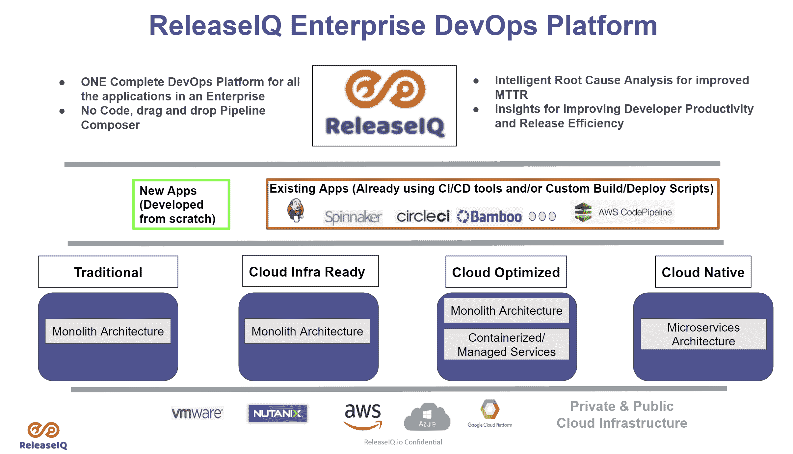

# ReleaseIQ 为 Jenkins 的多个实例添加了编排工具

> 原文：<https://devops.com/releaseiq-adds-orchestration-tool-for-multiple-instances-of-jenkins/>

ReleaseIQ 为开源持续集成/持续交付(CI/CD)环境推出了一个编排框架，使 DevOps 团队能够跨 Jenkins 的多个实例编排管道。

ReleaseIQ 首席执行官 Seetharam Param 表示[release IQ Essentials for Jenkins](http://www.prweb.com/releases/releaseiq_launches_new_product_edition_essentials_for_jenkins/prweb18205991.htm)是一个现有编排平台的实施，使 DevOps 团队能够跨异构 CI/CD 平台编排管道。

挑战在于，在 Jenkins 上实现标准化的组织通常拥有多个实例，这些实例不仅被不同的 IT 运营团队使用，还被辅助质量保证流程的所有者使用。Param 说，ReleaseIQ Essentials for Jenkins 提供了一种替代 CloudBees 的编排工具的方法，cloud bees 是 Jenkins 的原始开发者。

Jenkins today 是独立于 CloudBees 的一个开源项目，由持续交付(CD)基金会管理，该基金会是 Linux 基金会的一个分支。CD 基金会的创始成员包括 CloudBees 以及 Alauda、Alibaba、Anchore、Armory、Autodesk、Capital One、CircleCI、DeployHub、GitLab、Google、华为、JFrog、网飞、Puppet、Red Hat、SAP 和 Snyk。

ReleaseIQ Essentials for Jenkins 优化了作业和管道的执行，并为 DevOps 团队提供了一个无代码的图形界面来构建管道。

除了能够预合并管道之外，DevOps 团队还可以导入和执行 Jenkins 管道和作业。
最后，开发运维团队可以根据平台代表他们自动跟踪的关键指标获得见解。Param 指出，这些指标使得通过控制台日志聚合快速发现和修复多个 Jenkins 实例中的管道问题成为可能。

尚不清楚在 Jenkins 上实现标准化的 DevOps 团队会在多大程度上用一个编排工具替换另一个。然而，Param 表示，更多的组织要么担心被某个特定的 [CI/CD](https://devops.com/?s=CI/CD) 平台所束缚，要么发现自己处于需要继续使用来自不同供应商的多个 CI/CD 平台的境地。Param 指出，ReleaseIQ 平台提供了一种编排管道的方法，无论使用多少不同的 CI/CD 平台。

很明显，采用编排工具的需求变得越来越明显。DevOps 团队花费太多时间手动维护 DevOps 管道。随着同时启动的应用程序开发项目数量的持续增长，对开发运维工作流管理自动化工具的需求变得越来越迫切。可以说，DevOps 流程没有被广泛接受的原因之一是当今管理组成工作流的所有管道所需的专业知识水平。

当然，DevOps 的成熟度因组织而异。即使是同一个组织中的不同团队，他们的熟练程度也大不相同，这种情况并不罕见。现在的挑战和机遇是为这些 DevOps 团队提供在足够高的抽象层次上运行的工具，以使每个 IT 专业人员都可以访问 DevOps，而不管他们是否具有编程专业知识。