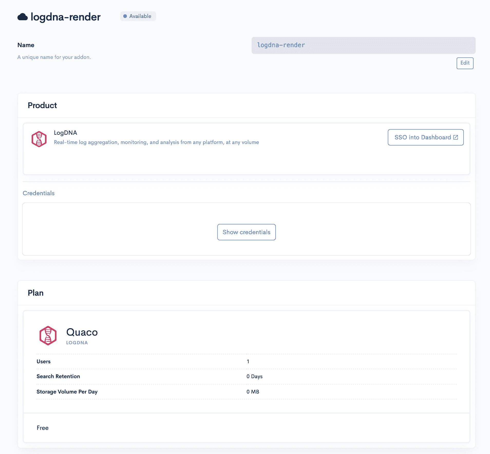

# Render Taps 为开发者拓展云服务

> 原文：<https://devops.com/render-taps-manifold-to-expand-cloud-services-for-developers/>

由于 [Render 与市场即服务平台提供商 Manifold](https://www.globenewswire.com/news-release/2019/09/30/1922747/0/en/Render-is-the-First-Cloud-to-Offer-Integrated-World-Class-Developer-Services-with-Manifold-s-Marketplace-as-a-Service.html) 的新联盟，依赖 Render 云服务的 DevOps 团队发现新工具的速度将大幅提高。

Render 已经提供了日志记录、监控和其他 DevOps 工具，并将使用 Manifold 技术来创建自己的市场。Render 首席执行官 Anurag Goel 表示，此次合作将为他的公司提供一个平台，使其能够即时访问，而不必导航许多配置步骤，因为 Manifold 已经自动化了这些过程。

Goel 表示，通过关注开发者的需求，Render 一直以每月 50%的速度增长，这一战略导致 Render 平台上每周超过 1 亿次 http 请求。他说，这种方法使该公司能够将其云平台与亚马逊网络服务、微软 Azure 和谷歌云平台等规模大得多的竞争对手区分开来，这些竞争对手不太注重开发者体验。

Manifold 首席执行官 Jevon MacDonald 表示，Manifold 一直致力于建立一个市场，允许较小的云服务提供商提供工具和应用程序，其用户体验可以与三大云服务提供商提供的任何市场相媲美，但不必自己建立和维护该市场。他说，Manifold 还与市场上的每个工具和应用程序提供商合作，实现配置过程的自动化。

随着时间的推移，市场已被证明对云服务提供商至关重要，因为它们为开发者生态系统的创建提供了基础。云服务提供商让 DevOps 团队发现新工具和应用越容易，生态系统往往会变得越大。

显然，AWS、微软和谷歌相比 Render 拥有海量的 DevOps 生态系统。然而，随着 Kubernetes 等云原生平台的兴起，DevOps 团队在一个云平台上构建应用程序并在另一个平台上部署它们将变得更加容易。为了吸引云原生应用的开发者，Render 构建了一个容器化的平台，作为传统平台即服务(PaaS)环境的替代方案。

Render 认为，构建应用程序的跨平台策略变得越来越普遍，越来越多的开发人员将选择在云平台上构建应用程序，专门致力于提供卓越的开发人员体验。目前的渲染客户包括 99designs、Gatsby 和 Indie Hackers by Stripe 等较小的初创公司。

随着开发人员开始转向云原生技术，有多少 DevOps 团队愿意考虑替代云平台仍有待观察。主要的云服务提供商已经围绕提供尽可能少的支持建立了商业模式。虽然云服务提供商可能无法通过昂贵的支持合同来支持每个 DevOps 团队，但云服务提供商似乎有足够的空间来创建更丰富的开发人员体验，而不仅仅是基本的一刀切方法。

— [迈克·维扎德](https://devops.com/author/mike-vizard/)