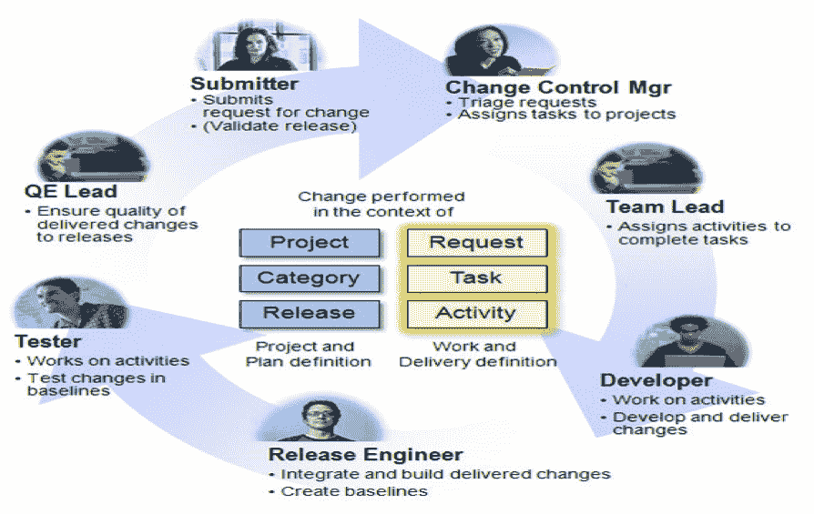

# 资源可用性:云开发运维难题中缺失的一块

> 原文：<https://devops.com/resource-availability-the-missing-piece-of-the-cloud-devops-puzzle/>

任何成功的软件都是五个团队的努力:开发人员、操作/基础设施团队、QAs 或测试人员、产品经理和所有者，以及支持团队。可能还涉及到其他头衔，但大部分工作都是由这五个小组完成的。

https://www.ibm.com/developerworks/rational/library/edge/08/mar08/pampino-pierce/image003.jpg

[AWS 将 DevOps 描述为](https://aws.amazon.com/devops/what-is-devops/):

> …文化理念、实践和工具的结合，提高了组织高速交付应用程序和服务的能力，比使用传统软件开发和基础架构管理流程的组织更快地发展和改进产品。
> 
> 
> 
> 在开发运维模式下，开发和运营团队不再是“孤岛”有时，这两个团队会合并成一个团队，工程师在整个应用程序生命周期中工作，从开发和测试到部署再到运营，并开发一系列技能，而不仅限于单一功能。质量保证和安全团队**也可能**与开发和运营更加紧密地结合在一起，贯穿整个应用生命周期。

参加【2015 年 DevOps.com 的大多数 DevOps 领导都同意:

*   DevOps 旨在帮助企业取得成功。
*   范围很广，但以它为中心。
*   敏捷和精益奠定了基础。
*   文化很重要。
*   反馈是创新的燃料。
*   自动化有所帮助。

查看这两个参考文献，从技术角度来看，我们可以总结出 DevOps 将开发和运营放在一起，交付速度可以通过工具和自动化来实现。

对于内部部署来说，这一切听起来可能非常完美，因为您的开发、QA、测试和预生产设备将 24 小时正常运行，而那些参与软件成功的人—QA 经理、产品负责人等。—可以随时访问它们。

然而，在云开发运维中，情况可能并非如此。任何有成本意识的组织都可能会指示开发人员在不需要的时候让基础设施离线(我们大多数人都知道开发人员如何管理基础设施，所以我不打算对此进行过多讨论)。但是项目的其他涉众呢？如果 QA 团队想要手动测试或验证某些东西，或者产品所有者想要审查某些东西，该怎么办？

目前，团队有三种选择:

1.  利益相关者打电话请求基础架构团队提供他们需要的服务器。
2.  涉众被提供一个脚本来启动服务器本身。
3.  利益相关者必须等到调度程序启动服务器。

这些都有很大的缺点。前两种选择浪费大量人力。在这个时代，公司正试图通过自动化琐碎的事情来尽可能多地利用人力，用昨天的解决方案来解决今天的问题是没有意义的。此外，要求这些团队运行脚本来启动服务器会引入出错的可能性，因为这些团队对基础架构或脚本并不熟悉。

第三种选择是用老办法解决当前问题的完美例子。尤其是在云领域，我认为这种解决方案至少存在两个问题:

1.  在云环境中，您按秒支付资源费用，在任何预定时间启动服务器都是浪费金钱。坦率地说:谁会早上 8 点就坐在电脑前，直到晚上 7 点才动？白天会有一些时候，由于其他任务，如员工会议、午餐等，服务器根本不会被使用。
2.  在敏捷环境中，人们按照自己的节奏和时间表工作，将他们限制在某个预定的时间段是没有意义的。

云开发运维需要一种模式，能够让所有利益相关方以最高效率工作，而不会遇到[资源调度](http://invoke.cloud/)问题。这是一个需要有效解决方案的难题。

您的组织如何处理云中的资源可用性？

— [奎师那 T](https://devops.com/author/krishna-t/)