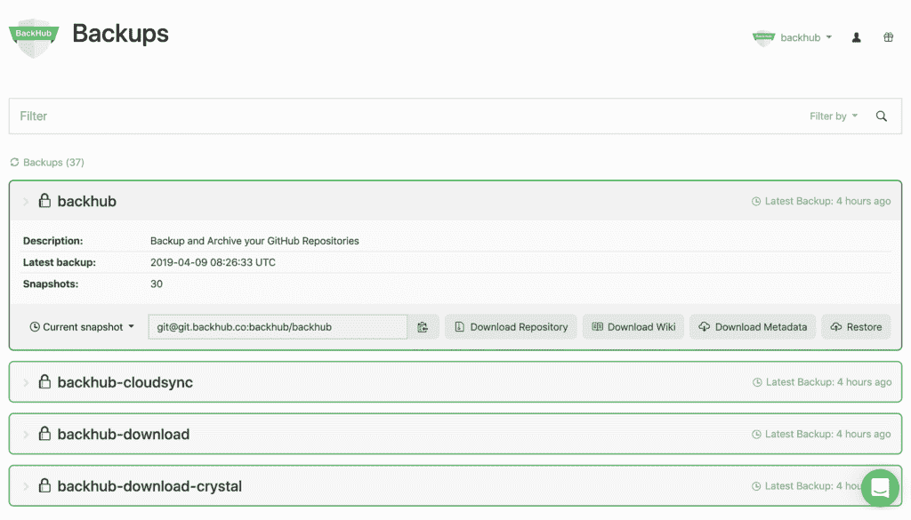

# Rewind 收购 BackHub 以保护 GitHub 库

> 原文：<https://devops.com/rewind-acquires-backhub-to-protect-github-repositories/>

备份云服务的软件即服务(SaaS)平台提供商 Rewind 今天宣布，它已经[收购了 BackHub](https://www.prweb.com/releases/rewind_acquires_backhub_and_expands_cloud_backup_portfolio_reach/prweb17719863.htm) 以获得 GitHub 仓库备份平台的控制权。

总部位于德国的 BackHub 为 Rewind 产品组合增加了一个数据保护平台，该产品组合包括备份从 QuickBooks 到 Shopify 的所有产品。刚刚从[筹集了 1500 万美元的额外资金](https://venturebeat.com/2021/01/19/rewind-picks-up-15-million-to-protect-data-in-saas-applications/)，Rewind 首席执行官迈克·波特说，BackHub 解决了一个关键问题，涉及保护任何组织在云服务中拥有的一些最有价值的知识产权。微软的子公司 GitHub 是世界上最大的源代码主机，拥有超过 4000 万用户和 1.9 亿个存储库。BackHub 声称它为 1000 多家组织保护这些存储库中的数据。

虽然 GitHub 本身是一种可靠的云服务，但驻留在 GitHub 中的代码与驻留在任何其他云服务中的代码一样，会受到相同的潜在威胁。出于这样或那样的原因，恶意行为者获取他们利用的凭证来删除或更改数据——或者在 GitHub 的情况下，删除或更改代码，这种情况并不罕见。BackHub 使得将存储在 GitHub 中的代码备份到另一个云服务中成为可能，在那里可以很容易地恢复代码。

波特说，Rewind 的最终目标是让备份整个云成为可能。波特说，实现这一目标将需要额外的收购和内部产品开发。

与此同时，该公司专注于为其他备份和恢复工具提供商通常忽略的专业云服务提供数据保护。目前，它将存储在广泛使用的云服务(如微软 365)上的数据的备份和恢复留给了其他供应商。Rewind 声称，超过 80，000 个组织正在使用其平台来保护存储在各种云服务中的数据，这些数据解决了一个特定的利基用例。

鉴于 GitHub 在软件供应链中扮演的重要角色，存储在 Git 存储库中的代码成为网络罪犯的目标也就不足为奇了。对于希望减少重新设计竞争对手公司的功能所需时间的组织来说，存储在这些存储库中的大部分知识产权是高价值的目标。

世界各地的民族国家都有网络间谍计划，旨在收集任何可能有利于其军事或经济的数字资产。自然地，当突然添加代码时，复制代码并不总是足够的，这些代码可能会使项目脱轨足够长的时间以便他们赶上。

不幸的是，出现了一些涉及软件供应链的高调违规事件。确定项目是否已经受损的最好方法是比较代码库。根据定义，存储库为应用程序开发团队提供版本控制能力。然而，备份 GitHub 存储库提供了一个额外的安全层，可以更容易地从违规中恢复。