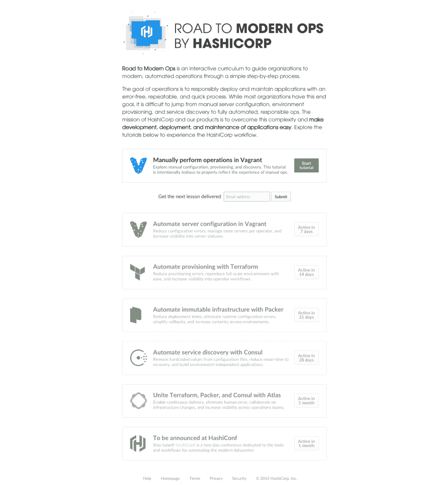

# 通向现代作战的道路

> 原文：<https://devops.com/road-modern-ops/>

这是 HashiCorp 的现代运营之路(Road to Modern Ops)的第一课，这是一门交互式课程，致力于指导组织从手工流程转向现代自动化运营。本文通过概述手动操作任务和实现自动化的途径，为课程设置奠定了基础。要运用这些知识，请浏览交互式教程，了解如何手动管理运营工作流。

给操作员、系统管理员和开发人员的一封信:不要忘记操作的最终目标。运营的目标是通过一个安全、无错误的过程，将开发中的应用程序代码转换为生产服务器上的运行应用程序。这是通过三个常规步骤完成的—服务器供应、服务器配置和应用程序维护。在过去的几个月甚至几周内，已经发布了大量与这三个步骤和整个运营领域相关的技术，包括新的容器技术、最小虚拟机、配置管理工具、监控工具、自动配置工具、服务发现系统等等。结果，运营行业被这些细节所困扰，却忽略了运营的最终目标。

正如过去几个月所显示的那样，操作工作流程中的技术很容易发生变化。然而，运营工作流本身——将应用程序从开发阶段转移到生产阶段——不太可能在短期内改变。常规操作工作流程的主要进步是自动化取代了手动任务。这通常被称为“devo PS”(devo PS 的众多解释之一)。现代工作流采用自动化来减少人为错误，使用相同数量的操作员扩展部署，并提高整个流程的透明度。

虽然大多数组织都有一个自动化、无错误、快速的运营工作流的最终目标，但令人困惑的是如何将所有不同的运营工具结合起来实现这一目标。詹金斯，厨师，流浪汉，码头工人，Terraform，Datadog 等是如何相互联系的？如何使用它们来构建自动化部署流程？从手动配置、供应和服务发现过渡到完全自动化的现代运营是一条不明确的道路。

**现代运营之路——自动化和现代数据中心**

“现代运营之路”是 HashiCorp 的一门交互式课程，旨在通过循序渐进的详细教育过程，引导组织实现现代化的自动化运营。每节课都采用手动流程，并通过交互式教程演示如何实现自动化。在课程结束时，参与者将了解运营的组成部分、如何自动化这些组成部分，以及最终如何将这些组成部分组合成完全自动化的应用交付工作流。

第一个教程通过手动配置、配置和维护为课程奠定了基础。后续课程一次自动化一个组件，然后将它们结合起来，形成一个连贯的自动化操作工作流。该课程的目标不仅是提供自动化的实践经验，而且要理解这些工具如何适应更大的运营生态系统。开始走向现代作战。

***关于作者[凯文·菲什纳](https://www.hashicorp.com)***

凯文·菲什纳是哈希公司的客户成功总监。他拥有与 HashiCorp 开源和商业产品客户合作的丰富经验。哲学家由教育(杜克)，工程师由贸易。在推特上与凯文联系。