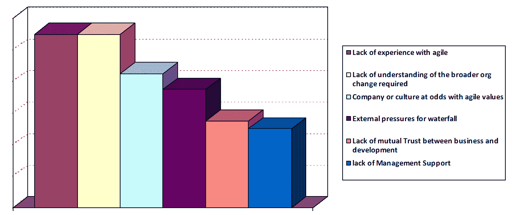
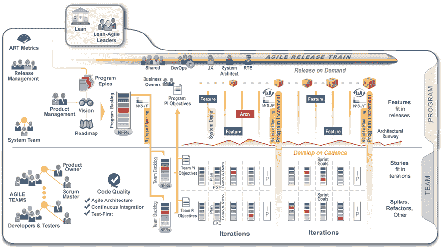
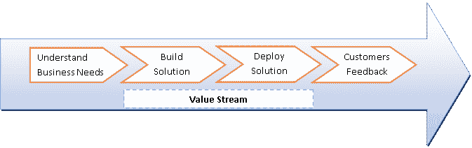
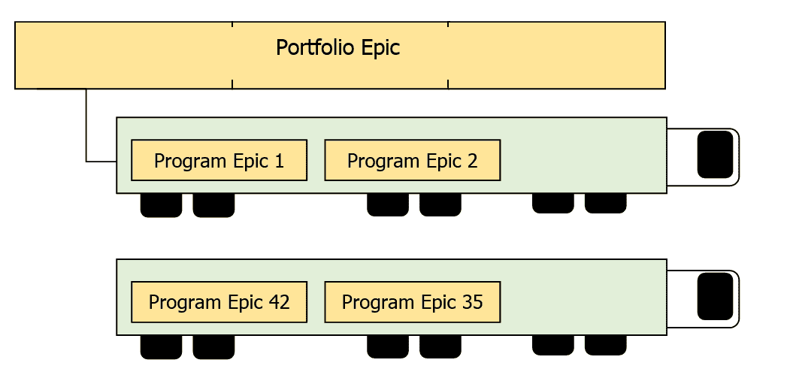
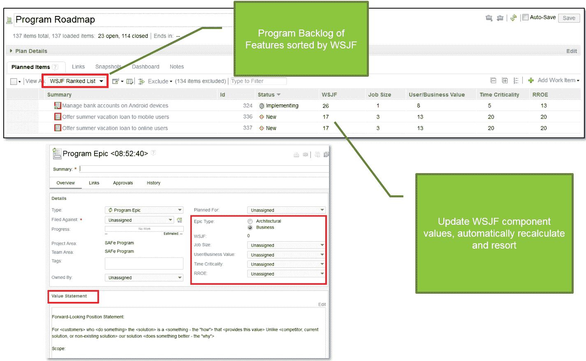
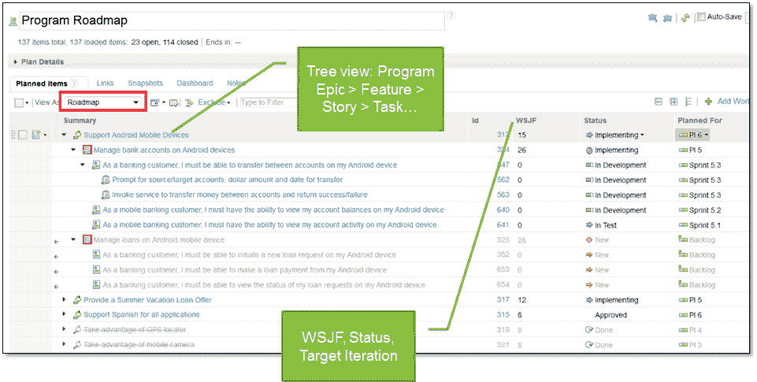
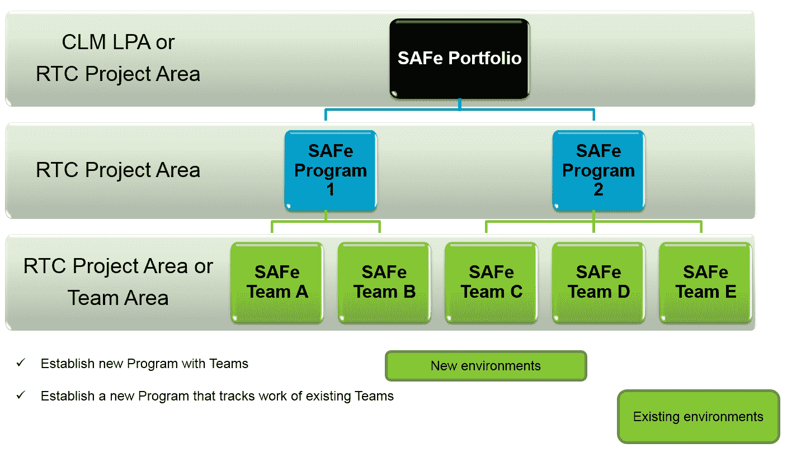
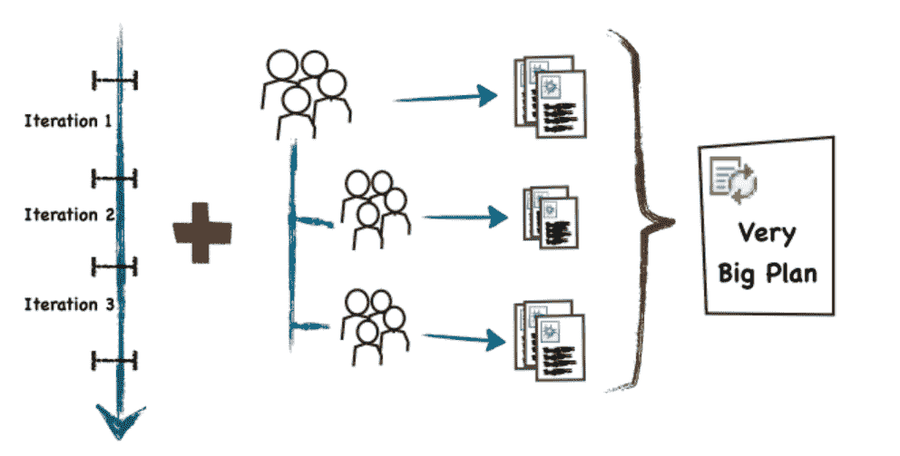

# 卷起袖子——启动一个安全的敏捷发布系列

> 原文：<https://devops.com/roll-up-your-sleeves-launch-a-safe-agile-release-train/>

大多数组织通常从一系列低风险的独立试点项目开始他们的敏捷转型。虽然这些试点可能证明团队可以采用小团队敏捷实践，例如“Scrum”或“XP”，但是这些试点通常不能帮助证明您的组织可以在企业级采用敏捷。

扩展敏捷以支持更大更复杂的项目，需要获得利益相关者的一致，提供项目范围的透明性，并通过大量的团队(例如，100–500 多个)一起工作来交付端到端的价值。

几个月前，我有机会为一个大型 IT 项目(110 多个资源)启动了一个敏捷发布培训(ART ),这个项目是 IBM 为其提供敏捷辅导和指导的金融机构之一。该组织的大部分大型项目一直遵循瀑布方法，直到去年被一家已经在进行敏捷转型的大型银行收购。

IBM 被请来评估他们当前的进展，并提供额外的培训和推广大型企业项目的建议。我们的任务是帮助他们:

1.  定义一组支持预期商业利益的结果，并帮助他们成功启动敏捷项目
2.  识别价值流——用于构建和部署系统的一系列长期系统定义、开发和部署流程步骤？
3.  定义敏捷发布系列——围绕这些价值流形成的虚拟组织？
4.  如何推出 ART 以及 IBM 为 SAFe 提供了哪些支持

这里有一个由多个部分组成博客，可以帮助你启动自己的培训:

*   启动敏捷发布列车:从哪里开始？
*   [准备第一次敏捷发布系列(ART)发布？](#_Preparing_for_first)

**1。开展一项艺术。从哪里开始？**

在其最简单的形式中，敏捷提供了一个轻量级的框架，帮助组织使用快速交付方法来构建软件，从而提供商业价值。因此，这些组织能够在提供高质量产品和服务的同时，显著降低与软件开发相关的总体风险。

敏捷是软件开发的强大工具，不仅为开发团队带来好处，还为客户带来许多重要的商业利益。此外，许多敏捷项目团队已经能够以更可控的方式克服许多最常见的项目陷阱(如成本、进度可预测性和范围蔓延)。

我们方法的第一步是进行一个简短的敏捷评估(或可行性研究)来验证范围，确定当前的挑战，并推荐一个采用路线图来支持该计划的转型(110 多项资源)。

在帮助几个客户完成敏捷转型项目以及与这些采用相关的挑战和业务成果之后，我立即开始关注我们在多个团队之间进行协调的能力。

该组织有几个瀑布项目正在进行中，并在他们的一些社交应用上成功地试验了 Scrum。领导希望我们帮助采用多团队敏捷方法，其中组织的某些部分将保持瀑布状态。

在执行快速评估后，我们发现了以下组织问题

在回顾了当时一些最常见的方法后，我们得出结论，考虑到组织的挑战，扩展敏捷框架(SAFe)将是我们的起点。SAFe 由 [+Dean Leffingwell](https://plus.google.com/111678440224086860538) 的 [Scaling Software Agility](https://www.amazon.com/gp/product/B0027976NQ/ref=as_li_ss_tl?ie=UTF8&camp=1789&creative=390957&creativeASIN=B0027976NQ&linkCode=as2&tag=adveinscalagi-20) 创建，是一个经过验证的面向公众的框架，用于在企业范围内应用精益和敏捷实践。

 在大多数情况下，我们发现当试图帮助一个组织在他们的组织中扩展敏捷时，从一个中小型项目开始是最好的起点。

从计划层面开始的好处:

*   几个关键的业务涉众通常对预算、交付团队有最终决定权
*   可以在赞助商的责任/影响力范围内选择项目
*   比一个团队接一个团队需要更多的组织，但比“大爆炸”式的企业转型要少得多
*   让人们看到大规模敏捷的真正挑战
*   提供真实的、基于事实的企业敏捷性度量…在大型复杂企业中快速交付高质量软件的能力

以下是从团队层面开始的一些挑战。

*   具有更大规模采用所具有的组织/文化影响
*   提供“移动指针”的可见性
*   覆盖足够的地面。延迟处理大规模实施敏捷的真正挑战

以下是从投资组合层面开始的一些挑战:

*   处理太多正在进行的项目
*   也要考虑要影响的结构(例如，混乱的架构和臃肿的技术堆栈)
*   与团队范围之外的团队合作，真正影响他们。
*   需要有精益思想的领导者和一个了解精益经济的敏捷项目管理办公室
*   可能会因企业全面转型所需的复杂组织和文化变革而推迟
*   如果资产开发不敏捷，则难以管理精益|敏捷投资组合中的软件“资产”

请点击此处了解更多信息:

*   [http://www . slide share . net/scaled agile/webinar-launching-ar-ts-why-start-30 may 2013？相关=2](http://www.slideshare.net/ScaledAgile/webinar-launching-ar-ts-why-start-30may2013?related=2)
*   [http://www.scaledagileframework.com/](http://www.scaledagileframework.com/)
*   [http://www.slideshare.net/ScaledAgile](http://www.slideshare.net/ScaledAgile)

**2。为第一次敏捷发布系列(ART)的启动做准备？**

对于任何想要成功的 IT 项目(传统的、敏捷的或其他的)，有一个清晰的愿景来引导项目团队朝着正确的方向前进是至关重要的。团队应该定期审查愿景，以确保计划实现其设定的目标。

以下是启动 ART 前必须完成的 3 个关键步骤。

*   ***确定价值流的初始集合***

价值流是一组长期存在的功能，用于为企业提供持续的收益流。价值流通常由一种或多种艺术实现，是理解价值如何在 SAFe 中传递的主要组织概念。

 以下是一些有助于识别价值流的问题

*   在未来 2 到 3 年内，有哪些更大的、正在进行的项目或计划将使你的企业脱颖而出？
*   外部客户如何感知你提供的价值？例如，你提供的主要产品或服务是什么
*   你能描述一下已经有 200 多、100 多或 50 多名开发人员/测试人员一起工作的战略计划吗？它们的特性和组件之间有高度的相互依赖吗？
*   您支持哪些关键业务流程？你支持哪些内部部门？
*   在即将到来的一年中，我们的目标是什么关键流程、成本、KPI 或业务改进计划？

欲了解更多信息，请点击:

*   [http://www.scaledagileframework.com/strategic-themes/](http://www.scaledagileframework.com/strategic-themes/)
*   [http://www.scaledagileframework.com/value-streams/](http://www.scaledagileframework.com/value-streams/)

*   ***定义愿景、范围并确定组合和计划史诗***

SAFe 将大型敏捷项目组织成一个包含三个层次的规模敏捷项目结构:团队、敏捷项目(也称为敏捷发布系列——ARTs)和项目组合

敏捷发布系列是 SAFe 内部的主要组织和运营架构。每种艺术都是自组织的团队，负责交付商业价值。理想情况下，每个价值流应映射到相应的 ART，但是在许多情况下，可能需要 ART 来支持多个价值流，或者在某些情况下，单个价值流可能需要多个 ART 的支持，以交付所需的业务价值。

 SAFe 定义了一个史诗——特性——用户故事的工件层次结构。敏捷项目待办事项列表(又名 ART)包含一个优先的特性和故事列表。投资组合史诗是外管局推动商业价值的大型计划。这些计划通常跨越组织和财务报告(季度、年度)的界限。大多数组织的业务计划都是推动业务价值的大型计划。这些计划通常跨越组织和财务报告(季度、年度)的界限。

加权最短作业优先或 WSJF 来自于 Don Reinertsen 定义的一个综合模型，作为一种改进优先级的方法。在 IBM 的解决方案中，WSIF 是根据所提供的工作规模、业务价值、时间关键性和风险降低/机会实现值自动计算的。然后，程序路线图会根据 WSIF 分数自动排序，并给出特性待办事项列表的排序视图。WSIF 是一个有用的工具，有助于基于事实假设而不是个人感觉进行决策。

特性通常被分解成用户故事，这些故事流向团队级别的积压工作，并且可以起源于程序级别，或者它们可以从项目组合级别定义的史诗中派生出来。基于加权最短工作优先(WSJF)经济决策框架对要素进行优先排序。

*   ***确保你已经建立了***

SAFe 基于精益原则，根据业务需求和技术约束/依赖性确定最小可行产品(MVP)计划和功能。像 Scrum 一样，SAFe 假设每个敏捷交付团队(通常在 5 到 10 人之间)每个人都有在每个 sprint 中交付工作解决方案所需的所有跨职能角色。

与 Scrum 不同，SAFe 假设一些故事可能相互依赖，或者在 Epic 交付之前，多个团队可能需要在 Epic 上工作。在启动 ART 之前，重要的是要确保每个团队都有适当的敏捷实践(即整个团队)，并且知道如何执行与 Scrum / XP 相关的仪式。整体团队是一种哲学，它涉及团队成员和利益相关者之间的重大合作。

每个团队包括所有实质上为项目定义、开发和交付软件的个人:

*   任何和所有贡献者
*   直接和间接参与者，如发起人和主要利益相关者
*   共同拥有成功沟通问题要点并提供一致同意的解决方案的技能

以下是建立高效敏捷团队的七个技巧:

*   团队是否有完成工作的技能——他们是“整体”
*   团队越小越好吗
*   人们致力于这个项目吗？是否只有一个产品负责人
*   有一个团队领导(不是产品所有者)
*   团队成员是否是跨职能的，主要由“归纳专家”组成
*   可能包括专家，希望他们成为推广专家
*   在适当的治理框架内自我组织

越偏离这个策略，你的项目风险就越大

**3。IBM 合作生命周期管理(CLM)如何支持 SAFe？**

作为项目的一部分，IBM 团队负责实现 IBM 的协作生命周期管理(CLM)解决方案，以支持敏捷发布系列(SAFe)。IBM DevOps 结合 SAFe 提供了一个全面的过程和工具平台和框架，它将优化您的端到端生命周期，因此您可以在异构环境中跨团队同步开发、测试和部署，并在软件交付的规划和执行中跨组织中的所有角色进行协作。

IBM 的安全支持提供了以下关键的**功能**:

*   借助 ***开箱即用的基础设施*** 快速启动并运行，引领安全计划
*   利用 ***仪表盘*** 的可见性提高敏捷性和可预测性，以实时调整业务目标
*   通过快速方便地访问 ***安全指南*** ，简化文化和流程的变更

每个团队在固定长度的时间盒中工作，称为迭代或冲刺，通常持续两到六周。在冲刺的最后，有可测量的产品增量或(PI)。

规划一个迭代很简单:从产品 Backlog 中，产品所有者(PO)和 Scrum 团队召开一个冲刺规划会议，来选择在即将到来的迭代中可以交付的最重要的故事。一旦确定了故事集，团队就将工作分解成更小的任务，并将其分配给各个团队成员。

RTC 中的敏捷计划功能可以通过多种方式帮助您做到这一点:

*   团队中的每个人都可以访问计划——保持透明。
*   计划反映了团队的立场和方向——知道你什么时候会失败。
*   计划是实时的，因为它们基于工作项目——没有不必要的计划工件需要处理。

IBM 的方法包括一套加速器，专门用于帮助组织采用精益思维，将他们当前的敏捷项目提升到下一个水平。敏捷计划包括一组开发实践，允许团队快速地计划和交付高质量的软件。更多详情见:见以下增值**资产**:

*   [IBM 的 SAFe 支持 YouTube 频道](https://www.youtube.com/playlist?list=PLZGO0qYNSD4XWRBikkjb0H0yaX5RCuQoK)
*   [IBM 的安全解决方案–发布概述](https://www.ibm.com/developerworks/community/wikis/form/anonymous/api/wiki/d75200fa-c296-466b-affc-87c12dd9c4e0/page/4c11cedd-eaaa-4d8f-a17e-d4aa02e85ae5/attachment/80fb8738-1201-4ad7-bee8-5c4cc98cbf33/media/SAFe%20Solution%20Overview.pdf)
*   [安全视角(POV)](https://www.ibm.com/developerworks/community/blogs/c914709e-8097-4537-92ef-8982fc416138/entry/safe_with_the_power_of_ibm_devops?lang=en)
*   [借助 IBM DevOps 的强大功能实现安全(白皮书)](https://www14.software.ibm.com/webapp/iwm/web/signup.do?source=swg-rtl-sd-wp&S_PKG=ov34576)
*   [安全 RTC 迁移指南(2015-08-14)](https://www.ibm.com/developerworks/community/wikis/form/anonymous/api/wiki/d75200fa-c296-466b-affc-87c12dd9c4e0/page/4c11cedd-eaaa-4d8f-a17e-d4aa02e85ae5/attachment/ba99ada9-81b6-4a97-a721-64fd04034022/media/RTC%20SAFe%20Migration%20Guidelines.pdf)

*   [安全支持截图](https://www.ibm.com/developerworks/community/wikis/form/anonymous/api/wiki/d75200fa-c296-466b-affc-87c12dd9c4e0/page/4c11cedd-eaaa-4d8f-a17e-d4aa02e85ae5/attachment/c33d13f0-47ce-4c33-beba-647b086504b2/media/SAFe%20Screen%20Shots%20%28External%29.pdf)

最后，对于那些使用 Scrum 方法的团队来说，这里有一篇关于在 Rational Team Concert (RTC)中使用 Scrum 的文章

*   [https://www . IBM . com/developer works/rational/library/scrum-methods-rational-team-concert-v4-2/](https://www.ibm.com/developerworks/rational/library/scrum-methods-rational-team-concert-v4-2/)

*   [https://jazz.net/library/article/593](https://jazz.net/library/article/593)

***关于作者/芦苇***

 Reedy 是领先的敏捷蔻驰和软件架构师，拥有 SAFe SPC 认证、ScrumMaster 认证和 PMP 认证项目经理认证，拥有 20 多年领导成功 IT 项目的经验，采用敏捷、瀑布和 RUP 流程的组合。在 IBM，他目前是一名敏捷蔻驰，负责领导大中型敏捷转型。Reedy 在几个杂志上发表过论文，也是会议的特邀演讲者。他作为培训师的经验导致了几个定制研讨会的发展，主题从项目管理到过程采用。

  上接芦苇