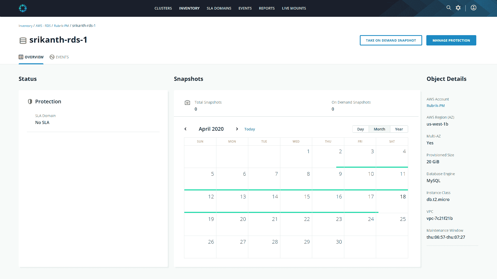

# Rubrik 希望融合数据管理和 DevOps

> 原文：<https://devops.com/rubrik-looks-to-meld-data-management-and-devops/>

在上周的 [FORWARD Digital Summit](https://forward.rubrik.com/) 活动中，Rubrik 提出了一个融合开发运维与数据管理的案例。

该公司宣布，其作为软件即服务(SaaS)平台提供的北极星数据管理平台[增加了保护运行在谷歌云平台](https://www.globenewswire.com/news-release/2020/05/11/2031238/0/en/Rubrik-Ushers-in-New-Era-of-the-Data-Forward-Enterprise-at-FORWARD-Digital-Summit.html) (GCP)上的虚拟机上的工作负载的能力。Rubrik 已经为亚马逊网络服务(AWS)和微软 Azure 云提供了支持。

此外，Rubrik 宣布，它已经扩展了对 AWS 数据保护的支持，包括亚马逊关系数据库服务以及对微软 OneDrive 云服务的支持。Rubrik 已经为微软 Office 365 提供了支持。

虽然 Rubrik 产生的大部分收入来自作为服务提供的数据保护，但总裁 Dan Rogers 表示，Rubrik 实际上是一个数据管理平台的提供商。随着越来越多的应用程序进入云，DevOps 团队开始利用 Rubrik 应用程序编程接口(API)使 Polaris 平台成为访问大量数据的工具只是时间问题，他说，并指出 Polaris 是使用 GraphQL APIs 和元数据从头开始构建的，使其可以通过编程访问。

当然，如今 IT 运营团队最常通过图形用户界面(GUI)访问 Polaris。这种方法使 Polaris 能够将传统的数据管理方法与新兴的 DevOps 环境结合起来。目前还不清楚 DevOps 团队在多大程度上以编程方式调用 Polaris 等平台，但随着应用程序的开发和部署速度加快，DevOps 团队对能够更轻松地访问这些应用程序所需数据的平台有着既得利益。

Rogers 还指出，数据保护平台在应用程序开发和测试环境中发挥着重要作用。开发人员需要能够在崩溃后恢复应用程序的前一次迭代。

IT 团队还广泛利用数据保护平台提供的备份功能，将数据从内部 IT 环境迁移到云中。

Rubrik 并不是唯一一家通过一系列 SaaS 应用程序提供数据管理平台的供应商。该公司一直在论证最初用云方法取代内部数据保护产品的可能性，除了数据保护软件之外，云方法还提供数据管理工具来解决数据治理和合规性以及元数据管理等任务。

尚不清楚数据管理和保护的自动化程度。然而，在新冠肺炎疫情之后，Rogers 指出，更多的组织将加快所有类型的 IT 管理平台作为云服务进行访问的速度。他说，随着许多 IT 运营团队现在在家工作的时间可能会延长，组织将迁移到更容易被远程访问的平台。事实上，很明显，在某些情况下，it 团队——不管喜欢与否——可能再也不会回到办公室了。