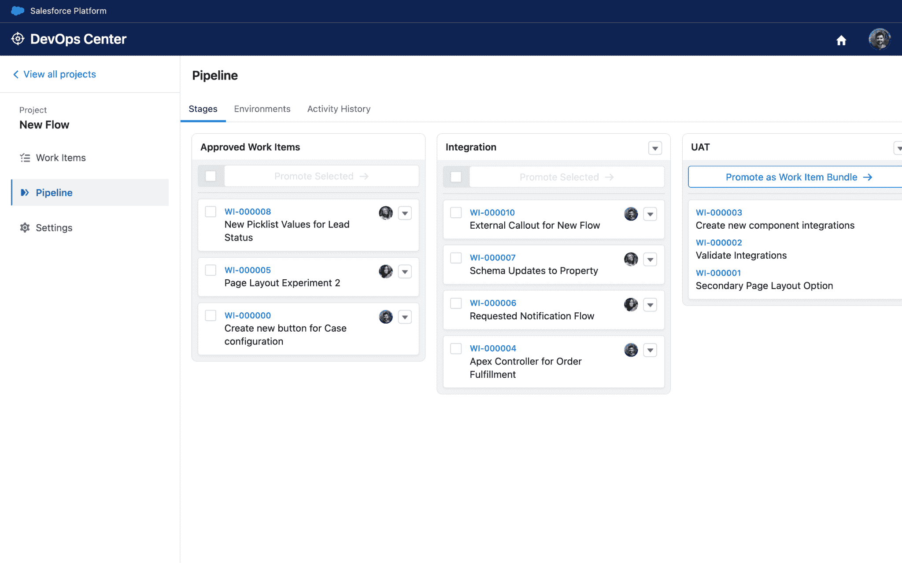

# Salesforce 推出低代码 DevOps 平台

> 原文：<https://devops.com/salesforce-launches-low-code-devops-platform/>

Salesforce 今天在其基础设施上提供了一个低代码的 DevOps Center 服务，通过该服务，开发人员可以为构建定制应用程序提供一个自以为是的平台。Salesforce DevOps Center 服务基于 Salesforce 用于构建其自己的应用程序的相同对象模型。

Salesforce 的产品管理高级主管 Karen Fidelak 表示，经过近两年的开发工作，该平台将使专业人员和公民开发人员使用公共源代码控制库一致地构建应用程序变得更加简单。Fidelak 指出，这对于专业开发人员来说尤其重要，他们可能需要访问以前由公民开发人员创建的源代码。

Fidelak 补充说，2023 年，Salesforce 将在平台中嵌入更强大的持续集成/持续交付(CI/CD)功能，以简化在 Salesforce 平台上部署定制应用程序。

Fidelak 指出，总的来说，自从该平台于 2020 年首次推出以来，愿意采用 DevOps 最佳实践来构建 Salesforce 应用程序的开发人员数量令人惊讶。她指出，公民和专业开发人员都希望采用最佳实践，提供一套护栏，确保高质量应用程序的安全。Fidelak 补充说，Salesforce 预计 DevOps 的抵制程度会高得多。

DevOps Center 平台使开发团队能够跟踪和部署对 Salesforce 平台上的自定义对象的更改，作为可以与公司提供的其他 Salesforce 流程(一组流程管理工具)集成的工作项目。当开发团队在他们的沙箱中进行更改时，DevOps Center 会自动跟踪它们。然后，开发人员可以点击鼠标，通过他们定义的自定义管道来提升他们所需的元数据组件。

此外，Salesforce 还提供了与版本控制系统(如 GitHub)的可选集成，以集中管理和治理工件。

Fidelak 说，最后，Salesforce 致力于加强 DevOps Center 与多个软件即服务应用程序(如 Tableau)和中间件平台(如 Mulesoft)之间的集成。

目前还不清楚有多少低代码正在通过 DevOps 管道传输，但随着越来越多的开发人员依赖这些工具来加速应用程序开发，数量正在增加。由此产生的问题是，公民开发人员通常不具备大规模构建和部署安全应用程序所需的专业知识——至少不具备除了他们自己以外的任何人真正想要使用的应用程序。理想情况下，公民开发人员应该得到应用程序开发平台和 DevOps 团队的支持，以确保为大规模构建应用程序提供安全防护。DevOps 团队还应该减少普通开发人员在构建任何应用程序时肯定会遇到的摩擦。

事实是，在缺乏这种支持的情况下，如果项目变得过于复杂，大多数公民开发人员——他们通常有其他需要他们关注的任务——会简单地放弃应用程序开发项目。这并不意味着组织不应该致力于建立自己的公民开发者大军。越来越依赖公民开发者是不可阻挡的 IT 民主化浪潮的一部分。挑战在于确保这些应用程序的最高质量，而不管它们是由谁开发的。