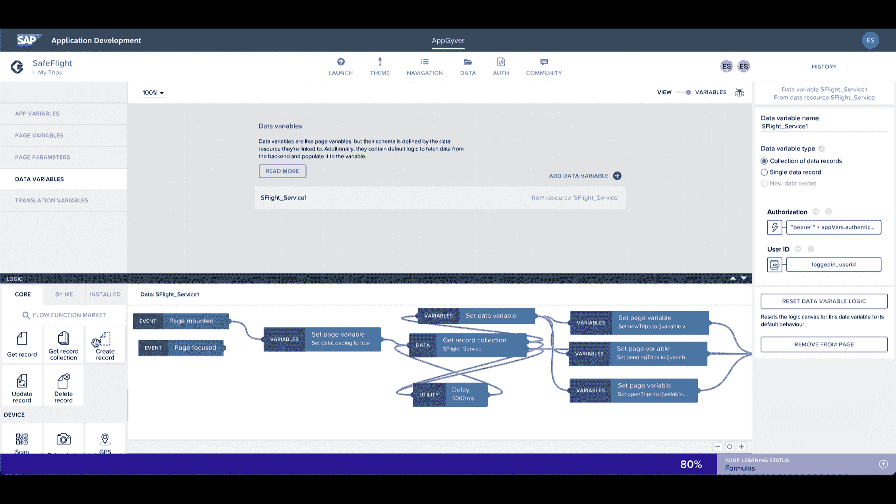

# SAP 扩展开发人员工具组合

> 原文：<https://devops.com/sap-extends-developer-tool-portfolio/>

在本周举行的一次在线会议上，SAP 宣布它已经在 T2 的 SAP 商业技术平台 T3(BTP)上增加了额外的低代码/无代码工具，使专业和市民开发者能够构建应用程序，调用通过该公司的云平台提供的应用程序服务。

增加调用这些服务的定制应用程序数量的努力围绕着本周推出的名为 SAP AppGyver 的无代码开发和自动化平台，以及一套现有的名为 SAP Business Application Studio 的[低代码](https://devops.com/?s=low-code+no-code)工具，该公司还对其进行了增强。SAP Process Automation 是一个自动化工作流程的机器人流程自动化(RPA)平台，也正在预览中。

SAP BTP 公司的首席营销和解决方案官 JG·奇拉普拉斯表示，目标是让组织更容易更快地使用工具构建应用程序，这些工具提供更高的抽象层，通过这些抽象层，他们可以通过应用程序编程接口(API)调用后端 RPA 和 AI 服务。SAP 通过为 it 团队提供的 SAP BTP 平台实现了这一目标。BTP 平台允许团队构建应用程序，这些应用程序可以与运行在公共云上的 SAP 应用程序服务集成，或者由 SAP 代表客户进行管理。他说，无论是哪种情况，目标都是让开发者有可能花更多时间构建业务逻辑，而不是构建和维护集成。

作为努力的一部分，SAP 对话式人工智能服务也增加了新的功能，该公司承诺推出基于神经网络的个性化推荐服务。

与此同时，该公司还透露，它已经更新了 SAP BTP 的 SAP 集成套件，以提供对 SAP API Business Hub 上可用的其他预打包集成的访问。

此外，该公司表示，到今年年底，它计划在谷歌云平台上提供 SAP 集成套件，以及它为其他公共云提供的支持。

最后，一个改版的名为 SAP Learning 的培训网站将使开发者更容易提升他们的技能。

SAP 应用程序开发人员面临的挑战是，确定哪些业务流程最适合使用打包的云应用程序，而哪些业务流程需要实际的客户代码。随着时间的推移，企业资源规划(ERP)应用程序套件中打包的流程数量大大增加。随着每一次连续的更新，SAP [等 ERP 平台提供商发现了可能对其大部分客户有益的新流程。](https://digitalcxo.com/podcast/digital-cxo-podcast-ep-3-digital-business-transformation/)例如，组织用于跟踪发票和支付的流程都非常相似。编写一个定制的应用程序来管理一组已经在打包的应用程序中定义好的任务是没有意义的。

定制应用程序开发通常是组织有机会脱颖而出的地方。毕竟，如果每个组织都依赖于打包应用程序供应商提供的相同核心流程，那么各个组织之间就没有真正的区别。另一方面，使用无代码或低代码工具或由开发人员编写的过程代码构建的定制应用程序，应该用于以应用程序不具备的方式扩展工作流，或者应该用于创建提供可持续竞争优势的应用程序。挑战和机遇是首先识别这些过程，然后找到最简单的方法来构建和维护驱动它们的应用程序。