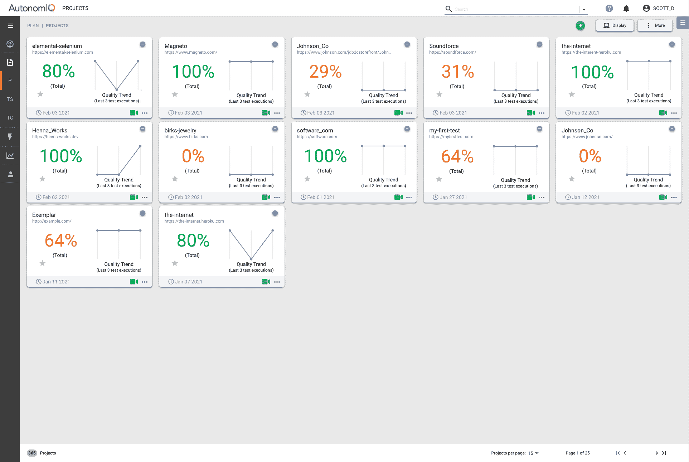

# sauce labs 收购 autonomic 以推进应用测试

> 原文：<https://devops.com/sauce-labs-acquires-autonomiq-to-advance-app-testing/>

sauce Labs[正在收购 AutonomIQ](https://saucelabs.com/news/sauce-labs-enters-into-definitive-agreement-to-acquire-autonomiq) ，AutonomIQ 是一家基于机器学习(ML)算法的无脚本测试自动化平台提供商。

Sauce Labs 首席产品官马特·怀曼(Matt Wyman)表示，收购 AutonomIQ 将发挥关键作用，使 Sauce Labs 能够将测试进一步推向开发者，并最终成为 DevOps 测试工具链的一部分的“公民测试员”。

在收购 AutonomIQ 之前，该公司刚刚宣布打算[收购应用编程接口(API)测试平台提供商 API Fortress](https://saucelabs.com/news/sauce-labs-acquires-api-fortress-to-bolster-continuous-testing-platform-with-modern-api-testing-solution) 。两项收购的条款均未披露。

Wyman 说，DevOps 的兴起，加上使用低代码工具开发的应用程序数量的增加，是需要将测试进一步左移的主要驱动因素。Wyman 说，随着越来越多的开发人员开始开发应用程序，他们需要访问一个测试平台，这个平台不需要他们知道如何编写脚本来测试应用程序。

AutonomIQ 平台采用机器学习来理解，例如，测试用例的自然语言描述或捕获的鼠标点击。Wyman 说，然后它会生成合成数据和测试用例，当应用程序发生变化时，这些数据和测试用例可以自我修复。

怀曼说，这种测试方法在软件即服务(SaaS)环境中更可行，在这种环境中，基于 Salesforce、ServiceNow、Workday、Oracle 或 SAP 等平台的定制应用程序不会像从头开始构建的应用程序那样发生根本性的变化。Wyman 说，这些类别的应用程序仍然需要开发人员或专门的测试团队使用脚本来构建测试。

事实上，Wyman 表示，在微服务时代，测试这些应用程序变得越来越具有挑战性。怀曼说，收购 API Fortress 解决了这个问题，因为微服务依赖 API 与其他微服务进行通信。总的来说，Wyman 说，Sauce Labs 现在不仅仅关注用户界面的功能测试。

测试向左移动的速度有多快还有待观察。开发人员对他们的应用程序质量负有更大的责任，因此应用程序开发过程中的测试集成已经增加。这导致了应用测试与持续集成/持续交付(CI/CD)平台的紧密结合。不太清楚的是，这些努力在多大程度上减轻了专门的应用程序测试团队的负担，该团队通常在应用程序构建完成后对其进行评估。

公民测试员究竟在哪里以及如何被纳入这些过程还不清楚。理论上，公民测试人员可以为测试过程带来更多的业务流程专业知识。在构建应用程序时，让具有这种专业水平的个人抽出时间参与应用程序测试可能是一个挑战。

然而，无论采用何种方法，已经很明显的是，机器学习算法以及其他形式的人工智能(AI)将在未来几个月和几年的应用测试中发挥更大的作用。