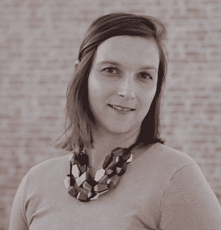

# SauceCon 2020 演讲人简介:Hélène Doumenc 和 Jonathan Chacón

> 原文：<https://devops.com/saucecon-2020-speaker-profile-helene-doumenc-and-jonathan-chacon/>

*这是一系列文章中的第一篇，重点介绍在 SauceCon 2020**举办的* [*演讲嘉宾。SauceCon 将全球的 Sauce Labs 用户和持续测试专家聚集在一起，互相学习，提升他们的自动化测试和持续交付技能。今年的活动将于 4 月 27 日至 29 日在得克萨斯州奥斯汀举行，DevOps.com 将在现场直播。*](https://saucecon.com/)

Jonathan Chacón

Hélène Doumenc

Hélène Doumenc 和 Jonathan Chacón 是肩负使命的同事:帮助人们理解无障碍设计对每个人都是必要的——不仅仅是残疾人。

Hélène 和 Jonathan 一起在西班牙拼车公司 [Cabify](https://cabify.com/en) 的 QA 团队工作，该公司通过其智能手机应用程序提供租车服务。Hélène 管理 QA 团队，Jonathan 是一名可访问性软件工程师，他与公司内的其他团队合作，使所有用户都能访问 Cabify 的所有数字和物理用户界面。作为一名盲人研究人员和开发人员，乔纳森是唯一有资格领导这项工作的人。

Hélène 说:“当我第一次见到 Jonathan 时，我真的很想和他一起工作，将可访问性测试添加到我们的计划中，因为我们以前根本没有测试过可访问性。“这是一个清晰的例子，说明了我们团队中的多样性是如何制造出更好的产品和更好的人的！如果我们没有一个盲人和我们一起工作，我们可能永远不会想到让我们的应用程序对残疾人可用。”

乔纳森同意了。“可访问性在 QA 流程中是必要的，以保证为每个人提供高质量的产品，无论是否残疾。乔纳森说:“我希望人们明白，可访问性应该是一个质量特征，而技术是让社会变得更加包容的途径。”。

Hélène 和 Jonathan 将在[SauceCon 2020](https://saucecon.com/)上共同展示他们在移动应用可访问性测试方面的经验。他们将谈论如何创建可访问和包容性的移动应用程序不仅仅是一个乌托邦式的理想，而是一些组织可以变成现实的东西。

Hélène 说:“最近，我读到一个评论，说盲人不可能使用 Twitter。“人们不知道这是多么错误，也不知道包容性应用程序可以为任何残疾人创造公平的竞争环境。科技真的可以帮助我们创造一个更包容的社会。我们选择在 SauceCon 上讨论这个问题，是为了让社区了解和意识到一些问题，这些问题可能不会出现在你的脑海中，但对于创建这种包容性来说确实非常重要。”

你可以在 SauceCon 2020(第四届年度酱实验室用户大会)上听到来自【hélène、Jonathan 和其他 30 多位专家的演讲。要查看完整的演示列表或注册 、 [请点击此处](https://saucecon.com/) 。

— [丽贝卡·克莱默](https://devops.com/author/rebecca-cramer/)