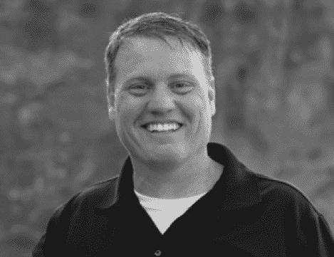

# SauceCon 扬声器简介:Mike Millgate，Optum

> 原文：<https://devops.com/saucecon-speaker-profile-mike-millgate-optum/>

自动化架构师 Mike Millgate 想让自己失业。当然，他不想让自己被淘汰。他只是想自动化测试，这样 QA 团队就可以腾出时间来做其他策略练习，比如探索性测试和关注安全性。

迈克知道他在说什么。在健康服务和创新公司 Optum，他管理着一套在三个小时内运行的测试，测试了 18 个不同的应用程序和超过 24，000 个测试案例。他对并行化充满热情，并指出如果测试没有并行运行，它们将需要 55 天才能运行。

在即将到来的 SauceCon 会议上，Mike 将展示“以并发的速度进行测试”，带领与会者踏上从内部机器测试到基于云的测试的旅程。他将展示什么可行，什么不可行，以及随着机器越来越多地执行工作，如何使用并行化来提高效率。

Mike 希望他的演示能够帮助与会者了解如何并行执行大量测试，无论他们使用的是 Sauce Labs 还是其他测试平台。他的口头禅是，“质量是团队的努力”，并表示整个团队需要同等投入才能取得成功。

迈克已经在 Optum 工作了 15 年。作为医疗保健行业测试自动化的专家，他在 2013 年被带入科技热潮，帮助解决 healthcare 问题。他在该行业的工作有助于 Optum 实现其目标:帮助人们过上更健康的生活，并帮助卫生系统更好地为每个人服务。

作为犹他州南部的居民，迈克喜欢和家人一起徒步旅行和探索附近的国家公园。他热衷于寄养和收养，已经和妻子收养了三个小男孩。迈克也每天跑步，并参加了两次马拉松比赛。

他会说测试自动化是马拉松还是短跑？“如果你做得对，你可以在一个冲刺的时间框架内完成一场马拉松式的测试，”他说。

与 Mike 和其他主持人一起参加 SauceCon，这是第一次 Sauce Labs 用户会议。SauceCon 是一个为期三天的活动，充满了培训、研讨会、最佳实践和自动化测试领域顶尖人物的远见卓识。欲了解更多即将举行的 SauceCon 演示或注册，请访问 [SauceCon](http://saucecon.com) 网站。

## 关于作者/丽贝卡·克拉默

Rebecca Cramer 是一位专注于技术的作家和沟通策略师。Rebecca 在戴尔和 Quest Software 等公司拥有超过 20 年的跨领域经验，包括营销、内部和高管沟通，她热衷于创作和分享各种优秀内容。在业余时间，她喜欢在海滩上度过时光，并在她的家乡南加州徒步旅行。