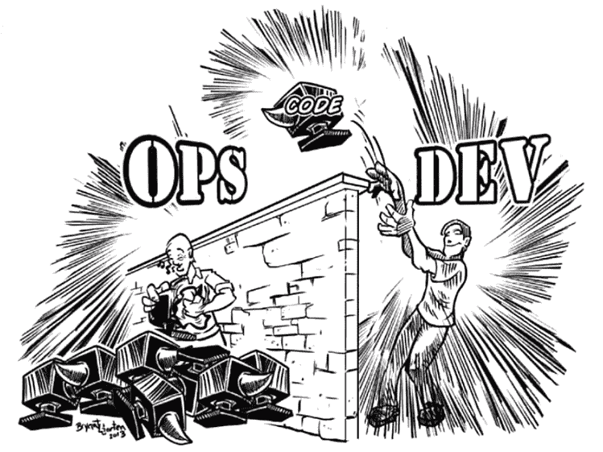

# 在 Pearson 缩放 DevOps

> 原文：<https://devops.com/scaling-devops-pearson/>

培生可能是你从未听说过的最有影响力的公司之一。它在教育出版市场的足迹是广阔的，当它转移到 DevOps 时，它的范围只是一个挑战。

[肖恩·d·麦克](https://www.google.com/url?q=https://www.linkedin.com/in/seandmack&sa=D&ust=1503334670445000&usg=AFQjCNFLGqPEJ6H8BMIXZjXrX3QBOznIJw)([@ SeanDMackNYC](https://www.google.com/url?q=http://twitter.com/seandmackNYC&sa=D&ust=1503334670445000&usg=AFQjCNGOtN4oea3VOLeY47mP9b0Cmmj01g))曾任 [培生](https://www.google.com/url?q=https://www.pearson.com/us/&sa=D&ust=1503334670446000&usg=AFQjCNFDQj6Ajbt2sDI42xQelyMbFcAp2A) 运营与应用副总裁。为了让您了解该公司开始实施 DevOps 时的运营规模，Sean 在全球范围内监督了 110 个开发团队和 3，000 种不同的产品。更复杂的是，培生是一家成熟的公司，既有传统产品，也有新产品。这是一个关于公司如何实现 DevOps 的案例研究，目的是帮助您了解如何实现。肖恩在 2016 年 [全天 DevOps](https://www.google.com/url?q=http://www.alldaydevops.com/&sa=D&ust=1503334670446000&usg=AFQjCNH10QZRz4DvGTZkpd9dH9VwXljmuw) 大会上展示了它。

正如他们所说，你常常从失败中吸取最大的教训。Sean 指出，由于组织变革，DevOps 最终在 Pearson 失败了。但是，他提出了这个案例研究，希望你能从皮尔逊的做法中学到东西，并把它发扬光大。他仍然是 DevOps 的热情传播者。

培生面临着挑战。这是一个大规模运作的孤立组织，在处理问题时有一种抛砖引玉的心态。眼不见心不烦。

此外，Pearson 的所有团队都处于不同的成熟度水平，从传统团队开始运行。Net 在 Windows 2000 服务器上运行，而其他人则对 AWS 进行 CI/CD。显然，这在实现 DevOps 时带来了挑战，但我们稍后将看到该公司如何尝试解决这一问题。

在高层次上，解决方案涉及几个方面:

*   一个 DevOps 练习区
*   devo PS 指导委员会
*   根据全球 KPI 衡量进展，重点是衡量业务影响
*   根据 DevOps 记分卡衡量团队
*   自下而上推动——许多开发者和运营者接受并渴望变革
*   来自高层的推动——来自关键高管的支持

Pearson 的 DevOps 指导委员会设立了几个工作流程:

*   追踪工具
*   指标
*   部署自动化和监控实践
*   测试自动化
*   App 工程资源争夺
*   投入运行
*   通信

虽然这些是培生特有的，但许多可能适用于您的组织。在任何情况下，重要的是退一步，看看你的组织，并决定你的组织需要什么。

Pearson 还关注了四项需要跟踪和衡量的核心能力:自动化；独立性(特性有多独立)；可操作性(维护的难易程度)；和持续改进。下表更详细地概述了每个领域。

| 自动化 | 持续改进 | 独立 | 投入运行 |
| 

*   unit test
*   Key scene
*   depends on the system
*   continuously build
*   Continuous deployment
*   Test automation

 | 

*   KPI
*   拍
*   indicator tracking
*   Index Report
*   Remediation

 | 

*   Isolation configuration
*   code depends on
*   Isolation infrastructure

 | 

*   监控和报警
*   第 1 级服务台系统知识
*   第 2 层服务台系统知识
*   文档

 |

为了帮助每个团队衡量他们的能力和进步，Pearson 开发了一个自我报告工具来授权团队，同时鼓励可见性，并开发了业务指标和能力模型来衡量团队，以了解他们的进展情况。正如 Sean 所说，“我们并没有试图让每个人都达到 5 分。一些团队，是的，但是我们也有遗留的产品成功地运行了几年，很少或者没有维护。培养团队的投资是不值得的。肯定有商业原因。”

最后，Pearson 提高了所有团队的 DevOps 成熟度。如前所述，虽然这最终被淘汰了，但是 Sean 提出了这个案例研究，希望您能在您的公司中找到推动 DevOps 的东西。

最后，如果你只有几个外卖，它们是:

1.  从确定你想要的结果开始。
2.  不要只是为了酷而做 DevOps。这样做是为了推动业务成果。

你可以在这里 在线观看肖恩的全部谈话 [。如果你错过了来自](https://www.google.com/url?q=https://youtu.be/hfkyrGGiWgY&sa=D&ust=1503334670456000&usg=AFQjCNEdk4DbMIgQq-G4gd7fMCFS08qSFA) [全天 DevOps](https://www.google.com/url?q=http://www.alldaydevops.com/&sa=D&ust=1503334670456000&usg=AFQjCNEgJwMoh9Y5_8yJyJw96sRH81JgHQ) 的任何其他 30 分钟长的演示，它们很容易找到并且可以在这里 免费获得。最后，请务必在此 处注册您和您团队的其他成员参加 2017 年全天 DevOps 大会 [。今年的活动将提供 96 场由从业者主导的会议(不允许供应商推介)。10 月 24 日，这一切都是免费在线的。](https://www.google.com/url?q=http://www.alldaydevops.com/&sa=D&ust=1503334670456000&usg=AFQjCNEgJwMoh9Y5_8yJyJw96sRH81JgHQ)

— [德里克·威克斯](https://devops.com/author/derek-e-weeks/)