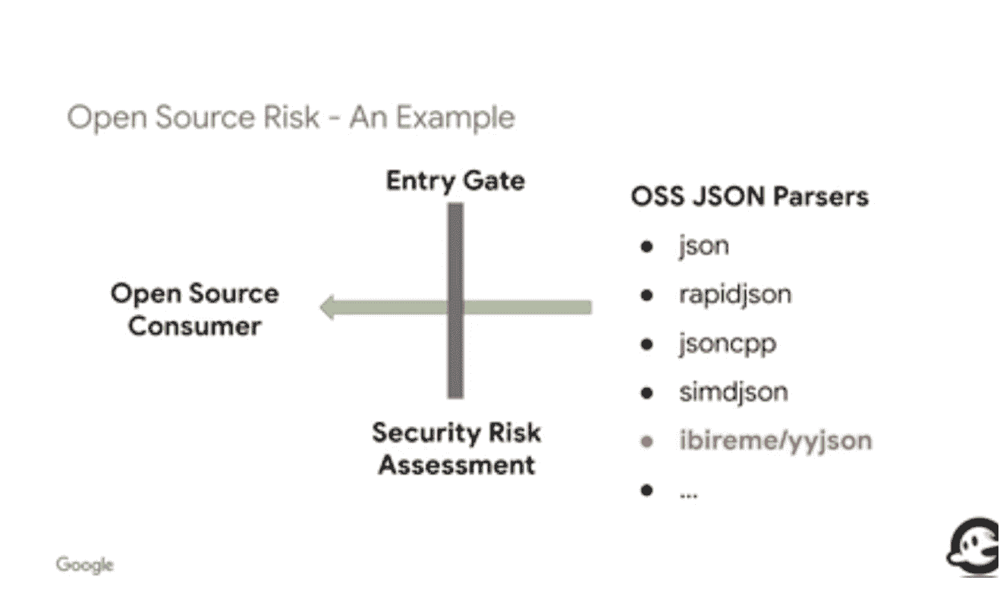
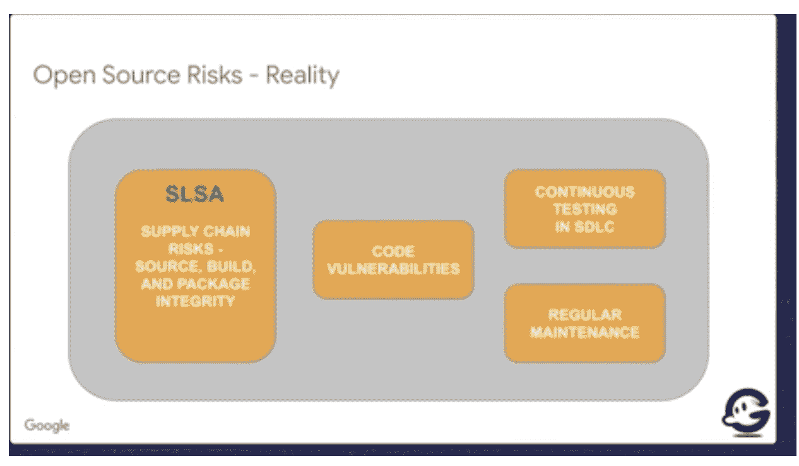

# 安全软件峰会:测量和减轻 OSS 风险

> 原文：<https://devops.com/secure-software-summit-measuring-and-mitigating-oss-risks/>

测量和减轻开源软件中的安全风险正成为软件开发社区的一个主要问题。对[开源](https://devops.com/?s=open+source)软件(OSS)的攻击呈上升趋势；2021 年，开源供应链攻击增长了 650%，这是一个惊人的数字。

2021 年和 2022 年初，发生了影响 1000 多家组织的重大攻击。最近最突出的 OSS 攻击是 2021 年 12 月披露的 Log4Shell 漏洞。对 OSS 供应链和 OSS 的攻击几乎影响了这个星球上的每一个软件组织。随着新的漏洞不断涌入，每个人都在争先恐后地不断修补系统。

为了正确应对这种环境并保证我们系统的安全，我们作为一个群体需要了解开放源码软件的安全风险，并更好地准备集体和单独处理这些风险。

## 开源风险

如果没有适当的安全措施，许多风险会使操作系统变得更加脆弱。

### OSS 是免费的；OSS 安全是昂贵的

首先，我们必须认识到开源软件可以免费下载，不需要付费，但是它会带来巨大的安全成本。

很大一部分开源软件是由志愿者在业余时间开发的。大多数杰出的开源志愿者实际上都有全职工作，他们为像 [Log4j](https://devops.com/?s=Log4j) 日志库这样的项目贡献的代码是在晚上和周末编写的；用自己的时间而不是公司的钱。毫不奇怪，安全性在他们的优先列表中并不重要。他们没有资源投资于安全的开发生命周期，也没有时间和带宽来维护他们的代码。这可能意味着安全漏洞长期得不到解决，有时是无限期的。

### 所有的 bug 都很浅，但是眼球不够

在 [软件开发](https://en.wikipedia.org/wiki/Software_development) ，莱纳斯定律陈述“……给足了眼球，所有[bug](https://en.wikipedia.org/wiki/Software_bug)都浅了。”然而，只有当这些眼睛看向正确的地方时，这才是真的。在开源的情况下，所有的代码都是开放的，但是没有足够多的眼睛关注它来发现所有的错误。此外，组织可能不会考虑他们决定使用特定的开源软件并将其添加为依赖项的安全后果。依赖树变得越来越复杂；随着您不断向核心代码库添加更多的第三方组件，监控和保护变得越来越困难。每个新的依赖项都可能带来额外的嵌套依赖项——可能是数百个或数千个，这取决于添加的库的大小或它在应用程序架构中扮演的角色。例如， [Kubernetes](https://containerjournal.com/?s=Kubernetes) 项目——最成功和最广泛采用的 OSS 项目之一——有几千个依赖项，其中许多都有额外的二级和三级下游依赖项。

### 这么多代码。这么多选择。不是所有的都是好的。

开源生态系统的美妙之处在于每件事都有一个解决方案。开源生态系统的问题是不只有一个解决方案，而是几十个。例如，如果您的应用程序需要一个 JSON 解析器，有几种可供选择。如果您的应用程序正在运行一个关键的服务或基础设施，那么选择正确的 JSON 解析器——一个安全的、来自负责任的项目或维护者的解析器——就变得非常重要。JSON 解析器将作为应用程序的关键组件，因此它将影响整个系统的安全性。如果您选择了错误的 JSON 解析器，您可能会在安全风险和随后的违规中付出巨大的代价。

## 提议:入口安全风险评估

增强 OSS 代码安全性的一个潜在解决方案是创建和实施一个安全风险评估门，作为您的 OSS 摄取管道的一部分。实施这一流程将有助于您了解使用某个软件是否存在高风险，并避免使用不符合您风险标准的软件。

这里有一个例子来说明这是如何工作的。考虑 GitHub 中五个不同的 JSON 解析器库，它们都有很高的星级，看起来评价很高。我们如何评估这些库的风险，并快速轻松地消除那些风险太大的库？其中一个 JSON 库由一个用户帐户托管。大多数提交都是由一个开发人员完成的，没有经过评审。仅这一点就表明在关键系统中使用这个库存在很高的风险。这个单独的开发人员可能未经审查就提交恶意代码。维护者的令牌访问可能会被泄露，使得攻击者能够插入恶意代码。开发人员还可能在不通知用户(用户可能根本不会注意通知)的情况下，将他们库的提交者控制权交给一个恶意的参与者。识别这种风险只需要对存储库进行几分钟的审查，并且花费的时间和精力很少。

## OSS 安全态势的更广阔视角

更广泛地说，在将开源代码添加到关键系统之前，我们需要了解一个组织或开发人员的全部安全状况以及他们的开源代码。因为开放源码软件是一个复杂的生态系统，许多开放源码软件都很复杂，它们产生的风险也同样复杂。我们对这些风险的传统短视观点是，我们只需要找到我们代码库中所有的安全漏洞并修复它们。这并不能解决所有的风险，可能会让我们产生一种虚假的安全感。

我们需要了解一个开源项目的全面安全状况。这涉及到理解代码漏洞之外的广泛风险。除了确保您的代码库得到良好的保护和修补之外，这里还有一些需要考虑的关键风险。

**供应链对构建渠道的攻击**

像网络安全管理软件产品和 CodeCove 这样的攻击告诉我们，供应链风险是一个非常大的问题，工具和代码一样有风险。攻击者发现攻击构建管道比在代码中寻找漏洞要容易得多，也可靠得多。

**持续安全测试揭示的安全风险**

持续的安全性测试对于维护代码库的安全性至关重要。今天可能没有代码漏洞，但随着开发人员不断修改代码和迭代应用程序，漏洞可能会被引入。这意味着在每一次新的代码推送时，都要将代码测试作为 CI/CD 流程的一部分。例如，我们在 OpenSSL 库中发现了许多严重的错误。所有这些都在一个主分支或主要分支上被捕获，并且从未发布到产品版本中。

**项目维护和能力**

开源的一个真正大的风险是项目维护的质量和频率。提出的问题可能无法及时解决。项目的维护者可能有很长的问题积压，这表明他们没有积极地维护项目。数百万应用程序中使用的关键开源项目，以及对全球软件供应链的重大依赖，在一年或更长时间内没有更新，这种情况并不罕见。此外，OSS 项目的维护者可能不知道如何响应安全事件和修复安全漏洞。如果维护人员不在大型组织工作，没有网络安全或安全开发经验，或者从未经历过在短时间内解决代码中的重大漏洞的辛劳和创伤，这种情况尤其如此。

## 衡量和解决供应链风险的工具

许多人正在努力创造免费的工具来帮助开发者和应用安全团队更好地以编程和分析的方式测量和解决供应链风险。

### SLSA——软件工件的供应链级别

作为一个帮助组织更好地解决软件供应链风险的工具，谷歌创建了一个新颖的框架，我们称之为软件工件的供应链层次( [SLSA](https://devops.com/google-proposes-slsa-framework-to-secure-software-supply-chains/) )。该项目已经在谷歌进行了十多年，并作为 OSSF 的一部分被开源。贡献者包括 VMware、花旗银行和 Datadog 等。谷歌希望将 SLSA 标准化，使其成为评估供应链风险的行业基准。现在，SLSA 主要关注于构建过程风险，但是希望在不久的将来扩展到其他领域，比如漏洞和维护者风险。

### OSS 安全记分卡项目

为了扩大评估、识别和减轻 OSS 风险的流程，我们需要强大的自动化。2020 年，作为 OSSF 的一部分，谷歌发布了一个名为开源安全记分卡的新项目。该项目旨在评估开源代码的安全状态时，自动化分析和信任方面。此外，记分卡可以提供具体的安全建议。记分卡流程可以整合许多其他自动化工具，包括使用[开源漏洞(OSV)](https://osv.dev/) 数据库检查漏洞，以及使用[依赖机器人](https://github.com/dependabot)等开源依赖跟踪器运行依赖检查。记分卡项目还使得报告新的漏洞和将这些漏洞提供给项目中合适的人变得更加容易。

## 结论:没有被测量的不会被减轻

没有人否认 OSS 已经成为运行世界技术基础的绝大多数应用程序的关键。随着越来越多的语言和框架出现以及专业化程度的提高，开放源码软件的范围不断扩大。没有人想重新发明轮子，重写新代码来执行每个新应用程序的相同任务。重用、依赖和分布式软件开发的模型起作用并加速创新。也就是说，用于构建 OSS 的开源社区和供应链需要一种更严格的方法来降低风险。考虑到问题的范围，自动化和标准化有助于实现既定目标。我们正处于创建工具和基础设施以自动化风险识别、测量、评估和缓解流程的早期阶段。像 SLSA 这样的安全框架和像用安全记分卡进入新的 OSS 代码这样的新过程将引导组织沿着这条路走下去，并使我们走向一个更加安全的开源未来。

**关于安全软件峰会**  安全软件峰会汇聚了全球领先的安全软件开发创新者、从业者和学者，分享和传授安全编码和部署实践的最新方法和突破。如果您正在开发、发布和保护软件，快速交付新功能，并从一开始就构建东西，请单击下面的链接访问本次峰会的所有会议。

[https://go.shiftleft.io/secure-software-summit-2022-replay](https://go.shiftleft.io/secure-software-summit-2022-replay)