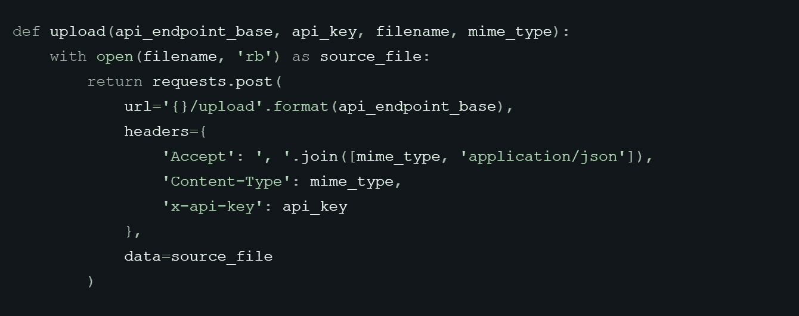
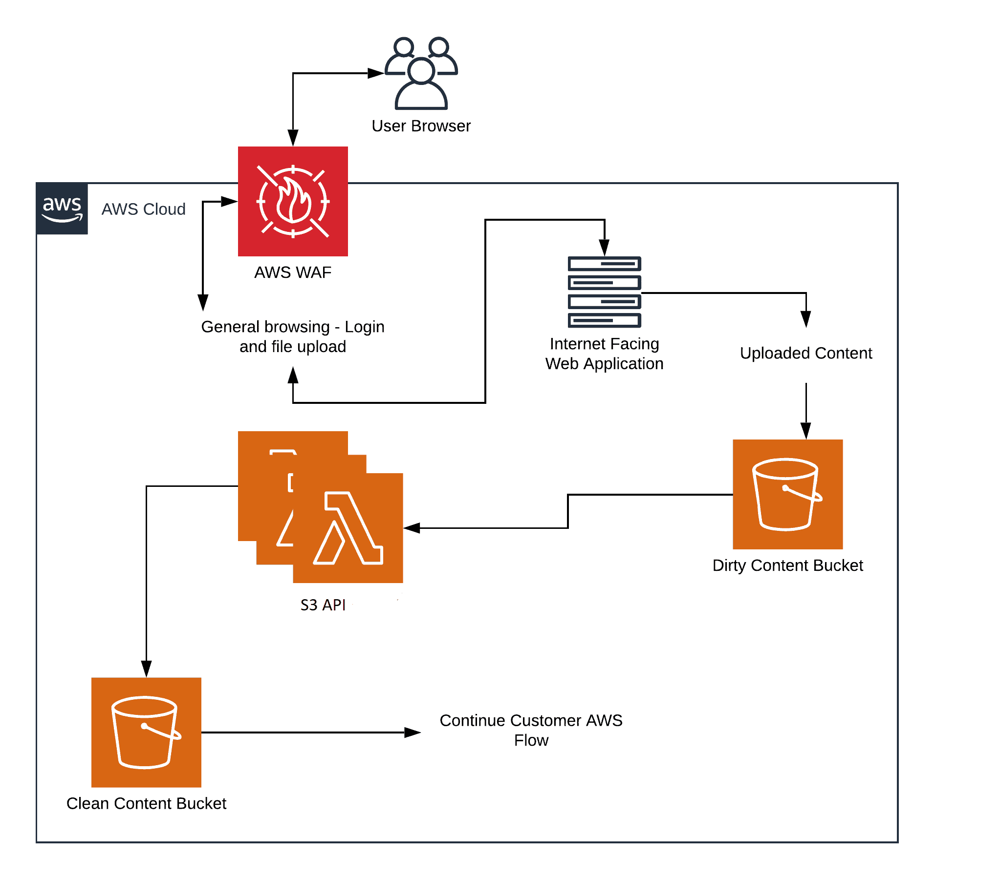

# 保护面向互联网的门户

> 原文：<https://devops.com/securing-internet-facing-portals/>

在当前疫情的背景下，几乎没有一天不推出另一个门户或网络应用来帮助公民和客户与政府和企业互动。将这些应用程序快速推向市场，并确保它们不会危及组织的安全性，这需要 DevOps 采用新的技巧和技术。那么，DevOps 如何才能最好地确保这些应用程序不会成为坏人的后门呢？

## **附加防守技术**

在 OWASP 的 Web 应用程序十大漏洞列表中，确保上传的文档和图像没有威胁并不重要。然而，这些可能是任何面向互联网的门户或应用程序的致命弱点。

将恶意软件走私到组织中的主要途径是通过文档和图像。这些文件通常嵌入恶意软件，有些是基本的，有些非常复杂，目标是最终上传文件的用户或员工。或者，隐藏的恶意软件可以攻击门户本身，例如，通过畸形的文档。

这种恶意软件足够新，而且隐藏得很好，它一再逃避基于检测的网络防御，甚至现代人工智能技术。确保通过门户到达的内容是无威胁的意味着找到额外的防御技术，在不降低应用程序速度的情况下提高安全性。

## **最佳实践**

英国 NCSC 发布了一套基本准则，适用于任何负责必须接受来自互联网的文件和图像的应用程序的安全性的人。在 NCSC 的“模式:安全导入数据”中，该组织描述了一组接受来自不可信来源的文档的最佳实践指南，并推荐了一种称为文档转换的方法，以确保导入的文档没有威胁。

转换是一种机制，通过这种机制，不受信任的文档和图像可以从中提取重要的业务信息。然后原件将被丢弃，同时丢弃的还有任何嵌入的威胁。然后对业务信息进行验证，然后创建全新的文档并进行格式化，以与原始文档相匹配。

Figure 1: Transformation engine.

一旦文档通过转换引擎，它们就完全安全，无需任何进一步的安全措施即可使用。

## **“内置”安全控制**

对于 AppSec 经理来说，转型是在开发运维团队中推广的一个很好的方法。它可以通过云 API 进行访问，并增加了额外的安全层，符合安全最佳实践，有助于确保 web 应用程序和门户网站不会成为恶意软件渗透的后门。

Figure 2: Uploading a Document via an API.

根据特定应用程序的性质，开发人员需要选择转换 API。例如，一些应用程序将需要简单的上传/下载 API 来转换文件，而其他应用程序将需要能够处理更复杂任务的 API，例如事件驱动的工作流或在不同存储桶之间移动文件。

Figure 3: AWS Flow Using S3 API.

## **提前开始**

web 应用程序接受上传到门户网站的文档的需求只会增加，随之而来的是隐藏的恶意软件的潜在危害风险。好消息是，任何构建必须接受来自 internet 的文档和图像的 web 应用程序或门户的 DevSecOps professional，如果使用无服务器体系结构，在安全构建方面已经有了优势。

从安全的角度来看，无服务器架构的替代方案，即云中的机器映像，具有相关的风险，例如，如果恶意软件成功地危害了机器，它在此后仍然会受到危害。有了无服务器的云原生架构，就没有剩余的机器，因此几乎没有剩余风险。

支持构建无服务器云原生计算模式的另一个要点是，它将打补丁的责任移交给了服务提供商。人们普遍认为，未打补丁的系统是网络安全漏洞的主要原因之一。无服务器架构使开发人员能够将操作职责和日常安全任务(如修补、维护和升级)转移给服务提供商。

当前的疫情加速了对面向互联网的门户网站的需求，随之而来的是恶意软件通过上传的文档和图像渗透的风险。对于开发人员来说，这意味着找到新的防御技术，如转换，可以快速轻松地融入代码中，以确保上传没有威胁。