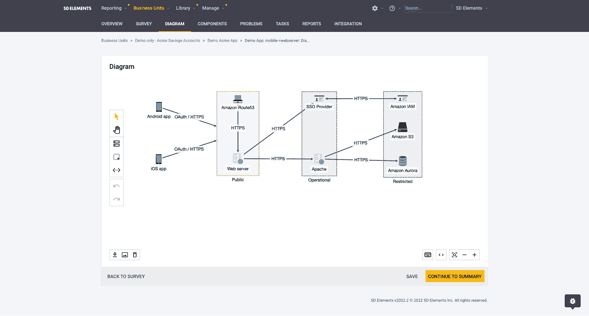

# 安全指南针使 AppSec 威胁可视化变得更简单

> 原文：<https://devops.com/security-compass-makes-visualizing-appsec-threats-simpler/>

Security Compass 本周为开发人员更新了其威胁建模平台，使其更容易暴露应用程序的安全问题。

SD Elements 2022 的最新版本[增加了对以开发人员为中心的威胁建模图、可重用组件、更高级的报告功能和 114 个实时培训(JITT)模块的支持。此外，Security Compass 现在已经将其平台与 Black Duck 软件组合分析(SCA)工具集成在一起。](https://www.businesswire.com/news/home/20220712005260/en/Security-Compass-Releases-New-SD-Elements-Capabilities-to-Enable-a-Developer-Centric-Approach-to-Software-Threat-Modeling)

Security Compass 的产品管理总监 Drew Koelemay 表示，目标是使用一个在 DevOps 工作流中可视化网络安全威胁的平台，使应用程序开发和网络安全团队更容易合作。

他说，这种应用程序安全的方法至关重要，因为开发者更容易理解应用程序的变化如何改善复杂应用程序环境的整体网络安全状况，其中有许多依赖关系。

Koelemay 指出，一旦实现了可视化，就有可能创建报告，突出显示该产品组合中最普遍的威胁和弱点。

在一系列引人注目的应用程序违规事件之后，各种规模的组织都希望通过实施 [DevSecOps](https://devops.com/?s=DevSecOps) 最佳实践来更好地保护其软件供应链。立即出现的问题是应用程序开发团队和网络安全专业人员之间的文化差异。Koelemay 说，Security Compass 平台展现了以开发人员为中心的安全问题可视化，有助于弥合这些团队之间存在的历史性分歧。

在很大程度上，网络安全专业人员认为开发团队缺乏网络安全专业知识是他们遇到的许多问题的根本原因。这并不是说开发人员故意开始构建和部署易受攻击的应用程序。等到对应用程序进行审查时——通常就在应用程序应该部署的前几天——对发现的大部分漏洞采取措施往往为时已晚。网络安全专业人员和应用程序开发团队需要在应用程序开发生命周期的早期就进行有意义的合作。

简单的事实是，开发人员不太可能仅仅因为他们不知道在应用程序环境中应该寻找什么样的网络安全问题而首先寻求帮助。大多数时候，他们都在赶着满足应用程序交付的最后期限，这使得他们将网络安全视为一个需要克服的障碍，而不是集成在其工作流程中的自动化流程。因此，网络安全专家需要找到一种更有建设性的方式来吸引开发者。网络安全团队有责任在应用程序开发过程的前端介入，而不是在后端等待不可避免的问题出现。

不管怎样，应用程序的安全性将会得到改善。唯一尚未确定的是这个过程会有多痛苦。使 DevOps 团队能够自己看到遇到了什么问题的工具应该大大有助于减少经历的痛苦程度和解决手头的网络安全问题所需的时间。