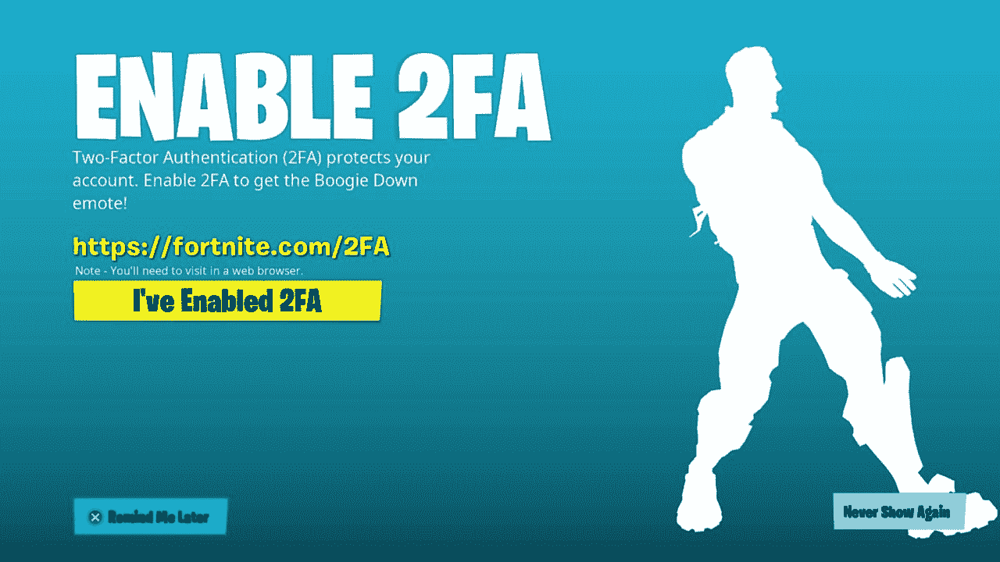
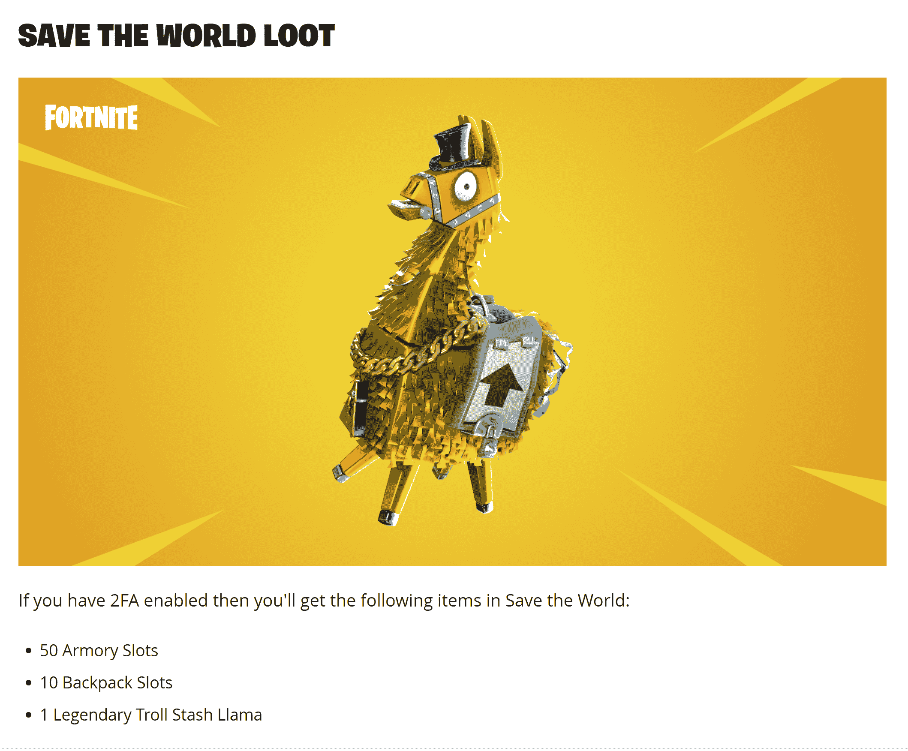
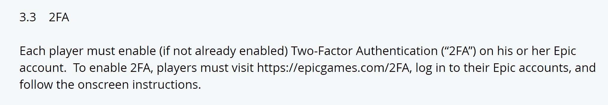

# 安全关乎人，而不是技术

> 原文：<https://devops.com/security-is-about-people-not-technology/>

只是今天的一个随机想法:我们有世界上最好的例子来说明我们有多少安全灾难实际上是人的问题，而不是技术问题。

我们都知道。我们都讨论过这个问题，但是让我们考虑一下这个例子，快速讨论一下 2FA。

史诗游戏公司遇到了一个和我们一样的问题。但这每天都要花掉他们的钱，部分原因是他们用户群的性质。问题？攻击者接管合法[堡垒之夜](https://www.epicgames.com/fortnite/en-US/home)用户的账户。在游戏世界里，骗子很普遍，因为玩家群体更年轻。至少从 Ultima Online (1997 年)开始，在线游戏就一直在增长，而堡垒之夜处于这场运动的最前沿，在它流行起来之前，用户数量是闻所未闻的。许多用户加上黑客和骗子利用了被游戏吸引的年轻群体——堡垒之夜庞大的用户群中超过 60%的人年龄在 24 岁以下——他们没有提供进一步的细分，但肯定有年仅 6 岁的孩子在玩游戏；甚至可能是更年轻的玩家)。

这造成了一个问题。毫无疑问，为支持有账户问题的客户而投入的时间、金钱和精力是巨大的。我没有内部人士向我提供信息，但简单的数学——以及他们采取措施的证据——表明情况确实如此。

因此，他们对孩子们做了很多我们成年人没有勇气做的事情。他们实施了 2FA。虽然他们并不要求这样做——而且像大多数游戏公司一样，对任何类型的玩家统计数据都守口如瓶——但他们用胡萝卜加大棒的方法实现了这一点，毫无疑问，这是成功的。我的游戏团队中有六个人都在使用它——因为我们要么想要胡萝卜，要么在逃避大棒。它不是真正的棍子。称之为胡萝卜和墙。对于这款游戏最受欢迎的两个版本来说，胡萝卜有两种形式:一种是让你的角色(如果你喜欢的话，可以叫它卡通)在*堡垒之夜:皇家战役中表演的免费舞蹈。*

付费版的免费装备-*堡垒之夜:拯救世界。*

对于那些不熟悉的人来说，这两个都是不错的奖励；根据堡垒之夜团队的计算，这足以令人信服地证明这些步骤是正确的，但并不疯狂。拯救世界奖励实际上更有用，但皇家战役之舞可能更受欢迎。

然后，他们建起了一堵墙。如果你想玩竞技堡垒之夜，你必须打开 2FA。可能这样做是为了保护他们比赛的神圣性，但它的效果是提供了“奖励和惩罚”等式的另一半。根据[对比营](https://comparecamp.com/fortnite-statistics/)，仅游戏世界杯就有 4000 万玩家试图获得参赛资格。这是 2FA 激活账户的最小数量——如果没有开启 2FA，你就不能参加竞技堡垒之夜。

然后，他们尽可能容易地打开 2FA。你需要从中吸取教训。对我来说，打开 2FA 并让它为[不和](https://discord.com/)工作比打开它并让它为堡垒之夜工作更难。努力变得像堡垒之夜一样简单。

在这一点上，我们都应该认识到某种形式的 [2FA](https://devops.com/?s=multifactor-authentication) ，甚至是像电子邮件这样备受指责的(指责是因为有人破坏了你的电子邮件，然后就可以更容易地访问所有内容，因为 2FA 被破坏了)，几乎是必不可少的。有人劫持有效用户帐户的成本——如首席系统工程师或首席执行官——高得不容忽视。但是一些 2FA 的解决方案比其他的更难。因此，我们需要效仿 Epic Games 的做法，让游戏尽可能简单，激励员工打开游戏，如果合适的话，还可以挥舞大棒。如果激励机制好的话，在实现完成之前，稍微检查一下就足够了。休假一天？一小笔奖金？你了解你的组织，既了解管理层会同意支付什么费用，也了解用户会觉得什么有吸引力。

完成它。你最不希望的就是你的 CEO 突然开始在公司账目上说些/做些古怪的事情。除非他们已经做了——那么我建议你考虑找份新工作。我知道；有 5000 件事要做，而你只有几件。但是这个很大。不要等到失去客户后才启动非常有效的预防机制。