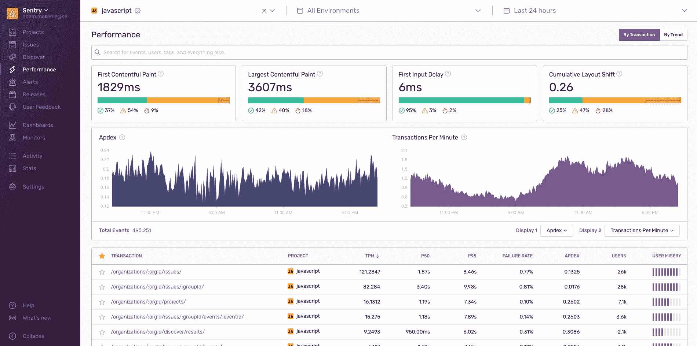

# Sentry 扩展了应用程序性能监控工具

> 原文：<https://devops.com/sentry-extends-application-performance-monitoring-tool/>

Sentry 本周宣布，它已经在其[应用监控工具](https://devops.com/?s=application%20performance%20monitoring)中添加了对采用无服务器计算框架的应用程序以及谷歌网络生命服务的支持。

公司首席执行官米林·德赛表示，将 [Google Web Vitals](https://web.dev/vitals/) 指标纳入 Sentry 性能监控将变得至关重要，因为谷歌兑现了根据通过这项服务收集的指标在其搜索引擎上对网站和应用程序进行排名的承诺。

Google Web Vitals 通过监控网站呈现用户界面对象的速度来确定应用程序的速度。通过将 Web Vitals 与 Sentry 收集的交易数据相结合，开发人员可以关联交易如何对用户体验产生负面影响。Desai 说，这些数据可以用来调整应用程序中应该调用什么样的应用编程接口(API)。

与此同时，他指出，越来越多的开发者开始在其应用程序的前端采用无服务器计算框架。Sentry 平台现在监控 PHP、Node 和基于 Ruby 的应用程序中使用的无服务器计算框架。Desai 说，当应用程序中发生某种类型的事件时，大多数这些框架都被用来触发特定的动作。

最后，Sentry 还添加了一个趋势视图，使开发人员能够看到随着时间的推移发生的改进最多和退步最多的事务。该功能使开发人员能够更容易地确定整体 IT 环境的变化何时会对他们的应用程序产生负面影响。有了这些数据，识别当时做了什么更改就变得容易了。

总的来说，Desai 表示，与 IT 运营团队相比，对应用程序开发人员的可观察性关注不够。Sentry 性能监控旨在通过向应用程序添加五行代码，使开发人员能够将代码中发生的特定事件与实际的最终用户体验相关联。

开发人员的可观察性工具不会消除 IT 运营团队对可观察性工具的需求，但 Desai 指出，就应用程序的可见性而言，当今大多数开发人员都是盲目的。可观察性应该是任何 DevOps 实践的核心原则。然而，实际达到的可观察性水平在不同的 IT 组织中有很大的差异。

当然，解决任何问题的最好方法是尽可能在应用程序代码中。许多开发人员可以在许多 IT 运营团队意识到性能问题存在之前很久就消除这些问题，如果他们对代码如何执行有更多的可见性的话。随着 IT 组织基于具有许多依赖性的微服务部署应用程序，这个问题将变得更加紧迫。

IT 组织现在面临的挑战是，不仅要确定采用哪种可观察性平台，还要确定组成团队的所有不同角色和人物角色所需的可见性级别。