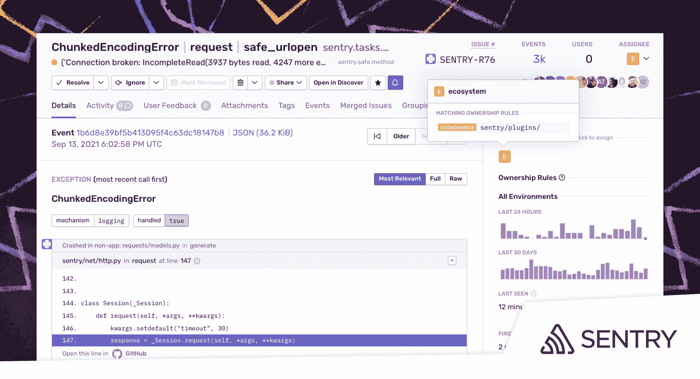

# Sentry 将代码可观察性工具与 GitHub、GitLab 集成在一起

> 原文：<https://devops.com/sentry-integrates-code-observability-tool-with-github-gitlab/>

Sentry 本周[扩展了其同名的代码](https://www.businesswire.com/news/home/20210916005240/en/Solve-Issues-Faster-With-Sentry%E2%80%99s-New-Enterprise-Capabilities)可观察性平台，以提供与 GitHub 和 GitLab 提供的 DevOps 平台的更紧密集成。

应用程序开发项目经理现在可以通过直接与 GitHub 或 GitLab 中的 CODEOWNERS 文件集成，将问题分配给 DevOps 团队。例如，错误消息现在可以通过 Slack 中的通知自动发送给拥有代码的个人或团队。

IT 团队现在还可以根据问题在特定时间内超过用户会话的特定百分比来设置警报，从而根据用户影响来识别问题并确定问题的优先级。

Sentry 首席执行官米林·德赛(Milin Desai)表示，基于百分比的警报方法减少了产生的总体噪音，使 DevOps 团队能够更好地优先考虑他们的补救工作。

最后，Sentry 增加了与 Okta 身份管理平台的集成，使得使用跨域身份管理系统自动配置和取消配置用户和团队成为可能。

Desai 指出，随着管理应用环境的更多责任转移到开发人员身上，需要一种方法来简化开发人员与 IT 运营团队其他成员之间的沟通。如今，大多数开发人员已经花了不到三分之一的时间来编写代码。

Sentry 平台已经被超过 75，000 个组织使用，使开发人员能够更好地观察和分析代码行为。德赛指出，该公司现在正通过简化通信和工作流程来弥合开发人员和现场可靠性工程师(SREs)之间的鸿沟。

随着管理应用程序的责任向左转移，开发人员不一定想使用 IT 运营团队多年来一直依赖的工具。大多数开发人员希望能够在与 IT 运营团队最少互动的情况下排除应用程序故障。

过去，IT 运营团队依赖应用性能管理(APM)平台来管理 IT 运营。这些平台现在正在演变成[可观察性](https://devops.com/?s=observability)平台，这些平台承诺通过在应用程序和 IT 基础架构平台上关联事件来提供更多上下文。然而，这种方法通常需要开发人员将代理软件插入到他们的应用程序中。一旦插入，代理软件需要维护和更新，德赛补充说。

Sentry 方法为开发人员提供了一种从应用程序中收集数据的工具，这种方法在直接嵌入到应用程序中后只需消耗几十千字节的内存。这种方法消除了依赖大得多的代理软件来实现应用程序代码的可观察性的需要。然后，开发人员可以诊断并可能修复代码中的问题，而不必创建请求 DevOps 团队调查问题的票证。

不管开发人员如何对他们的应用程序进行检测，大多数 IT 人员都同意当前的可观测性状态需要改进。现在的问题是确定如何以对 DevOps 团队和开发人员都有利的方式最好地实现这一目标，开发人员现在不仅要编写代码，还要管理整个应用程序生命周期。