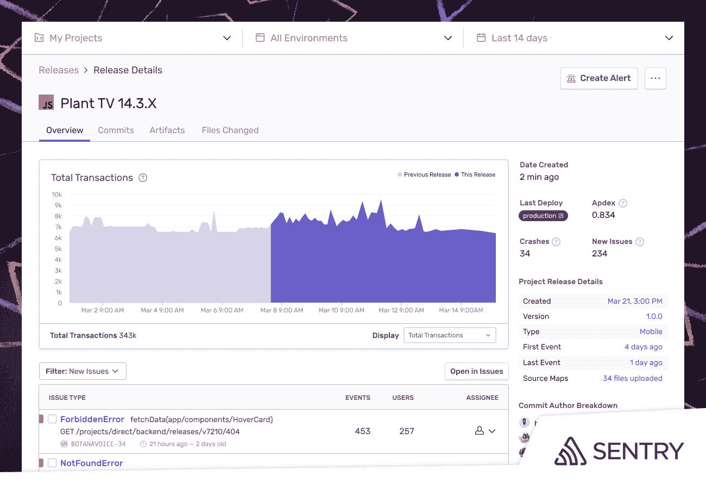

# 用于监控 JavaScript 应用程序的哨兵更新工具

> 原文：<https://devops.com/sentry-updates-tool-for-monitoring-javascript-apps/>

[Sentry](https://sentry.io/) 今天宣布，它已经更新了用于监控应用程序的 JavaScript SDK 工具，以提供更全面的应用程序健康状况视图。

以前，Sentry 的 JavaScript SDK 允许 JavaScript 开发人员插入代码行来告诉他们，例如，应用程序失败了多少次。一个新的发布健康功能现在还可以识别那些失败的实例占应用程序成功启动的总次数的百分比。

实际上，开发人员可以通过跟踪应用程序生命周期中无崩溃会话和无崩溃用户的百分比来更好地评估 JavaScript 应用程序的采用情况。

Sentry 的工程副总裁 Ben 醋说，JavaScript SDK 旨在为开发人员提供监控功能，不需要 IT 运营团队站起来管理整个应用性能管理平台。醋溜说，这种方法还消除了用代理软件编写 JavaScript 应用程序的需要。

醋说，JavaScript SDK 在直接嵌入 JavaScript 应用程序后会消耗数万千字节的内存。

总的来说，JavaScript 越来越多地被用来构建复杂的应用程序，使用 React 等框架作为 Java 的替代品。多年来，IT 组织已经对如何使用 APM 平台监控和管理 Java 应用程序形成了一定的偏见。然而，随着 JavaScript 开发人员在部署后对他们的应用承担更多责任，他们需要实时监控工具，这些工具可以使用 JavaScript 应用指标并内置于现有的 APM 平台中。

当然，APM 平台管理的不仅仅是 JavaScript 应用程序，所以在可预见的未来，它们仍然很有用。然而，当应用程序开发人员选择构建应用程序的语言时，易于观察和监控是一个重要因素，并且由个人来解决生产中可能出现的问题。因此，开发人员在部署应用程序之前发现潜在问题是他们的既得利益。

从历史上看，开发人员无法使用 JavaScript 应用程序监控工具，而他们自己可以轻松实现这些工具。Sentry 的工具使开发人员能够识别性能问题，包括调用应用程序编程接口(API)和其他常见错误，并在应用程序崩溃前解决这些问题。

随着性能和安全问题转向左边，开发人员变得对用户体验更加负责，有一天开发人员可能会自己检测和监控应用程序——如果没有其他原因，只是为了自我保护。开发人员在修正现有应用程序中的生产问题上花费的每一分钟，他们编写新代码的时间就会减少一分钟。