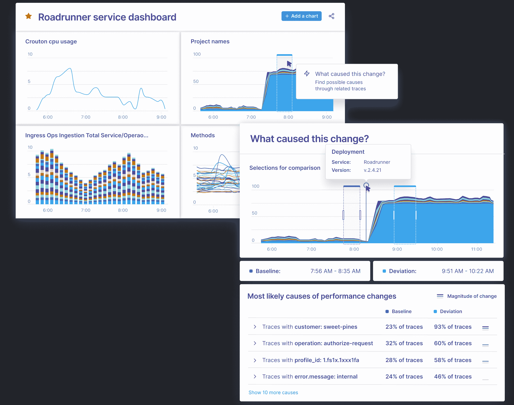

# ServiceNow 收购 Lightstep 以获得观察平台

> 原文：<https://devops.com/servicenow-acquires-lightstep-to-gain-observability-platform/>

ServiceNow 今天宣布已经[收购 Lightstep](https://www.businesswire.com/news/home/20210510005194/en/ServiceNow-to-Acquire-Lightstep-Combining-Next-Generation-Observability-with-the-World%E2%80%99s-Leading-Enterprise-Digital-Workflow-Platform) ，这是为其 it 运营组合增加一个可观察性平台的努力的一部分。预计将于本季度完成的交易条款尚未披露。

Lightstep 的[Change Intelligence](https://devops.com/lightstep-delivers-next-generation-observability-platform/)observability 平台基于一个时间序列数据库，每天能够处理一万亿个事件。它是由创建 Monarch 的同一团队创建的，Monarch 是一个全球分布式内存时间序列数据库系统，谷歌用来监控其应用程序和系统。Lightstep 团队成员还共同创建了 OpenTracing 和 OpenTelemetry 开源项目，用于收集踪迹、指标和日志。

ServiceNow 高级副总裁兼 IT 工作流产品总经理 Pablo Stern 表示，ServiceNow 将采用 Lightstep，使 IT 组织能够观察基于单片和微服务的应用程序，因为 IT 运营和 DevOps 团队将继续相互密切合作。我们的目标是提供一个单一平台，IT 团队可以通过该平台观察整个 IT 环境，该平台由 ServiceNow 通过软件即服务(SaaS)交付模式提供。

Stern 指出，这种方法将使 DevOps 团队能够与使用图形工具的 IT 管理员一起以编程方式管理 IT 环境。

Lightstep 首席执行官 Ben Sigelman 补充说，随着更多的应用程序利益相关者开始跟踪处于各种数字业务转型计划核心的软件开发项目，这种可观测性的用户数量将会增加。

主要由于现在部署在高度分布式计算环境中的微服务的兴起，发现 it 问题的根本原因变得更加困难。基于微服务的应用程序有许多依赖项，这些依赖项虽然有助于提高整体应用程序的弹性，但也使得难以确定哪些特定的微服务可能会对应用程序的性能产生负面影响。

Change Intelligence observability 平台下的时序数据库使得超越日志和指标来处理分布式跟踪变得可行，从而提供对应用程序行为的更多洞察。Sigelman 说，最终目标是使组织能够更快地创新，对 IT 环境更有信心。

就向企业中的可观察性进军而言，现在还为时尚早。虽然可观察性可能是任何 DevOps 实践的核心原则，但是大多数 IT 组织依赖于无数的工具，这些工具将团队试图关联的数据表面化。每当出现重大问题时，这些 IT 团队通常会在“作战室”开会，比较由所采用的各种 IT 监控工具生成的报告。可观察性平台收集和处理分布式跟踪，用于使用一组一致的规范、框架和库来装备应用程序。OpenTracing 和 OpenTelemetry 工具非常重要，因为它们提供了一种开源方法来检测应用程序，从而降低可观测性的总成本。相比之下，许多传统的[应用性能管理](https://devops.com/?s=application+performance+management) (APM)平台采用专有代理来管理应用。

自然，每个 IT 组织都将朝着提供更大应用环境的可观察性平台的方向前进。然而，在这一点上，还不清楚在过渡到微服务之前需要安装到什么程度的可观测性平台，而只有当微服务的问题最终变得明显时，这种能力才会受到重视。