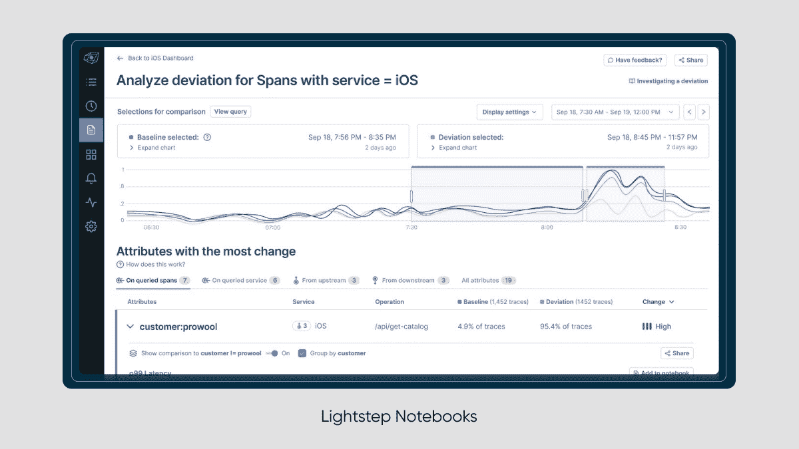

# ServiceNow 增加了 Lightstep 笔记本来可视化可观测性数据

> 原文：<https://devops.com/servicenow-adds-lightstep-notebooks-to-visualize-observability-data/>

ServiceNow 今天为其 Lightstep observability 平台添加了一个可视化工具，这将使 DevOps 团队更容易关联指标、日志和跟踪。

ServiceNow 的 Lightstep 总经理 Ben Sigelman 表示，Lightstep 笔记本电脑将使 DevOps 团队更容易理解 observability 平台收集的大量数据。

[Lightstep Notebooks](https://lightstep.com/blog/announcing-notebooks) 是变革智能分析引擎的扩展，ServiceNow 已经在 2021 年收购的可观察性平台中提供了该引擎。

Lightstep 笔记本附带了一组特别图表，其中包括使用 Lightstep [可观察性](https://devops.com/?s=observability)平台核心数据库访问热图和带有跟踪样本的时间序列数据。

即时生成的调查路径也使确定任何问题的根本原因变得更加简单，并且 Lightstep 笔记本的每个实例都可以通过嵌入式链接与 it 组织的其他成员共享。最后，100%的跟踪数据最多可以保留三天。

Sigelman 表示，通过嵌入式链接共享笔记本电脑的能力也将有助于弥合开发运维团队与 IT 服务管理(ITSM)团队之间的鸿沟，后者经常需要协作来解决 IT 问题。

自然地，这些团队之间的协作水平在不同的组织中会有很大的差异。然而，随着 DevOps 最佳实践被更广泛地接受，试图实现这一目标的组织数量持续稳步增长。今年早些时候， [ServiceNow 增加了事件响应服务](https://devops.com/servicenow-launches-incident-management-platform-infused-with-observability/),以协调电话呼叫上报、分组警报并提供分析，从而进一步实现这一目标。

可观察性平台聚集了日志、指标和跟踪的集合，使得开发运维团队能够查询这些数据。目标是让开发运维团队能够更轻松地识别 it 问题的根本原因，并查明任何可能扰乱应用环境的异常情况。目标是消除召开“作战室”会议的需要，该会议要求 IT 团队通过艰苦的排除过程来确定问题的根本原因。

当然，在观察 IT 环境之前，需要对其进行检测。由于在云计算原生计算基金会(CNCF)的支持下管理的 [OpenTelemetry](https://devops.com/?s=OpenTelemetry) 项目推动了开源代理软件的发展，it 环境的仪器化成本越来越低。当越来越多的 DevOps 团队部署基于微服务的应用程序时，这一点尤为重要，因为这些应用程序比传统的整体应用程序更难管理。虽然通常更具弹性，但如果没有可观察性平台的帮助，组成应用程序的微服务之间存在的依赖关系可能很难识别。

作为 DevOps 的核心原则，对可观测性和仪器的需求总是显而易见的。挑战在于找到以可接受的成本实现这一目标的最佳方式，幸运的是，现在并不缺少可观测性平台。唯一剩下的问题是确定哪一个最适合组织定义的 DevOps 工作流的结构。