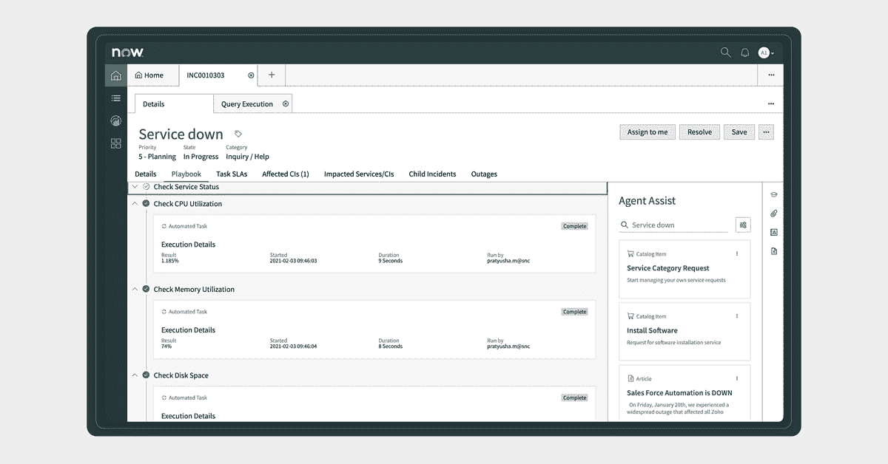

# 服务现在转向单一统一代理

> 原文：<https://devops.com/servicenow-shifts-to-single-unified-agent/>

ServiceNow 今天发布了一个代理客户端收集器(ACC)，使 it 团队可以从软件、硬件和云基础架构中捕获数据。

ServiceNow 的副总裁兼 IT 运营管理总经理 Jeff Hausman 表示，这种统一的代理将使 IT 团队能够减少代理的数量，否则他们将不得不部署代理来收集监控 IT 环境所需的数据。

Hausman 指出，IT 团队还将能够使用事故管理工具，以一种无需安装任何远程桌面软件的方式查看数据。Hausman 补充说，当许多员工将把他们的时间分在家里和办公室工作时，这种方法降低了当今许多 IT 团队经常遇到的 IT 服务管理(ITSM)摩擦的水平。

ACC 实时呈现配置和性能数据，为 IT 团队提供更高的可见性。然后，这些数据可用于驱动各种工作流和行动手册，从而触发自动化事件响应。

ServiceNow 将在其 ITSM 平台和 [IT 运营管理](https://devops.com/?s=ITOM) (ITOM)、硬件资产管理(HAM)、软件资产管理(SAM)和安全运营(SecOps)工具中采用 ACC。

Hausman 表示，ServiceNow 将采用 ACC 和无代理工具来管理 IT 环境，作为在需要部署的软件数量和代理软件支持的功能之间取得平衡的努力的一部分。他补充说，最终，ServiceNow 还将向提供补充功能的第三方工具开放 ACC。

如今，不少 IT 组织正遭受着一种被称为代理疲劳的现象。添加到 IT 武库中的每个新工具通常都需要在设备、应用程序、服务器或云服务中安装代理软件。减少代理软件数量的需求催生了管理 IT 资源的无代理方法，但代价是，在没有代理的情况下，可以启用的数据类型和功能往往更加有限。

市场研究公司国际数据公司( [IDC](https://www.idc.com) )预测，到 2023 年，75%的全球 2000 家 IT 组织将采用自动化运营实践。对自动化日益依赖的主要驱动力当然是新冠肺炎·疫情。不仅组织越来越多地使用云基础架构，而且应用程序用户通常也不方便位于公司办公室的防火墙后面。去年，IT 团队承担了支持大量远程工作人员的任务。随着越来越多的员工在未来几周接种疫苗，他们中的许多人将回到办公室。然而，即使新冠肺炎·疫情事件平息后，大多数员工也不太可能会在办公室全职工作。

无论如何管理，整个 IT 环境都将变得越来越复杂。因此，现在更大的问题是组织何时而不是是否需要重新考虑如何在高度分布式的环境中管理 it。