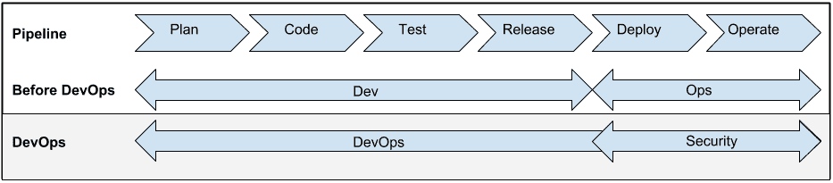
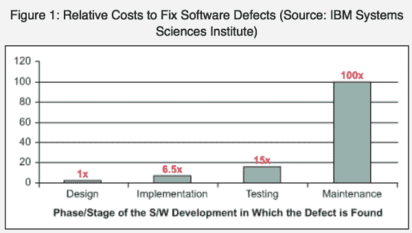

# 左移:你会被冷落吗？

> 原文：<https://devops.com/shift-left-can-you-be-left-out/>

DevOps 中流传最广的术语之一是“左移”。上个月，我参加了由 Sanjeev Sharma 和 Mustafa Kapadia 在 IBM InterConnect 举办的研讨会。他们举办了一个很棒的研讨会，这是他们在现场为客户进行的一项练习的预演。他们谈话的一个中心主题是左移的想法，以解决开发过程中的早期问题。

iBM、Sanjeev 和 Mustafa(他们都在这里写 DevOps.com)并不是第一个或唯一一个在 DevOps 谈论左移的人。Sonatype [的德里克·威克斯在 2013 年 9 月写了一篇关于此事的博文](http://blog.sonatype.com/2013/09/devops-success-is-contingent-on-shifting-left/#.VQpG_Y7F98E)。差不多一年后的今天，IBM 的 Dibbie Edwards(也是 George Hulme 的一篇好文章的焦点)写了一篇[的好文章](https://www.ibm.com/developerworks/community/blogs/invisiblethread/entry/enabling_devops_success_with_shift_left_continuous_testing?lang=en)，关于持续测试的左移。几个月前，安德鲁·斯托姆斯[在 DevOps.com 这里写了一篇关于转移德沃普斯的安全问题的文章。事实上，左移通常被认为是 DevOps 的基础。](https://devops.com/blogs/moving-security-left-devops-world/)

在我们深入了解这对您意味着什么之前，我们应该确保我们都理解左移的真正含义。对我来说，查看开发/部署流程的标准流程是最好的说明。我认为 Andrew Storms 在他的文章中使用了一个很好的例子，所以让我们在这里重新使用它:

现在不要注意之前的 DevOps 或 DevOps 射线。看一下最上面的线，这是管道。你可以看到一个 app 从计划到代码，一路运营的流程。水流从左向右。最简单的左移就是将任务进一步左移。安全性、持续测试、持续集成、持续交付都向左移动了。

这样做可以在生命周期的早期解决潜在的问题。这是什么好事？迪比·爱德华兹文章中的一个图表给了我们明显的答案:

可以看出，你越早发现问题，解决问题的成本就越低。仅此一点就是向左移动的理由。而且，在安全问题影响到您的客户之前解决它这样的概念也很有吸引力。同样的道理也适用于你可以向左移动的许多其他函数。

对我来说，问题是把所有的东西都向左移动，我们会在最左边得到一大堆东西吗？我们如何区分所有这些左移函数的优先级？在到达时间线的起点之前，您只能向左移动这么远。这不是宇宙的诞生，在那里你有一个违背物理定律的大爆炸。

在某种程度上，你能向左移动太多吗？这是我要向 Sanjeev 和 Mustafa 提出的问题。我也把它摆给你们这些读书的观众。

我认识到左移的概念并不那么有效，以至于所有可以左移的东西实际上都左移了。但是随着我们变得更有效率，越来越多的任务在这个过程中被转移。我们在什么时候到达收益递减点？

你对此有何感想？我们能向左移动太多吗？我对这方面的一些不同观点感兴趣。我是安全左移的大力支持者，但是还有其他的优先事项吗？

让我们知道您的反馈。