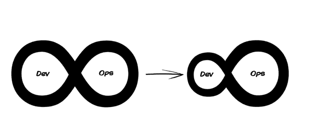
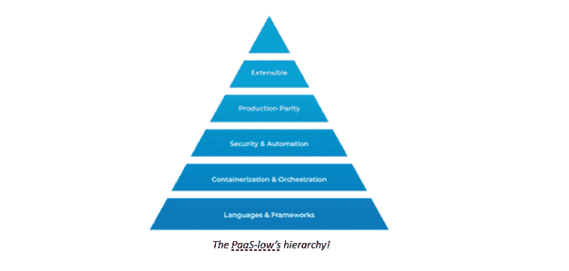

# 左移:对还是错？

> 原文：<https://devops.com/shift-left-right-or-wrong/>

DevOps 这个术语大约在 10 年前出现在主流软件开发社区中。它代表了工具和技术的组合，帮助解决了当时的许多相关问题，即产品中代码的责任和正反馈循环的缺乏。时至今日，DevOps 是一场声势浩大的运动。它被认为是软件开发应该实践的默认方式。它使得小团队也能像大团队一样高效地工作。几个工程团队已经采用了 DevOps 方法的衍生方法，以适应他们的利基工作流。

### DevOps 的阴暗面

DevOps 在实践中为软件工程团队带来了许多切实的利益。自动化、透明性和速度是主要优势。从商业角度来看，工程师现在对用户的体验更加投入和负责。对于工程师来说，“您的成功就是我们的成功”的时代终于到来了，业务团队非常高兴。

对于单个开发人员来说，他们负责的事情越来越多。生产中需要监控的对象更多。随着越来越多的功能被构建和部署，来自内部系统的警报越来越频繁地响起。就个人而言，工程师开始负责行为、性能、安全性、合规性以及应用程序和底层系统的许多其他方面。通常，这成为一种干扰，并开始挫败 DevOps 方法的真正目的，即消除开发人员前进道路上的障碍。

这是 DevOps 做错了。软件工程团队缺乏成熟度已经导致许多人走上了一条有害的 DevOps 之路，结果迫使工程师们很快筋疲力尽。DevOps 的核心原则是让工程师做更多的事情，但不是让他们不得不承担巨大的辛劳。DevOps 仍然认可两种不同形式的专业化努力——软件开发和平台运营。服务的性质、扩展和安全性可能会改变开发和运营职责的融合程度。

### Dev- *哎呀*:时间一长就出错了

有趣的是，工程团队将 DevOps 视为开发，以及“其他一切”。从开发人员将代码签入版本控制开始，就有各种各样的工作流开始工作。理想情况下，有测试，集成，更多的测试，部署和反馈。这是一项庞大的工作，往往被低估和代表性不足。将这种责任推给只负责开发的成员，事情就开始出错了。通常，随着产品的老化，事故管理、维护和其他工程工作会堆积起来，导致产品开发周期越来越短。

还有一种互补的情况，工程团队专注于产品开发，并为其分配最多的空闲周期。平台运营被迫成为一种淡化的努力，可以说只包含维持正常运转所需的最低限度。这是小团队和创业公司的常见现象，他们通常会发布新产品。

当正确实现时，DevOps 必须允许工程师对开发一个特性并在生产中管理它的所有方面负责。这意味着对业务逻辑进行编程、创建声明性和非声明性软件、与服务绑定、构建工件以及最终部署到生产环境都属于开发人员的职责范围。此外，反馈循环——通过将可观察性融入组合中而创建，将提供对服务(或功能)健康状况的洞察——将要求工程师保持对性能和可靠性的操作方面的了解。

当前开发运维的定义和实践源自敏捷方法。它们摆脱了典型敏捷团队的限制，这些团队在“冲刺”中发布，仍然将开发和运营工作分开，并且不知道底层技术。另一方面，DevOps 与所采用的技术结合得更紧密，例如:微服务和自动化。它促进了持续部署和高频率的发布。最重要的是，它融合了开发和平台运营的概念。我们发现对这种“融合”的解释是区分好的 DevOps 实现和坏的 devo PS 实现的原因。

### 右向左移动

健康采用 DevOps 的核心是技术转变和文化转变。掩盖成功团队的基本原则是伟大的[开发者体验](https://devops.com/?s=developer+experience)。不管支持 web 应用程序技术栈的基础设施是什么，从事这项工作的软件工程师都需要能够轻松地开发和部署。让我们来探索如何。

在开发阶段帮助工程师的工具的例子包括 ide、源代码控制、TDD 套件、文档生成器等等。大量的研究和产品开发目前正在进行中，以使开发人员能够更好地编程并促进更有效的开发。

优化运营范围的不同部分需要不同的技能组合和重点领域。在大型企业组织的情况下，这种二分法是很明显的。平台运营团队负责通过提供自动化手段在服务器端建立和维护可靠的系统来保持所有系统的运行。应用程序开发团队的任务是创建应用程序、API 端点、集成和各种其他工件，使用户能够执行他们的任务。

因为这两种功能的共同本质——编写软件——它们倾向于交叉授粉。只要管理得当，这种融合是受欢迎的。这就是抽象派上用场的地方。特别是，PaaS 抽象提供了同等的灵活性和不妥协性。足够灵活，以适应软件产品和团队的定制工作流和定制需求，同时防止开发和运营职责之间不必要的渗透，最终作为这种原子转换的核心，带来卓越的开发人员体验。

## 出色完成 PaaS

### PaaS-low 的等级制度！

完美的平衡只能来自 PaaS 系统，它包含一个模块化的架构，并提供应用程序构建和部署的功能。跨多种语言和框架工作的能力以及打包和部署最佳实践是一个基本原则。对底层基础设施进行抽象，以支持基于容器的构件，并对它们进行大规模编排，这是 PaaS 框架下一个最理想的组件。一种包含电池的方法可以自动执行连续交付、安全最佳实践和其他工作流，这对于确保 PaaS 底层满足各种开发人员的需求大有帮助。当使用抽象时，最大的不透明来自于缺乏生产对等性的形式。如果 PaaS 可以在所有暂存实例上运行，即开发、测试、预生产、生产或任何其他远程实例，它将节省因缺乏对等性而产生的大量劳动。

作为开放源代码和适应法规遵从性、政策要求和定制以适应不同组织的动态需求的奖励点。一个支持生态系统并推动创新和变革管理的活跃社区将为 PaaS 工具提供更有说服力的理由。